<!--  -->
# Mermaid Charts Cheatsheet (.mmd)

Mermaid diagrams are defined in plain text and rendered as SVG. Files use the `.mmd` extension standalone, or are embedded in fenced ` ```mermaid ` code blocks in Markdown (GitHub, GitLab, Notion, and most modern renderers support this natively).

## Flowcharts

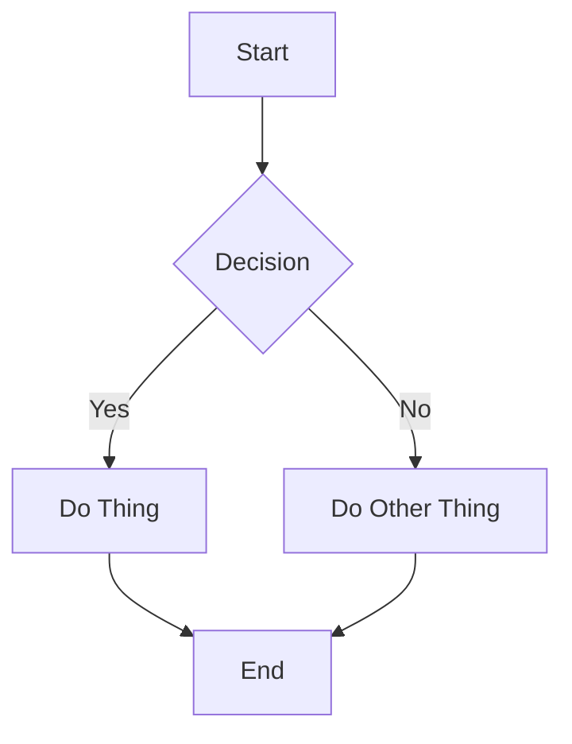

**Direction keywords:** `TD`/`TB` (top-down), `BT` (bottom-top), `LR` (left-right), `RL` (right-left).

**Node shapes:**
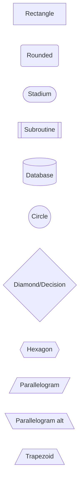

**Link/arrow types:**
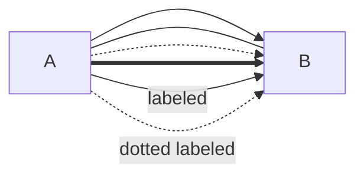

**Subgraphs:**
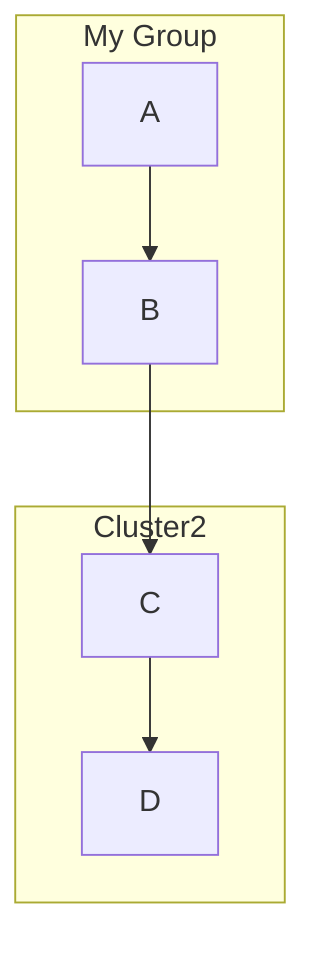

**Styling nodes:**
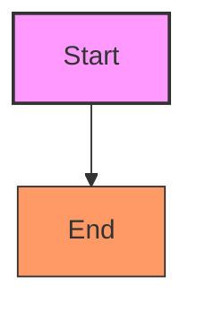

## Sequence Diagrams

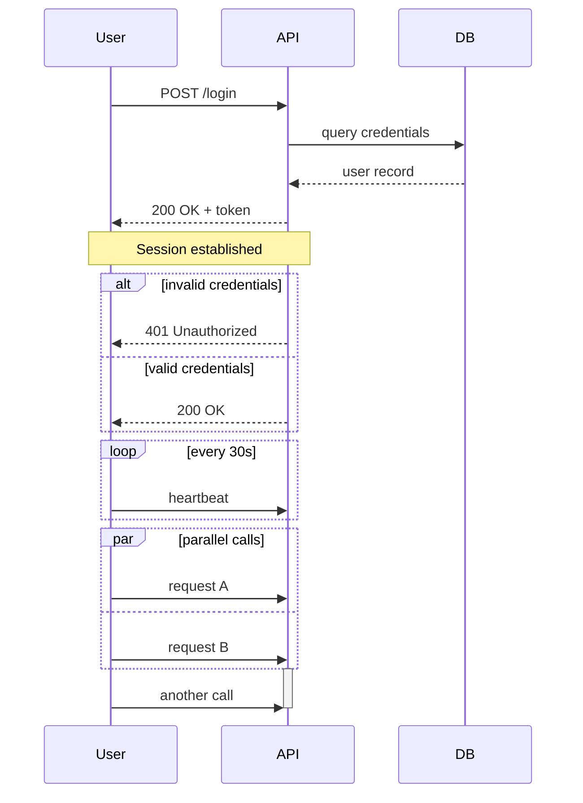

**Arrow types:** `->>` (solid, async), `-->>` (dashed, response), `->` (solid, no arrowhead), `-x` (async lost message).

## Class Diagrams

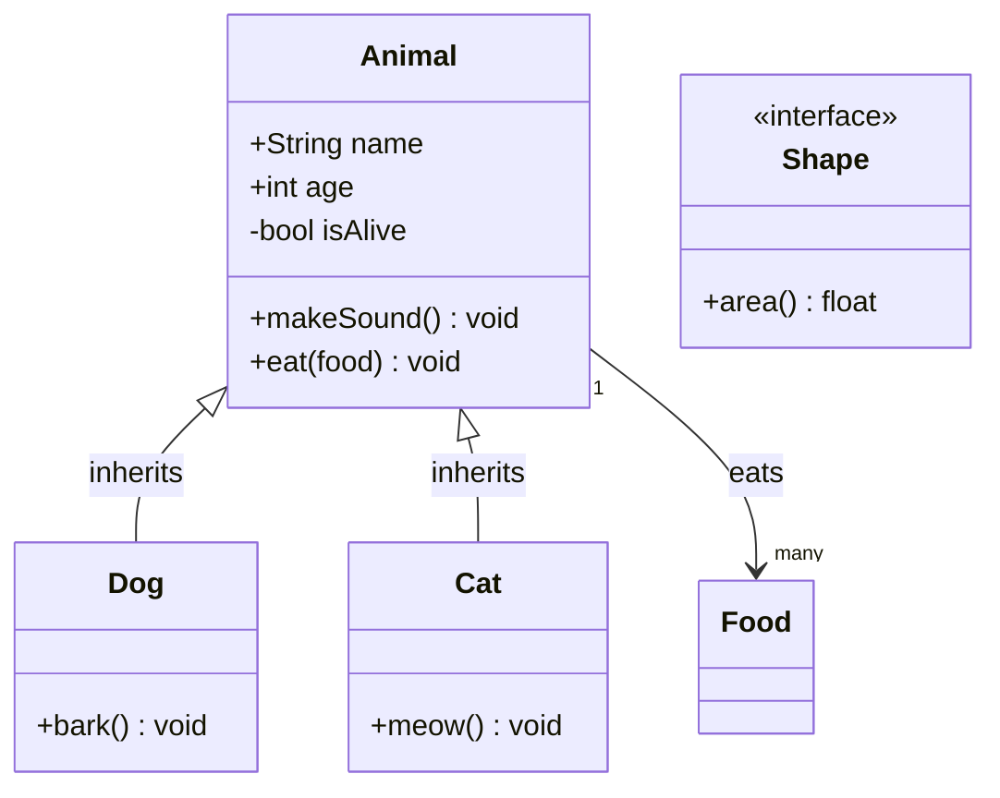

**Relationship types:** `<|--` (inheritance), `*--` (composition), `o--` (aggregation), `-->` (association), `..>` (dependency), `..|>` (realization/interface).

## Entity Relationship Diagrams

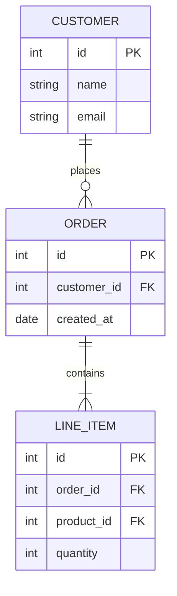

**Cardinality notation:** `||--||` (one-to-one), `||--o{` (one-to-many), `}o--o{` (many-to-many), `||--|{` (one-to-one-or-many).

## State Diagrams

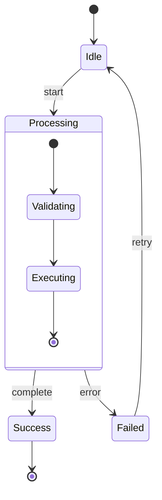

## Gantt Charts

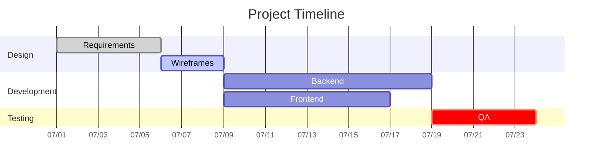

## Pie Charts

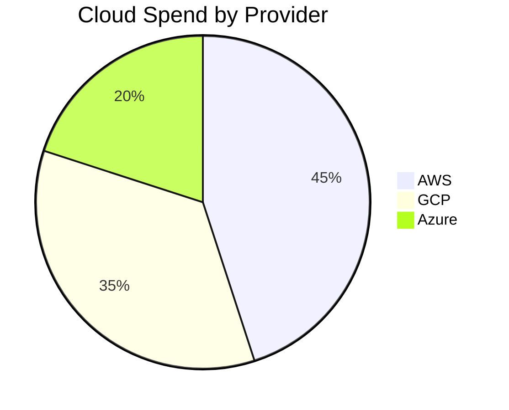

## Git Graphs

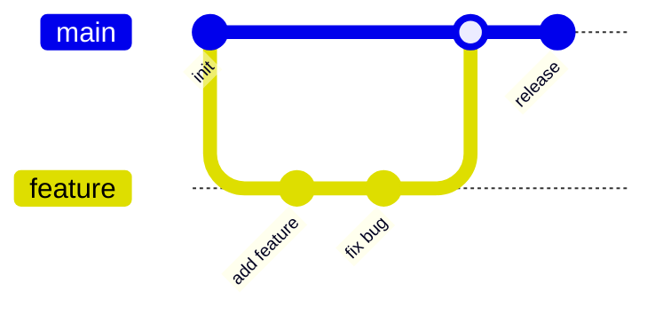

## Mindmaps

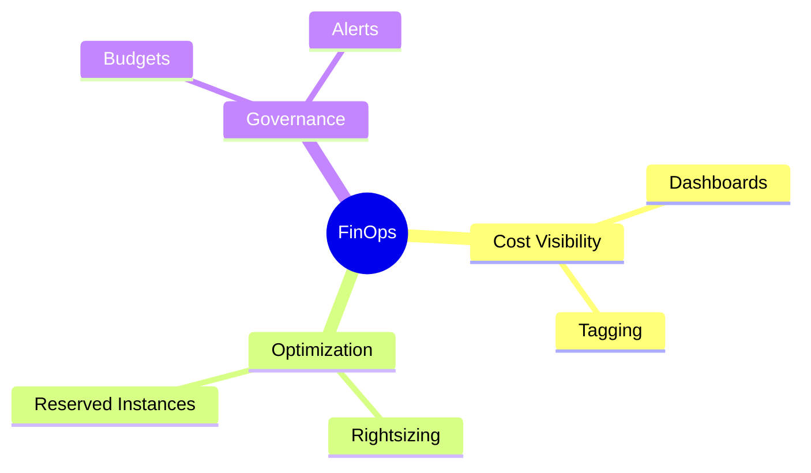

## Journey Diagrams (user experience mapping)

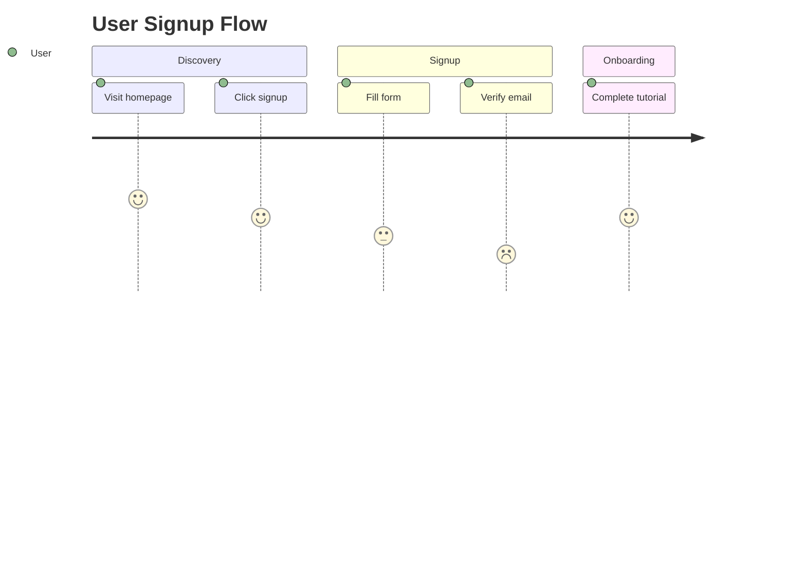

## Quadrant Charts

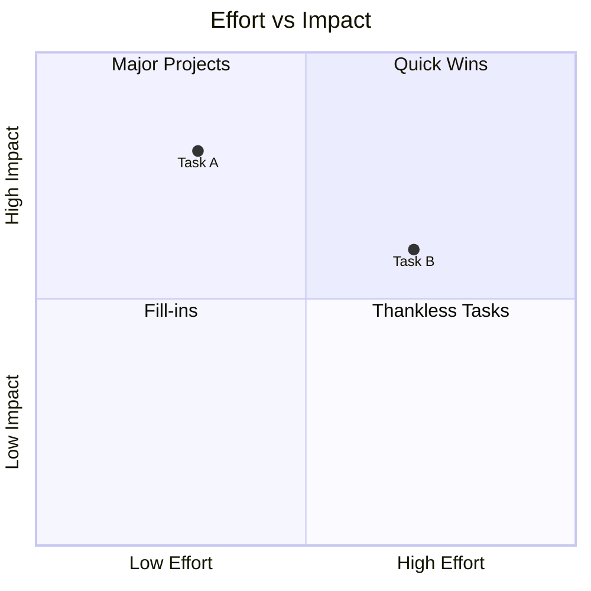

## Timeline

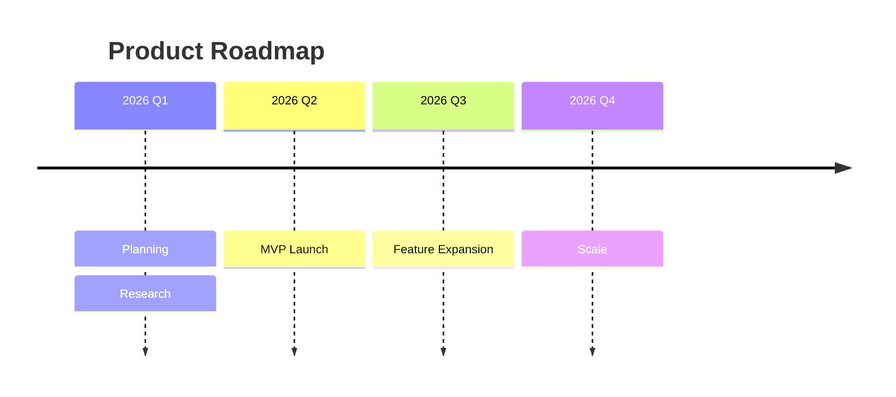

## Comments & Config


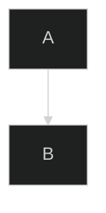

## Rendering Options

```bash
# CLI (mermaid-cli / mmdc)
npm install -g @mermaid-js/mermaid-cli
mmdc -i diagram.mmd -o diagram.svg
mmdc -i diagram.mmd -o diagram.png -theme dark

# In Markdown, most modern renderers auto-render fenced blocks:
```

````markdown

````

## Common Gotchas

- Node IDs must be consistent — `A[Start]` and later just `A` refer to the same node; redefining `A[...]` again with different label text elsewhere can cause unexpected duplicate rendering in some diagram types.
- Special characters in labels (parentheses, quotes) can break parsing — wrap the label in quotes: `A["Node (with parens)"]`.
- Diagram type keyword (`graph`, `sequenceDiagram`, `classDiagram`, etc.) must be the very first line — no blank lines or comments before it.
- Not all renderers support every diagram type or the newest syntax (`stateDiagram-v2` vs `stateDiagram`, `quadrantChart`, `timeline`) — check what your target platform (GitHub, GitLab, Notion, VS Code extension) actually supports before relying on newer features.

<!--  -->
