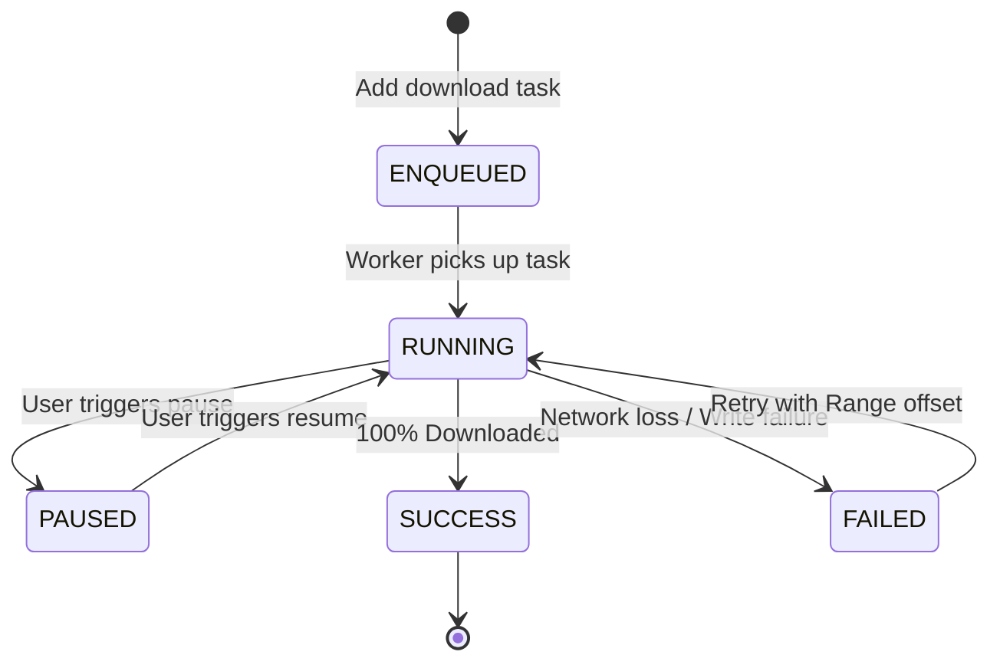

# DroidSurf Mobile Browser & Multi-Tool Integration Specification

**Version:** 1.4.0-PRO
**Author:** Lead Systems Architect & Core Developer
**Status:** Approved for Implementation
**Target Platform:** Android SDK 26 to 34+ (Kotlin/Jetpack Compose/GeckoView)

---

## 1. Executive Summary & Design Vision

DroidSurf is a privacy-focused, performance-driven mobile browser designed to serve as a power-user's primary command center. Unlike traditional browsers that wrap around standard system WebView (WebKit/Blink), DroidSurf utilizes the robust **Mozilla GeckoView Engine** to provide independent rendering, advanced tracker blocking, and desktop-class capabilities.

This document outlines the software architecture, user interface patterns (Material Design 3), and integration specifications for the major on-device components: the **Robust Download Manager**, **Media Sniffer & Profile Crawler**, **Advanced Page Tools**, and the custom **JSON-Based URL Hub & Preferences Router**.

---

## 2. Core Architecture: Mozilla GeckoView Integration

To bypass system-level Chrome rendering restrictions and enable true user-script engine hooks, DroidSurf embeds the standalone `geckoview` library.

```
+-------------------------------------------------------------+
|                     DroidSurf Compose UI                    |
|   (Material 3 Expressive Theme | Dynamic Theme Engine)      |
+-------------------------------------------------------------+
                               |
                               v
+-------------------------------------------------------------+
|             GeckoView Session & Delegate Router             |
+-------------------------------------------------------------+
        |                                              |
        v                                              v
+-----------------------+                    +------------------------+
| GeckoSession Settings |                    |  Web Extension Engine  |
|  (UserAgents, DNS,    |                    |  (User Scripts,        |
|   AdBlock Engine)     |                    |   Custom Styles)       |
+-----------------------+                    +------------------------+
```

### GeckoView Configuration Snippet
```kotlin
package com.droidsurf.browser.core

import android.content.Context
import org.mozilla.geckoview.GeckoRuntime
import org.mozilla.geckoview.GeckoSession
import org.mozilla.geckoview.GeckoView

class BrowserEngineManager(private val context: Context) {
    private var runtime: GeckoRuntime? = null

    fun getOrCreateRuntime(): GeckoRuntime {
        if (runtime == null) {
            val settings = GeckoRuntime.Settings.Builder()
                .useGeckoWebExtensions(true)
                .automaticExtensionUpdates(true)
                .javaScriptEnabled(true)
                .build()
            runtime = GeckoRuntime.create(context, settings)
        }
        return runtime!!
    }

    fun createSession(): GeckoSession {
        val session = GeckoSession()
        // Enable tracking protection by default
        session.settings.useTrackingProtection = true
        session.settings.userAgentOverride = "Mozilla/5.0 (Android 14; Mobile; rv:125.0) Gecko/125.0 Firefox/125.0"
        return session
    }
}
```

---

## 3. High-Performance Download Manager

DroidSurf embeds an asynchronous download engine powered by Jetpack WorkManager and Kotlin Coroutines. It features background queuing, chunked network streaming, and pause/resume capabilities utilizing the HTTP `Range` header.

### A. Core Properties and State Machine



### B. SQLite Schema (Room Entity) for Download Tracking
```kotlin
package com.droidsurf.browser.data.download

import androidx.room.Entity
import androidx.room.PrimaryKey

@Entity(tableName = "downloads")
data class DownloadTask(
    @PrimaryKey val id: String, // UUID string
    val url: String,
    val fileName: String,
    val savePath: String,
    val totalBytes: Long,
    val downloadedBytes: Long,
    val status: String, // ENQUEUED, RUNNING, PAUSED, SUCCESS, FAILED
    val mimeType: String,
    val timestamp: Long = System.currentTimeMillis()
)
```

---

## 4. Media Sniffer & Profile Crawler

The media sniffer hooks into GeckoView’s resource-loading callbacks to analyze incoming network payloads. It detects downloadable stream formats (`.mp4`, `.mp3`, `.m3u8`, `.jpeg`, `.png`, `.webp`) and displays a contextual UI overlay.

```
+-------------------------------------------------------------+
| [<-] Active Media Sniffer                                   |
+-------------------------------------------------------------+
| Detected: 14 Media Files Found                              |
|                                     [Select All] [Clear]    |
+-------------------------------------------------------------+
| [x] video_stream_hd_1080p.mp4 (42.5 MB)                     |
| [x] audio_podcast_track_2.mp3 (8.2 MB)                      |
| [ ] layout_background_vector.svg (120 KB)                   |
+-------------------------------------------------------------+
| [DOWNLOAD SELECTED (2)] -> Destination: /Downloads/DroidSurf|
+-------------------------------------------------------------+
```

### Profile Media Bulk Scraper
In addition to on-page sniffing, DroidSurf supports a dedicated profile scraping container for platforms like Instagram, Twitter, Pinterest, and Threads:
1. **Authenticated Session Fetching:** Reuses current GeckoView cookies to fetch user profiles.
2. **Infinite Pagination Walkers:** Crawls page metadata to discover high-resolution images and video arrays.
3. **Structured Storage:** Saves crawled profiles into custom directories matching the format: `output_dir/profile_name/`.

---

## 5. Rich Page Tools Specification

The browser includes a slide-up Page Tools sheets menu containing advanced commands to optimize page consumption and archiving.

### A. Reader Mode
Strips advertisements, floating banners, sidebars, and custom scripts to render clean typography:
- **Algorithm:** Combines a local implementation of Mozilla's Readability parser to extract the primary text block.
- **Controls:** Allows customizing background color (Light, Dark, Sepia) and adjustable sans-serif font scaling.

### B. Defuddle.md Integration (Save as Markdown)
Converts active page bodies into highly structured markdown files:
- Custom parser traverses the clean DOM tree, converting header elements (`<h1>`, `<h2>`) to Markdown headers (`#`, `##`), handling tables, and preserving absolute asset URL hyperlinks.

### C. Offline Save Engines (MHTML & PDF)
- **MHTML Chunker:** Bundles the page's HTML along with base-64 encoded image objects, stylesheets, and embedded assets into a single cohesive file.
- **PDF Vector Print:** Renders the page using vector scaling to produce high-resolution, searchable PDF files.

---

## 6. Advanced Customizer, User Scripts & Preferences Router

DroidSurf stores and loads user settings, history, and bookmarks in a single portable JSON file to support instant configuration migration.

### JSON Import/Export Configuration Schema
```json
{
  "version": "1.0.0",
  "preferences": {
    "homepage": "https://subbarao6338.github.io/Url-Hub",
    "theme": "Material_Expressive_System",
    "default_download_folder": "/storage/emulated/0/Download/DroidSurf",
    "private_dns": "dns.adguard-dns.com",
    "tracking_protection_level": "STRICT"
  },
  "bookmarks": [
    {
      "title": "My Url Hub",
      "url": "https://subbarao6338.github.io/Url-Hub",
      "icon": "https://subbarao6338.github.io/Url-Hub/favicon.ico",
      "category": "Main Hub"
    }
  ],
  "user_scripts": [
    {
      "name": "Dark Mode Autoswitcher",
      "match": "*://*/*",
      "code": "document.body.style.filter = 'invert(1) hue-rotate(180deg)';"
    }
  ]
}
```

### URL Hub Router Integration
When registered as the default browser in Android, DroidSurf implements custom Intent Filters. Whenever you click a link in an external app, DroidSurf captures the incoming intent, checks it against the active URL Hub categories, and routes it directly into a sandboxed browsing session tab, bypassing external tracking services completely.
