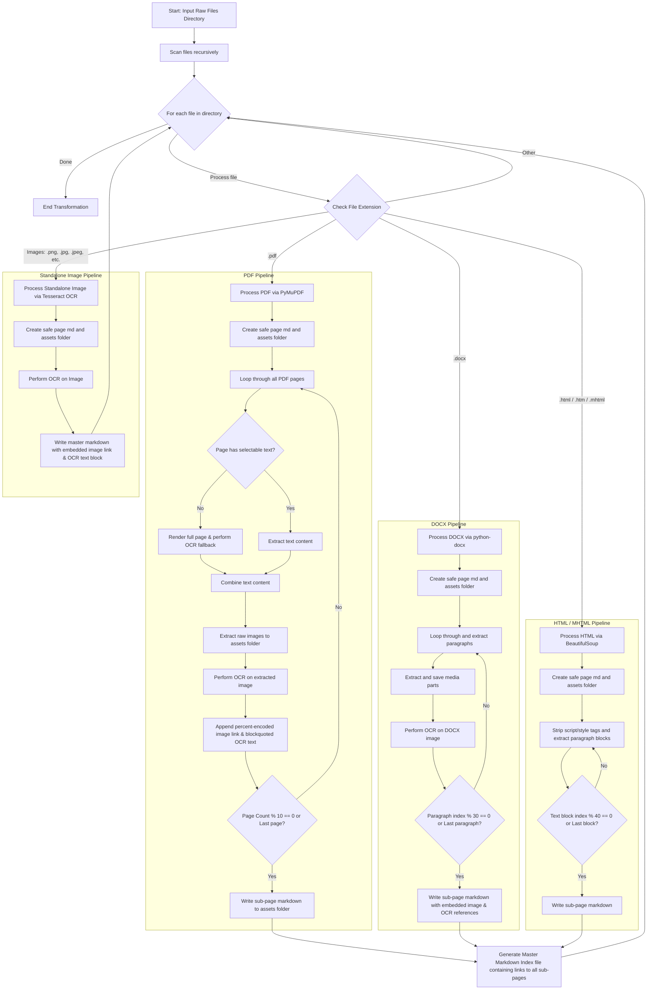

# Local Files to Notion-Ready Markdown Converter

This utility script converts bulky raw local files (`.pdf`, `.docx`, `.html`, `.mhtml`) and standalone image formats (`.jpg`, `.png`, etc.) containing hundreds of pages into a clean, hierarchical Notion-compatible vault. To comply with Notion's page limits and keep your notes highly organized, the tool extracts embedded images into separate directories and splits content into nested sequential markdown sub-pages. It also features integrated **Optical Character Recognition (OCR)** to parse scanned pages and extract text from embedded and standalone images.

---

## 1. Document Ingestion, Chunking & OCR Lifecycle

The following Mermaid flowchart maps out how different document formats are loaded, how text blocks and embedded images are parsed, OCR-analyzed, and linked safely, and how the sub-page hierarchy and index files are generated.



---

## 2. Setup, Installation & Command Line Interface

To run the converter, ensure you have Python installed along with the required libraries to parse complex document layouts, extract embedded tables, and perform optical character recognition. Run this in your terminal:

```bash
# Install Tesseract OCR on system level:
# Ubuntu/Debian: sudo apt-get install tesseract-ocr
# macOS: brew install tesseract

# Install Python package dependencies:
pip install pymupdf python-docx beautifulsoup4 pytesseract pillow
```

### Advanced Features & Arguments:
The latest version of the converter offers a complete command-line interface with custom configurations:
* **Custom Source & Output paths:** Control input and output folders dynamically.
* **Docx Table-to-Markdown:** Seamlessly extracts structured XML tables from `.docx` files and compiles them into clean Markdown tabular formats.
* **Robust Image & OCR Handlers:** Implements context managers to safely close file resources and handles truncated image files using Pillow's `LOAD_TRUNCATED_IMAGES = True`.
* **Sparse Page OCR:** Triggers fallback page-level OCR if a PDF page contains fewer than 30 characters.

```bash
# Display CLI help
python scripts/convert_to_notion_vault.py --help

# Run with custom input and output vault destinations
python scripts/convert_to_notion_vault.py --source "./my_raw_documents" --output "./ready_for_notion"
```

---

## 3. Converter Script Code (`scripts/convert_to_notion_vault.py`)

Save the script below as `scripts/convert_to_notion_vault.py`.

```python
import os
import re
import shutil
import urllib.parse
import io
import argparse
from bs4 import BeautifulSoup
import docx
import fitz  # PyMuPDF
import pytesseract
from PIL import Image, ImageFile

# Gracefully handle truncated or slightly corrupted images
ImageFile.LOAD_TRUNCATED_IMAGES = True

def slugify(text):
    """Cleans names to be completely safe for filesystems across different operating systems."""
    cleaned = re.sub(r'[\\/*?:"<>|]', "", text.strip())
    # Replace whitespace sequences with a standard hyphen
    return re.sub(r'\s+', "-", cleaned)

def perform_ocr(image_bytes_or_path):
    """Performs OCR on an image (bytes or path) using pytesseract and returns the extracted text."""
    try:
        if isinstance(image_bytes_or_path, bytes):
            with Image.open(io.BytesIO(image_bytes_or_path)) as img:
                text = pytesseract.image_to_string(img)
        else:
            with Image.open(image_bytes_or_path) as img:
                text = pytesseract.image_to_string(img)
        return text.strip()
    except Exception as e:
        print(f"[OCR Engine] Error performing OCR: {str(e)}")
        return ""

def create_sub_page(assets_dir, main_page_name, chunk_idx, text_content):
    """Creates a sub-page markdown file inside the matching assets folder, safely unquoted."""
    safe_main_page_name = slugify(main_page_name)
    sub_page_title = f"{safe_main_page_name}-Part-{chunk_idx}"
    sub_page_file = os.path.normpath(os.path.join(assets_dir, f"{sub_page_title}.md"))

    with open(sub_page_file, "w", encoding="utf-8") as f:
        f.write(f"# {sub_page_title.replace('-', ' ')}\n\n")
        f.write(text_content)

    return sub_page_title

def process_pdf(file_path, output_dir):
    doc = fitz.open(file_path)
    base_name = slugify(os.path.splitext(os.path.basename(file_path))[0])

    # Setup Notion backup architecture safely normalized
    main_md_path = os.path.normpath(os.path.join(output_dir, f"{base_name}.md"))
    assets_dir = os.path.normpath(os.path.join(output_dir, base_name))

    # Check traversal safety
    abs_output = os.path.abspath(output_dir)
    if not os.path.abspath(assets_dir).startswith(abs_output) or not os.path.abspath(main_md_path).startswith(abs_output):
        print(f"[PDF Parser] Skipping unsafe traversal path for {file_path}")
        return

    os.makedirs(assets_dir, exist_ok=True)

    current_chunk_text = ""
    chunk_idx = 1
    sub_pages_created = []

    for page_num in range(len(doc)):
        page = doc[page_num]
        page_text = page.get_text()

        # Scanned PDF page fallback: render page to image and perform OCR if empty or sparse text
        if len(page_text.strip()) < 30:
            print(f"[PDF Parser] Page {page_num} of {file_path} seems scanned or sparse. Performing full page OCR...")
            try:
                pix = page.get_pixmap(dpi=150)
                img_bytes = pix.tobytes("png")
                ocr_result = perform_ocr(img_bytes)
                if ocr_result:
                    page_text = f"*[Scanned Page OCR]*\n\n{ocr_result}\n\n{page_text}"
            except Exception as e:
                print(f"[PDF Parser] OCR fallback failed for page {page_num}: {str(e)}")

        current_chunk_text += page_text + "\n\n"

        # Extract Images
        for img_idx, img in enumerate(page.get_images(full=True)):
            xref = img[0]
            try:
                base_image = doc.extract_image(xref)
                image_bytes = base_image["image"]
                image_ext = base_image["ext"]

                img_name = f"image-p{page_num}-i{img_idx}.{image_ext}"
                img_save_path = os.path.normpath(os.path.join(assets_dir, img_name))

                with open(img_save_path, "wb") as f:
                    f.write(image_bytes)

                # Run OCR on the extracted image to append as helper text
                ocr_text = perform_ocr(image_bytes)

                # Embed image link relative to parent page, safely percent-encoded for markdown links
                encoded_base_name = urllib.parse.quote(base_name)
                encoded_img_name = urllib.parse.quote(img_name)
                current_chunk_text += f"\n\n\n"

                if ocr_text:
                    current_chunk_text += f"\n> **[OCR Recognized Text for {img_name}]:**\n> " + ocr_text.replace("\n", "\n> ") + "\n\n"
            except Exception as e:
                print(f"[PDF Parser] Failed to extract/OCR image {img_idx} on page {page_num}: {str(e)}")

        # Every 10 pages, cut a sub-page
        if (page_num + 1) % 10 == 0 or (page_num + 1) == len(doc):
            if current_chunk_text.strip():
                sub_title = create_sub_page(assets_dir, base_name, chunk_idx, current_chunk_text)
                sub_pages_created.append(sub_title)
                current_chunk_text = ""
                chunk_idx += 1

    # Build Master Index File
    with open(main_md_path, "w", encoding="utf-8") as f:
        f.write(f"# {base_name.replace('-', ' ')}\n\n")
        f.write("## Document Sub-pages\n\n")
        for sub_title in sub_pages_created:
            encoded_base_name = urllib.parse.quote(base_name)
            encoded_sub_title = urllib.parse.quote(sub_title)
            f.write(f"* [{sub_title.replace('-', ' ')}]({encoded_base_name}/{encoded_sub_title}.md)\n")

def iter_block_items(parent):
    """
    Yield each paragraph and table child within parent, in document order.
    Each returned value is an instance of either Paragraph or Table.
    """
    if isinstance(parent, docx.document.Document):
        parent_elm = parent.element.body
    elif isinstance(parent, docx.table._Cell):
        parent_elm = parent._tc
    else:
        raise ValueError("Unsupported parent type")

    for child in parent_elm.iterchildren():
        if isinstance(child, docx.oxml.text.paragraph.CT_P):
            yield docx.text.paragraph.Paragraph(child, parent)
        elif isinstance(child, docx.oxml.table.CT_Tbl):
            yield docx.table.Table(child, parent)

def docx_table_to_markdown(table):
    """Converts a python-docx Table object to a clean Markdown table string."""
    markdown_rows = []
    # Identify maximum number of cells in any row to keep columns balanced
    for row in table.rows:
        row_text = []
        for cell in row.cells:
            # Join paragraph texts inside cell
            cell_text = " ".join(p.text.strip() for p in cell.paragraphs).replace("\n", " ").replace("|", "\\|")
            row_text.append(cell_text)
        markdown_rows.append(row_text)

    if not markdown_rows:
        return ""

    num_cols = max(len(r) for r in markdown_rows)
    md_table = []

    # Format the header row
    header = markdown_rows[0]
    header += [""] * (num_cols - len(header))
    md_table.append("| " + " | ".join(header) + " |")

    # Format the separator row
    md_table.append("| " + " | ".join(["---"] * num_cols) + " |")

    # Format data rows
    for row in markdown_rows[1:]:
        row += [""] * (num_cols - len(row))
        md_table.append("| " + " | ".join(row) + " |")

    return "\n" + "\n".join(md_table) + "\n"

def process_docx(file_path, output_dir):
    doc = docx.Document(file_path)
    base_name = slugify(os.path.splitext(os.path.basename(file_path))[0])

    main_md_path = os.path.normpath(os.path.join(output_dir, f"{base_name}.md"))
    assets_dir = os.path.normpath(os.path.join(output_dir, base_name))

    # Check traversal safety
    abs_output = os.path.abspath(output_dir)
    if not os.path.abspath(assets_dir).startswith(abs_output) or not os.path.abspath(main_md_path).startswith(abs_output):
        print(f"[DOCX Parser] Skipping unsafe traversal path for {file_path}")
        return

    os.makedirs(assets_dir, exist_ok=True)

    # Extract block items (paragraphs and tables) in document order
    blocks = []
    for item in iter_block_items(doc):
        if isinstance(item, docx.text.paragraph.Paragraph):
            if item.text.strip():
                blocks.append(item.text.strip())
        elif isinstance(item, docx.table.Table):
            table_md = docx_table_to_markdown(item)
            if table_md.strip():
                blocks.append(table_md)

    # Docx doesn't have strict physical "pages", so we group every 30 blocks
    chunk_size = 30
    sub_pages_created = []

    # Extract images embedded inside Docx XML structures
    img_idx = 0
    docx_ocr_results = {}
    for rel in doc.part.rels.values():
        if "image" in rel.target_ref:
            try:
                img_name = f"docx-img-{img_idx}.png"
                img_save_path = os.path.normpath(os.path.join(assets_dir, img_name))
                img_bytes = rel.target_part.blob
                with open(img_save_path, "wb") as f:
                    f.write(img_bytes)

                # Perform OCR on DOCX embedded image
                ocr_text = perform_ocr(img_bytes)
                if ocr_text:
                    docx_ocr_results[img_name] = ocr_text
                img_idx += 1
            except Exception as e:
                print(f"[DOCX Parser] Failed to extract/OCR image {img_idx}: {str(e)}")

    for idx, i in enumerate(range(0, len(blocks), chunk_size)):
        chunk_paras = blocks[i:i + chunk_size]
        text_content = "\n\n".join(chunk_paras)

        # Inject images at the end of the matching textual sub-pages chunk
        if idx == 0 and img_idx > 0:
            for j in range(img_idx):
                img_name = f"docx-img-{j}.png"
                encoded_base_name = urllib.parse.quote(base_name)
                encoded_img_name = urllib.parse.quote(img_name)
                text_content += f"\n\n"
                if img_name in docx_ocr_results:
                    text_content += f"\n\n> **[OCR Recognized Text for {img_name}]:**\n> " + docx_ocr_results[img_name].replace("\n", "\n> ")

        sub_title = create_sub_page(assets_dir, base_name, idx + 1, text_content)
        sub_pages_created.append(sub_title)

    with open(main_md_path, "w", encoding="utf-8") as f:
        f.write(f"# {base_name.replace('-', ' ')}\n\n## Sub-pages\n\n")
        for sub_title in sub_pages_created:
            encoded_base_name = urllib.parse.quote(base_name)
            encoded_sub_title = urllib.parse.quote(sub_title)
            f.write(f"* [{sub_title.replace('-', ' ')}]({encoded_base_name}/{encoded_sub_title}.md)\n")

def process_html_mhtml(file_path, output_dir):
    """Processes HTML/MHTML files using text blocks to simulate 10-page split layouts."""
    with open(file_path, "r", encoding="utf-8", errors="ignore") as f:
        soup = BeautifulSoup(f.read(), "html.parser")

    base_name = slugify(os.path.splitext(os.path.basename(file_path))[0])
    main_md_path = os.path.normpath(os.path.join(output_dir, f"{base_name}.md"))
    assets_dir = os.path.normpath(os.path.join(output_dir, base_name))

    # Check traversal safety
    abs_output = os.path.abspath(output_dir)
    if not os.path.abspath(assets_dir).startswith(abs_output) or not os.path.abspath(main_md_path).startswith(abs_output):
        print(f"[HTML Parser] Skipping unsafe traversal path for {file_path}")
        return

    os.makedirs(assets_dir, exist_ok=True)

    # Strip scripts/styles
    for element in soup(["script", "style"]):
        element.decompose()

    lines = [p.get_text().strip() for p in soup.find_all(['p', 'div', 'h1', 'h2', 'h3']) if p.get_text().strip()]

    # Split text blocks into chunks to prevent hitting Notion individual page upload limits
    chunk_size = 40
    sub_pages_created = []

    for idx, i in enumerate(range(0, len(lines), chunk_size)):
        chunk_lines = lines[i:i + chunk_size]
        text_content = "\n\n".join(chunk_lines)

        sub_title = create_sub_page(assets_dir, base_name, idx + 1, text_content)
        sub_pages_created.append(sub_title)

    with open(main_md_path, "w", encoding="utf-8") as f:
        f.write(f"# {base_name.replace('-', ' ')}\n\n## Sub-pages\n\n")
        for sub_title in sub_pages_created:
            encoded_base_name = urllib.parse.quote(base_name)
            encoded_sub_title = urllib.parse.quote(sub_title)
            f.write(f"* [{sub_title.replace('-', ' ')}]({encoded_base_name}/{encoded_sub_title}.md)\n")

def process_image(file_path, output_dir):
    """Processes a standalone image, copies it to an assets directory, performs OCR, and generates a Markdown file."""
    base_name = slugify(os.path.splitext(os.path.basename(file_path))[0])
    img_ext = os.path.splitext(file_path)[1].lower()
    img_name = f"{base_name}{img_ext}"

    main_md_path = os.path.normpath(os.path.join(output_dir, f"{base_name}.md"))
    assets_dir = os.path.normpath(os.path.join(output_dir, base_name))

    # Check traversal safety
    abs_output = os.path.abspath(output_dir)
    if not os.path.abspath(assets_dir).startswith(abs_output) or not os.path.abspath(main_md_path).startswith(abs_output):
        print(f"[Image Parser] Skipping unsafe traversal path for {file_path}")
        return

    os.makedirs(assets_dir, exist_ok=True)
    img_save_path = os.path.normpath(os.path.join(assets_dir, img_name))
    shutil.copy2(file_path, img_save_path)

    print(f"[Image Parser] Performing OCR on standalone image: {file_path}...")
    ocr_text = perform_ocr(img_save_path)

    # Build the Markdown Page
    with open(main_md_path, "w", encoding="utf-8") as f:
        f.write(f"# {base_name.replace('-', ' ')}\n\n")
        encoded_base_name = urllib.parse.quote(base_name)
        encoded_img_name = urllib.parse.quote(img_name)
        f.write(f"\n\n")
        if ocr_text:
            f.write("## OCR Extracted Text\n\n")
            f.write("> " + ocr_text.replace("\n", "\n> ") + "\n")
        else:
            f.write("*(No text recognized in image)*\n")

def run_vault_generator(source_folder, output_vault):
    os.makedirs(output_vault, exist_ok=True)

    for root, _, files in os.walk(source_folder):
        for file in files:
            ext = file.lower()
            full_path = os.path.normpath(os.path.join(root, file))
            print(f"Processing: {file}...")

            try:
                if ext.endswith(".pdf"):
                    process_pdf(full_path, output_vault)
                elif ext.endswith(".docx"):
                    process_docx(full_path, output_vault)
                elif ext.endswith((".html", ".htm", ".mhtml")):
                    process_html_mhtml(full_path, output_vault)
                elif ext.endswith((".png", ".jpg", ".jpeg", ".tiff", ".bmp", ".webp")):
                    process_image(full_path, output_vault)
            except Exception as e:
                print(f"Error handling {file}: {str(e)}")

if __name__ == "__main__":
    parser = argparse.ArgumentParser(description="Multi-format document ingestion pipeline with OCR")
    parser.add_argument("--source", "-s", default="./my_raw_documents", help="Source folder with raw files")
    parser.add_argument("--output", "-o", default="./ready_for_notion", help="Output directory for Notion vault")

    args = parser.parse_args()

    # Create mock directory if running inside an automation loop
    if not os.path.exists(args.source):
        os.makedirs(args.source, exist_ok=True)
        print(f"Created template input folder: '{args.source}'. Place raw files here.")

    run_vault_generator(args.source, args.output)
    print(f"\nTransformation complete! Zip the contents of '{args.output}' and import to Notion.")
```
