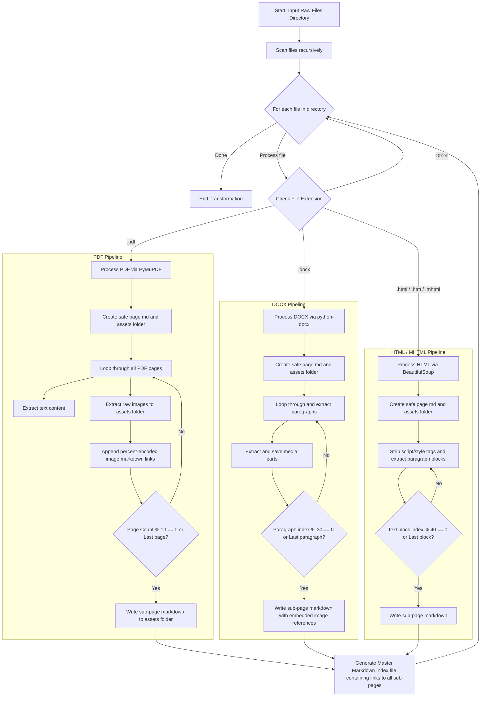

# Local Files to Notion-Ready Markdown Converter

This utility script converts bulky raw local files (`.pdf`, `.docx`, `.html`, `.mhtml`) containing hundreds of pages into a clean, hierarchical Notion-compatible vault. To comply with Notion's page limits and keep your notes highly organized, the tool extracts embedded images into separate directories and splits content into nested sequential markdown sub-pages.

---

## 1. Document Ingestion & Chunking Lifecycle

The following Mermaid flowchart maps out how different document formats are loaded, how text blocks and embedded images are parsed and linked safely, and how the sub-page hierarchy and index files are generated.



---

## 2. Setup & Installation

To run the converter, ensure you have python installed along with the required libraries to parse complex document layouts. Run this in your terminal:

```bash
pip install pymupdf python-docx beautifulsoup4
```

---

## 3. Converter Script Code (`convert_to_notion_vault.py`)

Save the script below as `convert_to_notion_vault.py`. Update the `SOURCE_DIRECTORY` and `FINAL_NOTION_VAULT` paths at the bottom to match your environment, then run it.

```python
import os
import re
import shutil
import urllib.parse
from bs4 import BeautifulSoup
import docx
import fitz  # PyMuPDF

def slugify(text):
    """Cleans names to be completely safe for filesystems across different operating systems."""
    cleaned = re.sub(r'[\\/*?:"<>|]', "", text.strip())
    # Replace whitespace sequences with a standard hyphen
    return re.sub(r'\s+', "-", cleaned)

def create_sub_page(assets_dir, main_page_name, chunk_idx, text_content):
    """Creates a sub-page markdown file inside the matching assets folder, safely unquoted."""
    safe_main_page_name = slugify(main_page_name)
    sub_page_title = f"{safe_main_page_name}-Part-{chunk_idx}"
    sub_page_file = os.path.normpath(os.path.join(assets_dir, f"{sub_page_title}.md"))
    
    with open(sub_page_file, "w", encoding="utf-8") as f:
        f.write(f"# {sub_page_title.replace('-', ' ')}\n\n")
        f.write(text_content)
        
    return sub_page_title

def process_pdf(file_path, output_dir):
    doc = fitz.open(file_path)
    base_name = slugify(os.path.splitext(os.path.basename(file_path))[0])
    
    # Setup Notion backup architecture safely normalized
    main_md_path = os.path.normpath(os.path.join(output_dir, f"{base_name}.md"))
    assets_dir = os.path.normpath(os.path.join(output_dir, base_name))

    # Check traversal safety
    abs_output = os.path.abspath(output_dir)
    if not os.path.abspath(assets_dir).startswith(abs_output) or not os.path.abspath(main_md_path).startswith(abs_output):
        print(f"[PDF Parser] Skipping unsafe traversal path for {file_path}")
        return

    os.makedirs(assets_dir, exist_ok=True)
    
    current_chunk_text = ""
    chunk_idx = 1
    sub_pages_created = []
    
    for page_num in range(len(doc)):
        page = doc[page_num]
        current_chunk_text += page.get_text() + "\n\n"
        
        # Extract Images
        for img_idx, img in enumerate(page.get_images(full=True)):
            xref = img[0]
            base_image = doc.extract_image(xref)
            image_bytes = base_image["image"]
            image_ext = base_image["ext"]
            
            img_name = f"image-p{page_num}-i{img_idx}.{image_ext}"
            img_save_path = os.path.normpath(os.path.join(assets_dir, img_name))
            
            with open(img_save_path, "wb") as f:
                f.write(image_bytes)
                
            # Embed image link relative to parent page, safely percent-encoded for markdown links
            encoded_base_name = urllib.parse.quote(base_name)
            encoded_img_name = urllib.parse.quote(img_name)
            current_chunk_text += f"\n\n\n"
            
        # Every 10 pages, cut a sub-page
        if (page_num + 1) % 10 == 0 or (page_num + 1) == len(doc):
            if current_chunk_text.strip():
                sub_title = create_sub_page(assets_dir, base_name, chunk_idx, current_chunk_text)
                sub_pages_created.append(sub_title)
                current_chunk_text = ""
                chunk_idx += 1
                
    # Build Master Index File
    with open(main_md_path, "w", encoding="utf-8") as f:
        f.write(f"# {base_name.replace('-', ' ')}\n\n")
        f.write("## Document Sub-pages\n\n")
        for sub_title in sub_pages_created:
            encoded_base_name = urllib.parse.quote(base_name)
            encoded_sub_title = urllib.parse.quote(sub_title)
            f.write(f"* [{sub_title.replace('-', ' ')}]({encoded_base_name}/{encoded_sub_title}.md)\n")

def process_docx(file_path, output_dir):
    doc = docx.Document(file_path)
    base_name = slugify(os.path.splitext(os.path.basename(file_path))[0])
    
    main_md_path = os.path.normpath(os.path.join(output_dir, f"{base_name}.md"))
    assets_dir = os.path.normpath(os.path.join(output_dir, base_name))

    # Check traversal safety
    abs_output = os.path.abspath(output_dir)
    if not os.path.abspath(assets_dir).startswith(abs_output) or not os.path.abspath(main_md_path).startswith(abs_output):
        print(f"[DOCX Parser] Skipping unsafe traversal path for {file_path}")
        return

    os.makedirs(assets_dir, exist_ok=True)
    
    paragraphs = [p.text for p in doc.paragraphs if p.text.strip()]
    
    # Docx doesn't have strict physical "pages", so we group every 30 paragraphs 
    # (roughly equivalent to 10 standard reading pages) to ensure structural safety.
    chunk_size = 30 
    sub_pages_created = []
    
    # Extract images embedded inside Docx XML structures
    img_idx = 0
    for rel in doc.part.relations.values():
        if "image" in rel.target_ref:
            img_name = f"docx-img-{img_idx}.png"
            img_save_path = os.path.normpath(os.path.join(assets_dir, img_name))
            with open(img_save_path, "wb") as f:
                f.write(rel.target_part.blob)
            img_idx += 1

    for idx, i in enumerate(range(0, len(paragraphs), chunk_size)):
        chunk_paras = paragraphs[i:i + chunk_size]
        text_content = "\n\n".join(chunk_paras)
        
        # Inject images at the end of the matching textual sub-pages chunk
        if idx == 0 and img_idx > 0:
            for j in range(img_idx):
                encoded_base_name = urllib.parse.quote(base_name)
                encoded_img_name = urllib.parse.quote(f"docx-img-{j}.png")
                text_content += f"\n\n"
                
        sub_title = create_sub_page(assets_dir, base_name, idx + 1, text_content)
        sub_pages_created.append(sub_title)
        
    with open(main_md_path, "w", encoding="utf-8") as f:
        f.write(f"# {base_name.replace('-', ' ')}\n\n## Sub-pages\n\n")
        for sub_title in sub_pages_created:
            encoded_base_name = urllib.parse.quote(base_name)
            encoded_sub_title = urllib.parse.quote(sub_title)
            f.write(f"* [{sub_title.replace('-', ' ')}]({encoded_base_name}/{encoded_sub_title}.md)\n")

def process_html_mhtml(file_path, output_dir):
    """Processes HTML/MHTML files using text blocks to simulate 10-page split layouts."""
    with open(file_path, "r", encoding="utf-8", errors="ignore") as f:
        soup = BeautifulSoup(f.read(), "html.parser")
        
    base_name = slugify(os.path.splitext(os.path.basename(file_path))[0])
    main_md_path = os.path.normpath(os.path.join(output_dir, f"{base_name}.md"))
    assets_dir = os.path.normpath(os.path.join(output_dir, base_name))

    # Check traversal safety
    abs_output = os.path.abspath(output_dir)
    if not os.path.abspath(assets_dir).startswith(abs_output) or not os.path.abspath(main_md_path).startswith(abs_output):
        print(f"[HTML Parser] Skipping unsafe traversal path for {file_path}")
        return

    os.makedirs(assets_dir, exist_ok=True)
    
    # Strip scripts/styles
    for element in soup(["script", "style"]):
        element.decompose()
        
    lines = [p.get_text().strip() for p in soup.find_all(['p', 'div', 'h1', 'h2', 'h3']) if p.get_text().strip()]
    
    # Split text blocks into chunks to prevent hitting Notion individual page upload limits
    chunk_size = 40 
    sub_pages_created = []
    
    for idx, i in enumerate(range(0, len(lines), chunk_size)):
        chunk_lines = lines[i:i + chunk_size]
        text_content = "\n\n".join(chunk_lines)
        
        sub_title = create_sub_page(assets_dir, base_name, idx + 1, text_content)
        sub_pages_created.append(sub_title)
        
    with open(main_md_path, "w", encoding="utf-8") as f:
        f.write(f"# {base_name.replace('-', ' ')}\n\n## Sub-pages\n\n")
        for sub_title in sub_pages_created:
            encoded_base_name = urllib.parse.quote(base_name)
            encoded_sub_title = urllib.parse.quote(sub_title)
            f.write(f"* [{sub_title.replace('-', ' ')}]({encoded_base_name}/{encoded_sub_title}.md)\n")

def run_vault_generator(source_folder, output_vault):
    os.makedirs(output_vault, exist_ok=True)
    
    for root, _, files in os.walk(source_folder):
        for file in files:
            ext = file.lower()
            full_path = os.path.normpath(os.path.join(root, file))
            print(f"Processing: {file}...")
            
            try:
                if ext.endswith(".pdf"):
                    process_pdf(full_path, output_vault)
                elif ext.endswith(".docx"):
                    process_docx(full_path, output_vault)
                elif ext.endswith((".html", ".htm", ".mhtml")):
                    process_html_mhtml(full_path, output_vault)
            except Exception as e:
                print(f"Error handling {file}: {str(e)}")

if __name__ == "__main__":
    SOURCE_DIRECTORY = "./my_raw_documents" 
    FINAL_NOTION_VAULT = "./ready_for_notion"
    
    # Create mock directory if running inside an automation loop
    if not os.path.exists(SOURCE_DIRECTORY):
        os.makedirs(SOURCE_DIRECTORY)
        print(f"Created template input folder: '{SOURCE_DIRECTORY}'. Place raw files here.")

    run_vault_generator(SOURCE_DIRECTORY, FINAL_NOTION_VAULT)
    print("\nTransformation complete! Zip the contents of 'ready_for_notion' and import to Notion.")
```
