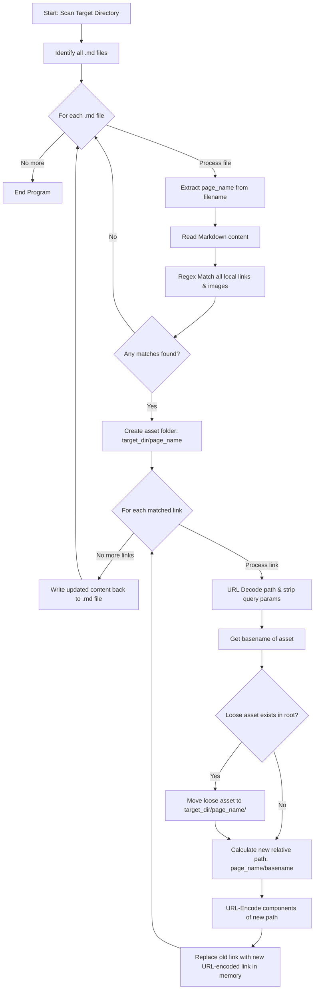
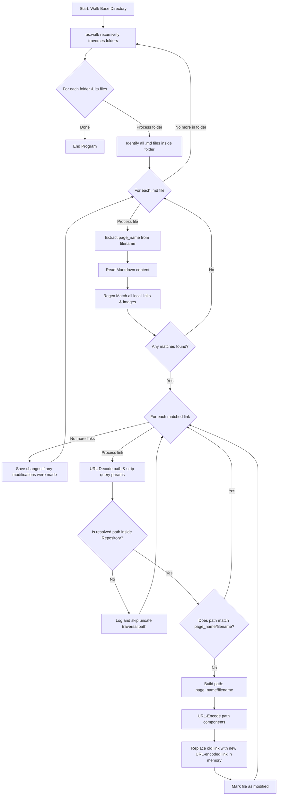

# Notion Structure Automation Scripts

This document provides optimized, production-ready automation scripts to manage your local Markdown vault and align it with Notion's import specifications. It includes clear logical workflow diagrams using Mermaid.

---

## 1. Local Vault Organizer (`scripts/organize_local_vault.py`)

This script runs locally on your machine. If you drop a loose image, pdf, or markdown sub-page file next to a parent document, running this script automatically:
1. Creates a folder named after the parent page (if it doesn't exist).
2. Moves the loose file into that folder.
3. Safe-decodes URL percent-encoding (`%20`) and strips queries.
4. Corrects the markdown links and percent-encodes the final paths so they render flawlessly.

### Flowchart:


### Script Code:
```python
import os
import re
import shutil
import urllib.parse

def organize_local_vault(target_dir):
    """
    Scans target_dir for Markdown files.
    Identifies links inside them pointing to local files.
    Creates matching folders for parent pages (handling the 32-character Notion ID scheme).
    Moves loose referenced files into the respective folders and updates markdown links.
    """
    # Match markdown inline images  and links []() pointing to local files
    # Ignores external web links starting with http/https or mailto:
    link_pattern = re.compile(r'!?\[.*?\]\(((?!http|https|mailto:)[^)]+)\)')
    
    try:
        files = os.listdir(target_dir)
    except Exception as e:
        print(f"[Local] Error listing target directory {target_dir}: {str(e)}")
        return

    md_files = [f for f in files if f.endswith('.md')]

    for md_file in md_files:
        page_name = os.path.splitext(md_file)[0]
        # In a proper Notion backup, the folder matches the markdown filename exactly
        assets_folder = os.path.join(target_dir, page_name)
        md_file_path = os.path.join(target_dir, md_file)
        
        try:
            with open(md_file_path, 'r', encoding='utf-8') as f:
                content = f.read()
        except Exception as e:
            print(f"[Local] Error reading {md_file}: {str(e)}")
            continue
            
        matches = link_pattern.findall(content)
        if not matches:
            continue
            
        updated_content = content
        changes_made = False
        
        for asset_path in matches:
            # Parse URL/percent-encoded link and strip any query parameters or hash anchors
            parsed = urllib.parse.urlparse(asset_path)
            decoded_path = urllib.parse.unquote(parsed.path)

            clean_asset_name = os.path.basename(decoded_path)
            if not clean_asset_name:
                continue

            old_asset_location = os.path.join(target_dir, clean_asset_name)
            
            # Check for path-traversal safety
            abs_target = os.path.abspath(target_dir)
            abs_old_asset = os.path.abspath(old_asset_location)
            if not abs_old_asset.startswith(abs_target):
                print(f"[Local] Skipping unsafe file path: {asset_path}")
                continue

            # Move loose files from root/target_dir into the specific parent folder
            if os.path.exists(old_asset_location) and not os.path.isdir(old_asset_location):
                if not os.path.exists(assets_folder):
                    os.makedirs(assets_folder, exist_ok=True)
                    print(f"[Local] Created folder: {assets_folder}/")

                new_asset_location = os.path.join(assets_folder, clean_asset_name)
                # Ensure we don't overwrite/move onto ourselves
                if abs_old_asset != os.path.abspath(new_asset_location):
                    try:
                        shutil.move(old_asset_location, new_asset_location)
                        print(f"[Local] Moved loose asset: {clean_asset_name} -> {page_name}/")
                    except Exception as e:
                        print(f"[Local] Error moving asset {clean_asset_name}: {str(e)}")
                
            # Enforce clean relative paths format with proper percent encoding
            # Encode components separately to preserve '/' path separator
            encoded_page_name = urllib.parse.quote(page_name)
            encoded_asset_name = urllib.parse.quote(clean_asset_name)
            new_markdown_path = f"{encoded_page_name}/{encoded_asset_name}"

            if asset_path != new_markdown_path:
                updated_content = updated_content.replace(asset_path, new_markdown_path)
                changes_made = True
            
        if changes_made:
            try:
                with open(md_file_path, 'w', encoding='utf-8') as f:
                    f.write(updated_content)
                print(f"[Local] Paths fixed inside {md_file}\n")
            except Exception as e:
                print(f"[Local] Error writing back to {md_file}: {str(e)}")

if __name__ == "__main__":
    current_directory = os.path.dirname(os.path.realpath(__file__))
    organize_local_vault(current_directory)
```

---

## 2. GitHub CI-CD Vault Validator (`scripts/prepare_github_vault.py`)

This script crawls **deeply nested sub-directories** (using `os.walk`) recursively. It validates all cross-repository relative paths, converts any absolute or broken references into strict Notion-compatible structures, resolves percent-encoding, and acts as a strict compliance pre-flight check before building zip files.

### Flowchart:


### Script Code:
```python
import os
import re
import urllib.parse

def organize_github_vault(base_dir):
    """
    Recursively crawls a GitHub directory tree/vault.
    Validates and standardizes relative local links inside Markdown files.
    Ensures link target folders match the exact naming of parent pages (with hashes if present).
    Ensures relative links use proper percent encoding.
    """
    # Regex to capture all local markdown links and asset strings
    link_pattern = re.compile(r'!?\[.*?\]\(((?!http|https|mailto:)[^)]+)\)')
    
    abs_base = os.path.abspath(base_dir)
    print(f"[GitHub Validator] Starting recursive scan from base: {abs_base}")

    # Recursively traverse every nested folder inside the base directory
    for root, dirs, files in os.walk(base_dir):
        md_files = [f for f in files if f.endswith('.md')]
        
        for md_file in md_files:
            md_file_path = os.path.join(root, md_file)
            page_name = os.path.splitext(md_file)[0]
            
            with open(md_file_path, 'r', encoding='utf-8') as f:
                content = f.read()
                
            matches = link_pattern.findall(content)
            if not matches:
                continue
                
            updated_content = content
            changes_made = False
            
            for asset_path in matches:
                # Safely URL-decode and strip any URL parameters/hash anchors
                parsed = urllib.parse.urlparse(asset_path)
                decoded_path = urllib.parse.unquote(parsed.path)

                # Check for path-traversal safety relative to base_dir
                abs_asset = os.path.abspath(os.path.join(root, decoded_path))
                if not abs_asset.startswith(abs_base):
                    print(f"[GitHub] Skipping unsafe path traversal: {asset_path}")
                    continue

                clean_path = decoded_path.lstrip('./')
                
                # Ensure the path perfectly conforms to Notion-style: folder_name/filename
                if not clean_path.startswith(f"{page_name}/"):
                    filename = os.path.basename(clean_path)

                    encoded_page_name = urllib.parse.quote(page_name)
                    encoded_filename = urllib.parse.quote(filename)
                    new_relative_path = f"{encoded_page_name}/{encoded_filename}"
                    
                    updated_content = updated_content.replace(asset_path, new_relative_path)
                    print(f"[GitHub] Standardized path in {md_file}: {asset_path} -> {new_relative_path}")
                    changes_made = True
            
            if changes_made:
                with open(md_file_path, 'w', encoding='utf-8') as f:
                    f.write(updated_content)
                print(f"[GitHub] Saved optimized formatting for {md_file}\n")

if __name__ == "__main__":
    # Scans the entire repository tree starting from the script location
    repo_root_directory = os.path.dirname(os.path.dirname(os.path.realpath(__file__)))
    organize_github_vault(repo_root_directory)
```
