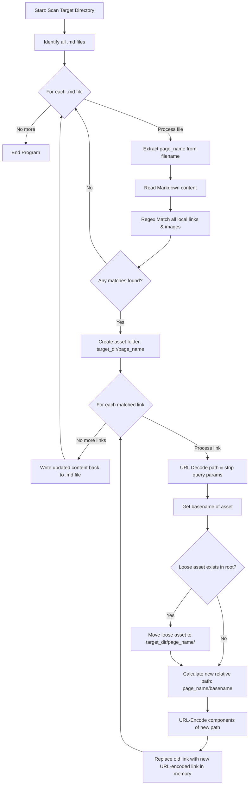
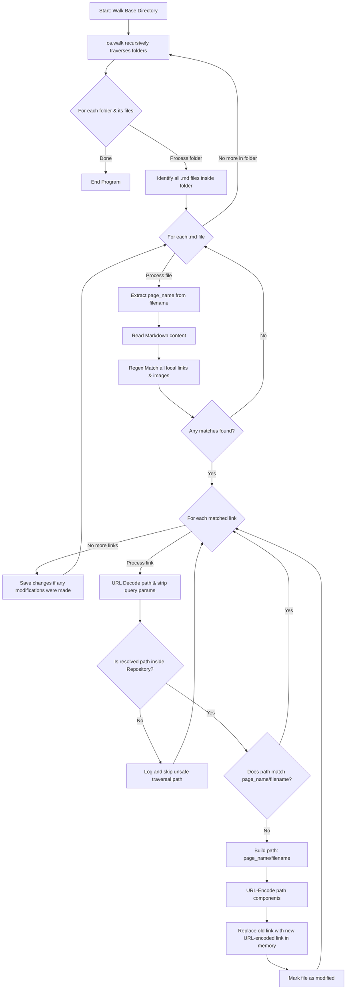

# Notion Structure Automation Scripts

This document provides optimized, production-ready automation scripts to manage your local Markdown vault and align it with Notion's import specifications. It includes clear logical workflow diagrams using Mermaid.

---

## 1. Local Vault Organizer (`scripts/organize_local_vault.py`)

This script runs locally on your machine. If you drop a loose image, pdf, or markdown sub-page file next to a parent document, running this script automatically:
1. Creates a folder named after the parent page (if it doesn't exist).
2. Moves the loose file into that folder.
3. Safe-decodes URL percent-encoding (`%20`) and strips queries.
4. Corrects the markdown links and percent-encodes the final paths so they render flawlessly.

### Flowchart:


### Advanced Features & Command-Line Interface:
The organizer is equipped with several production-ready features:
* **Fenced & Inline Code Block Masking:** Before searching for links to organize, the script masks all text inside inline backticks and fenced markdown code blocks with special placeholders. This prevents the script from rewriting paths inside developer command cheatsheets or code blocks.
* **Dry-Run Mode:** Supports a `--dry-run` flag to preview proposed file operations and path transformations without actually writing any changes to disk.
* **Flexible Target Directories:** Allows specifying any directory as a positional argument, defaulting to the current working directory if none is provided.

```bash
# Display all command options
python scripts/organize_local_vault.py --help

# Perform a dry-run preview on a local folder
python scripts/organize_local_vault.py ./my-vault --dry-run

# Run and commit organization changes
python scripts/organize_local_vault.py ./my-vault
```

### Script Code:
```python
import os
import re
import shutil
import urllib.parse
import argparse

def mask_code_blocks(content):
    """Temporarily masks fenced code blocks with placeholders."""
    lines = content.splitlines(keepends=True)
    in_block = False
    fence_char = None
    placeholders = []
    new_lines = []
    current_block = []

    for line in lines:
        stripped = line.strip()
        if not in_block:
            if stripped.startswith("```") or stripped.startswith("~~~"):
                in_block = True
                fence_char = "```" if stripped.startswith("```") else "~~~"
                current_block.append(line)
            else:
                new_lines.append(line)
        else:
            current_block.append(line)
            if stripped.startswith(fence_char):
                placeholder = f"__CODE_BLOCK_PLACEHOLDER_{len(placeholders)}__"
                placeholders.append((placeholder, "".join(current_block)))
                new_lines.append(placeholder + "\n")
                current_block = []
                in_block = False

    if in_block and current_block:
        new_lines.extend(current_block)

    return "".join(new_lines), placeholders

def unmask_code_blocks(content, placeholders):
    """Restores masked fenced code blocks from placeholders."""
    for placeholder, original in reversed(placeholders):
        content = content.replace(placeholder + "\n", original)
        content = content.replace(placeholder, original)
    return content

def mask_inline_code(content):
    """Temporarily masks inline code (surrounded by backticks) with placeholders."""
    inline_placeholders = []

    def replace_inline(match):
        placeholder = f"__INLINE_CODE_PLACEHOLDER_{len(inline_placeholders)}__"
        inline_placeholders.append((placeholder, match.group(0)))
        return placeholder

    content = re.sub(r"`[^`\n]+`" , replace_inline, content)
    return content, inline_placeholders

def unmask_inline_code(content, inline_placeholders):
    """Restores masked inline code from placeholders."""
    for placeholder, original in reversed(inline_placeholders):
        content = content.replace(placeholder, original)
    return content

def organize_local_vault(target_dir, dry_run=False):
    """
    Scans target_dir for Markdown files.
    Identifies links inside them pointing to local files.
    Creates matching folders for parent pages (handling the 32-character Notion ID scheme).
    Moves loose referenced files into the respective folders and updates markdown links.
    """
    # Match markdown inline images  and links []() pointing to local files
    # Ignores external web links starting with http/https or mailto:
    link_pattern = re.compile(r'!?\[.*?\]\(((?!http|https|mailto:)[^)]+)\)')

    try:
        files = os.listdir(target_dir)
    except Exception as e:
        print(f"[Local] Error listing target directory {target_dir}: {str(e)}")
        return

    md_files = [f for f in files if f.endswith('.md')]

    for md_file in md_files:
        page_name = os.path.splitext(md_file)[0]
        # In a proper Notion backup, the folder matches the markdown filename exactly
        assets_folder = os.path.join(target_dir, page_name)
        md_file_path = os.path.join(target_dir, md_file)

        try:
            with open(md_file_path, 'r', encoding='utf-8') as f:
                content = f.read()
        except Exception as e:
            print(f"[Local] Error reading {md_file}: {str(e)}")
            continue

        # Mask code blocks and inline code to ignore links inside them
        masked_content, fenced_placeholders = mask_code_blocks(content)
        masked_content, inline_placeholders = mask_inline_code(masked_content)

        matches = link_pattern.findall(masked_content)
        if not matches:
            continue

        updated_content = masked_content
        changes_made = False

        for asset_path in matches:
            # Parse URL/percent-encoded link and strip any query parameters or hash anchors
            parsed = urllib.parse.urlparse(asset_path)
            decoded_path = urllib.parse.unquote(parsed.path)

            # Skip template strings or placeholder variables
            if "{" in decoded_path or "}" in decoded_path:
                continue

            clean_asset_name = os.path.basename(decoded_path)
            if not clean_asset_name:
                continue

            old_asset_location = os.path.join(target_dir, clean_asset_name)
            new_asset_location = os.path.join(assets_folder, clean_asset_name)

            # Check for path-traversal safety
            abs_target = os.path.abspath(target_dir)
            abs_old_asset = os.path.abspath(old_asset_location)
            if not abs_old_asset.startswith(abs_target):
                print(f"[Local] Skipping unsafe file path: {asset_path}")
                continue

            # Check if the asset is actually a loose file in target_dir OR if it's already organized
            loose_exists = os.path.exists(old_asset_location) and not os.path.isdir(old_asset_location)
            already_organized = os.path.exists(new_asset_location) and not os.path.isdir(new_asset_location)

            if not (loose_exists or already_organized):
                # Sibling reference or external path not existing loose in target_dir, skip changing link
                continue

            # Move loose files from root/target_dir into the specific parent folder
            if loose_exists:
                if not dry_run:
                    if not os.path.exists(assets_folder):
                        os.makedirs(assets_folder, exist_ok=True)
                        print(f"[Local] Created folder: {assets_folder}/")

                    # Ensure we don't overwrite/move onto ourselves
                    if abs_old_asset != os.path.abspath(new_asset_location):
                        try:
                            shutil.move(old_asset_location, new_asset_location)
                            print(f"[Local] Moved loose asset: {clean_asset_name} -> {page_name}/")
                        except Exception as e:
                            print(f"[Local] Error moving asset {clean_asset_name}: {str(e)}")
                else:
                    print(f"[Local][Dry-Run] Would move loose asset: {clean_asset_name} -> {page_name}/")

            # Enforce clean relative paths format with proper percent encoding
            # Encode components separately to preserve '/' path separator
            encoded_page_name = urllib.parse.quote(page_name)
            encoded_asset_name = urllib.parse.quote(clean_asset_name)
            new_markdown_path = f"{encoded_page_name}/{encoded_asset_name}"

            if asset_path != new_markdown_path:
                if not dry_run:
                    updated_content = updated_content.replace(asset_path, new_markdown_path)
                print(f"[Local] Path fix in {md_file}: {asset_path} -> {new_markdown_path}")
                changes_made = True

        if changes_made and not dry_run:
            # Unmask to get the full original content with updated links
            final_content = unmask_inline_code(updated_content, inline_placeholders)
            final_content = unmask_code_blocks(final_content, fenced_placeholders)
            try:
                with open(md_file_path, 'w', encoding='utf-8') as f:
                    f.write(final_content)
                print(f"[Local] Paths fixed inside {md_file}\n")
            except Exception as e:
                print(f"[Local] Error writing back to {md_file}: {str(e)}")

if __name__ == "__main__":
    parser = argparse.ArgumentParser(description="Local Vault Organizer - Group loose assets next to parent pages")
    parser.add_argument("target_dir", nargs="?", default=None, help="Directory to process")
    parser.add_argument("--dry-run", action="store_true", help="Preview changes without modifying the files")

    args = parser.parse_args()

    # Default to current working directory if target_dir not provided
    if args.target_dir is None:
        target_dir = os.getcwd()
    else:
        target_dir = args.target_dir

    organize_local_vault(target_dir, dry_run=args.dry_run)
```

---

## 2. GitHub CI-CD Vault Validator (`scripts/prepare_github_vault.py`)

This script crawls **deeply nested sub-directories** (using `os.walk`) recursively. It validates all cross-repository relative paths, converts any absolute or broken references into strict Notion-compatible structures, resolves percent-encoding, and acts as a strict compliance pre-flight check before building zip files.

### Flowchart:


### Advanced Features & Command-Line Interface:
The pre-flight validator includes advanced features for repository integration:
* **Fenced & Inline Code Block Masking:** Shields links within technical writeups and code blocks so they are not rewritten by the organizer.
* **Skip Directories & Excluded Files:** Automatically ignores critical root folders (e.g., `.git`, `.github`, `scripts/`) and main repository documentation files (e.g., `README.md`, `Notion_scripts.md`, etc.).
* **Force Option:** Offers a `--force-all` flag to temporarily bypass all default directory and file exclusions.

```bash
# Display CLI command options
python scripts/prepare_github_vault.py --help

# Run with custom folder to scan
python scripts/prepare_github_vault.py ./Docs

# Scan the entire repo forcing all exclusions to be disabled
python scripts/prepare_github_vault.py --force-all
```

### Script Code:
```python
import os
import re
import urllib.parse
import argparse

def mask_code_blocks(content):
    """Temporarily masks fenced code blocks with placeholders."""
    lines = content.splitlines(keepends=True)
    in_block = False
    fence_char = None
    placeholders = []
    new_lines = []
    current_block = []

    for line in lines:
        stripped = line.strip()
        if not in_block:
            if stripped.startswith("```") or stripped.startswith("~~~"):
                in_block = True
                fence_char = "```" if stripped.startswith("```") else "~~~"
                current_block.append(line)
            else:
                new_lines.append(line)
        else:
            current_block.append(line)
            if stripped.startswith(fence_char):
                placeholder = f"__CODE_BLOCK_PLACEHOLDER_{len(placeholders)}__"
                placeholders.append((placeholder, "".join(current_block)))
                new_lines.append(placeholder + "\n")
                current_block = []
                in_block = False

    if in_block and current_block:
        new_lines.extend(current_block)

    return "".join(new_lines), placeholders

def unmask_code_blocks(content, placeholders):
    """Restores masked fenced code blocks from placeholders."""
    for placeholder, original in reversed(placeholders):
        content = content.replace(placeholder + "\n", original)
        content = content.replace(placeholder, original)
    return content

def mask_inline_code(content):
    """Temporarily masks inline code (surrounded by backticks) with placeholders."""
    inline_placeholders = []

    def replace_inline(match):
        placeholder = f"__INLINE_CODE_PLACEHOLDER_{len(inline_placeholders)}__"
        inline_placeholders.append((placeholder, match.group(0)))
        return placeholder

    content = re.sub(r"`[^`\n]+`" , replace_inline, content)
    return content, inline_placeholders

def unmask_inline_code(content, inline_placeholders):
    """Restores masked inline code from placeholders."""
    for placeholder, original in reversed(inline_placeholders):
        content = content.replace(placeholder, original)
    return content

def organize_github_vault(base_dir, exclude_dirs=None, exclude_files=None, force_all=False):
    """
    Recursively crawls a GitHub directory tree/vault.
    Validates and standardizes relative local links inside Markdown files.
    Ensures link target folders match the exact naming of parent pages (with hashes if present).
    Ensures relative links use proper percent encoding.
    """
    if exclude_dirs is None:
        exclude_dirs = {'.git', '.github', 'scripts'}
    else:
        exclude_dirs = set(exclude_dirs)

    if exclude_files is None:
        exclude_files = {'README.md', 'Notion_structure.md', 'Notion_scripts.md', 'Files to md.md', 'Site to md.md'}
    else:
        exclude_files = set(exclude_files)

    # Regex to capture all local markdown links and asset strings
    link_pattern = re.compile(r'!?\[.*?\]\(((?!http|https|mailto:)[^)]+)\)')

    abs_base = os.path.abspath(base_dir)
    print(f"[GitHub Validator] Starting recursive scan from base: {abs_base}")
    print(f"[GitHub Validator] Excluded directories: {exclude_dirs}")
    print(f"[GitHub Validator] Excluded files: {exclude_files}")

    # Recursively traverse every nested folder inside the base directory
    for root, dirs, files in os.walk(base_dir):
        # Filter directories in-place to prevent walking into excluded directories
        if not force_all:
            dirs[:] = [d for d in dirs if d not in exclude_dirs]

        md_files = [f for f in files if f.endswith('.md')]

        for md_file in md_files:
            if not force_all and md_file in exclude_files:
                continue

            md_file_path = os.path.join(root, md_file)
            page_name = os.path.splitext(md_file)[0]

            try:
                with open(md_file_path, 'r', encoding='utf-8') as f:
                    content = f.read()
            except Exception as e:
                print(f"[GitHub] Error reading {md_file_path}: {str(e)}")
                continue

            # Mask code blocks and inline code to ignore links inside them
            masked_content, fenced_placeholders = mask_code_blocks(content)
            masked_content, inline_placeholders = mask_inline_code(masked_content)

            matches = link_pattern.findall(masked_content)
            if not matches:
                continue

            updated_content = masked_content
            changes_made = False

            for asset_path in matches:
                # Safely URL-decode and strip any URL parameters/hash anchors
                parsed = urllib.parse.urlparse(asset_path)
                decoded_path = urllib.parse.unquote(parsed.path)

                # Skip template strings or placeholder variables
                if "{" in decoded_path or "}" in decoded_path:
                    continue

                # Check for path-traversal safety relative to base_dir
                abs_asset = os.path.abspath(os.path.join(root, decoded_path))
                if not abs_asset.startswith(abs_base):
                    print(f"[GitHub] Skipping unsafe path traversal: {asset_path}")
                    continue

                clean_path = decoded_path.lstrip('./')

                # Ensure the path perfectly conforms to Notion-style: page_name/filename
                # page_name can contain spaces and the 32-character hexadecimal suffix.
                expected_prefix = f"{page_name}/"
                if not clean_path.startswith(expected_prefix):
                    filename = os.path.basename(clean_path)
                    if not filename:
                        continue

                    encoded_page_name = urllib.parse.quote(page_name)
                    encoded_filename = urllib.parse.quote(filename)
                    new_relative_path = f"{encoded_page_name}/{encoded_filename}"

                    if asset_path != new_relative_path:
                        updated_content = updated_content.replace(asset_path, new_relative_path)
                        print(f"[GitHub] Standardized path in {md_file}: {asset_path} -> {new_relative_path}")
                        changes_made = True

            if changes_made:
                # Unmask to get the full original content with updated links
                final_content = unmask_inline_code(updated_content, inline_placeholders)
                final_content = unmask_code_blocks(final_content, fenced_placeholders)
                try:
                    with open(md_file_path, 'w', encoding='utf-8') as f:
                        f.write(final_content)
                    print(f"[GitHub] Saved optimized formatting for {md_file}\n")
                except Exception as e:
                    print(f"[GitHub] Error writing to {md_file_path}: {str(e)}")

if __name__ == "__main__":
    parser = argparse.ArgumentParser(description="GitHub Pre-flight Vault Link Validator")
    parser.add_argument("target_dir", nargs="?", default=None, help="Root directory of the vault to scan")
    parser.add_argument("--exclude-dirs", nargs="+", default=None, help="Directories to ignore")
    parser.add_argument("--exclude-files", nargs="+", default=None, help="Markdown files to ignore")
    parser.add_argument("--force-all", action="store_true", help="Force scanning all folders/files and ignore exclusions")

    args = parser.parse_args()

    # Default to script parent's repository root if target_dir not provided
    if args.target_dir is None:
        target_dir = os.path.dirname(os.path.dirname(os.path.realpath(__file__)))
    else:
        target_dir = args.target_dir

    organize_github_vault(
        target_dir,
        exclude_dirs=args.exclude_dirs,
        exclude_files=args.exclude_files,
        force_all=args.force_all
    )
```
