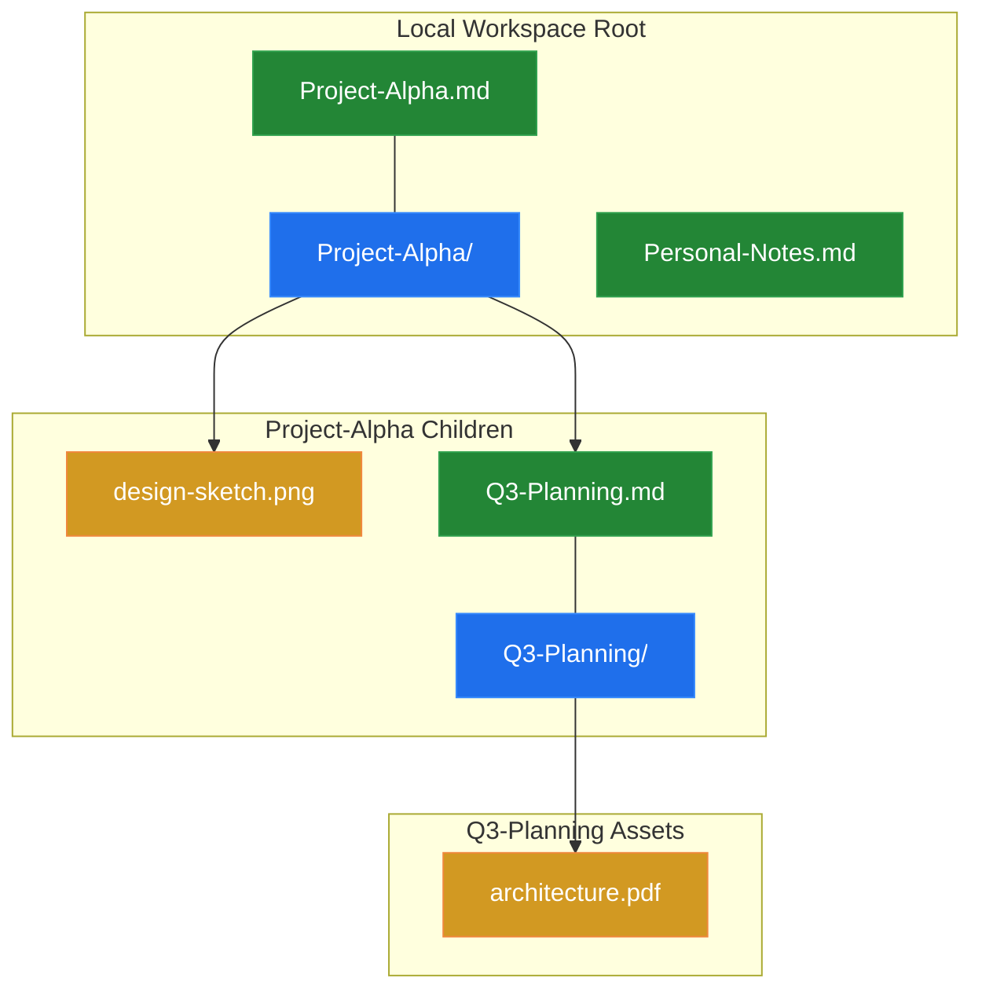
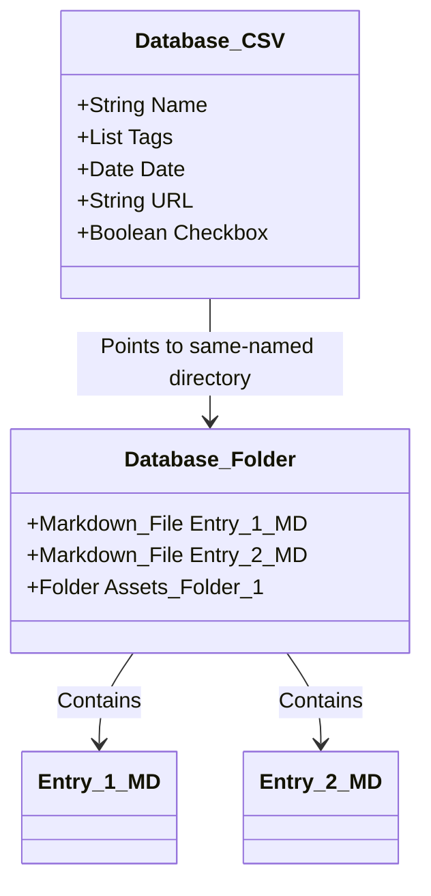
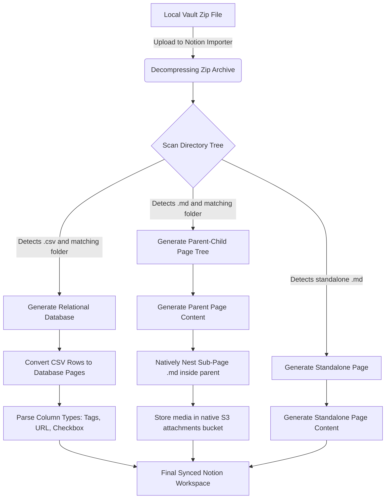

# Notion Backup Structure & Anatomy

Understanding the underlying mechanics of Notion's import/export architecture is critical for programmatically reconstructing, backing up, or migrating workspace data. This document outlines the exact rules, folder structures, naming conventions, and database schema mappings used by Notion, along with visual guides using Mermaid.

---

## 1. The Anatomy of a Notion Export

Notion backups (exports) typically come as a compressed `.zip` archive containing Markdown files (`.md`), Comma-Separated Values files (`.csv`), and matching sub-folders.

### A. The 32-Character Hexadecimal Page ID Scheme
When Notion exports a page or a database, it appends a unique 32-character hexadecimal string (a standard UUID v4 with hyphens removed) to the file or directory name.
* **Example File:** `Knowledge 21cb6c26d9ba808da8d4f72eb2193ca2.md`
* **Example Asset Folder:** `Knowledge 21cb6c26d9ba808da8d4f72eb2193ca2/`

#### Why Notion Uses Hex IDs:
1. **Collision Avoidance:** Multiple pages can share the exact same user-facing title (e.g., "To do"). The 32-character ID ensures that their corresponding markdown files and folders do not collide on the local filesystem.
2. **Global Relational Integrity:** When pages are nested inside databases or cross-linked via relation properties, Notion's importer uses these 32-character hashes to reconstruct the correct graph of pointers and links.
3. **Internal Backlink Mapping:** If you import a zip containing links like `[My Page](My%20Page%2021cb6c26d9ba808da8d4f72eb2193ca2.md)`, Notion parses the hex string to associate the imported document with its pre-existing or co-imported target, instantly spinning up native Notion backlinks.

---

### B. Spaces and Percent-Encoding
Operating systems allow literal spaces in filenames, but web browsers and markdown parsers require URL-friendly referencing.
* **Local Storage:** Files on disk store raw spaces, e.g. `My notes/To do/Addressing 2e9b6c26d9ba80e6bf63d8e1a49da87b.md`
* **Markdown Inline Pointers:** Links must represent these spaces using percent-encoding (`%20`), e.g. `[Addressing](To%20do/Addressing%202e9b6c26d9ba80e6bf63d8e1a49da87b.md)`

*Warning:* Case sensitivity and exact character matching are strictly enforced by the Notion importer. A link containing `To%20Do/` will fail to resolve if the matching folder on disk is named `To%20do/`.

---

### C. Standard Page & Sub-Page Trees
In Notion, there is no structural difference between a "folder" and a "page"—a page *is* a folder if it contains child elements. To replicate this locally, every parent markdown file sits side-by-side with a folder of the exact same name (minus the `.md` extension).

```text
my-local-vault/
│
├── Project-Alpha.md             <-- Parent Page (Holds text content and links)
├── Project-Alpha/               <-- Dedicated folder for Project-Alpha children/assets
│   ├── design-sketch.png        <-- Inline image asset
│   ├── Q3-Planning.md           <-- Nested sub-page
│   └── Q3-Planning/             <-- Dedicated folder for Q3-Planning assets
│       └── architecture.pdf
│
└── Personal-Notes.md            <-- Another Parent Page
```

Here is a visual representation of this hierarchical tree structure:



---

## 2. Relational Database / Inline Tables

Notion handles databases as structured collections where each row is an independent markdown page, and the overall table properties are stored in companion `.csv` files.

### Database Export Layout:
1. **The Parent Database File:** A `.csv` file named after the database containing columns for all structured properties (Tags, Date, Select options, Relations).
2. **The Content Folder:** A directory sitting next to the CSV containing a separate `.md` file for each row/page in the database.

```text
Docs/
│
├── My notes 21cb6c26d9ba81648e18c1761db2dcca.csv      <-- Database Schema & Metadata
├── My notes/                                          <-- Database Entry Folder
│   ├── To do 2e9b6c26d9ba80f780d7e00463b23078.md      <-- Database Entry Page
│   └── To-Do List 13cb6c26d9ba808ca4f9d290392ae099.md <-- Database Entry Page
```



---

## 3. Notion Importer Life Cycle & Edge Cases

When you zip and import local markdown files back into Notion, the platform executes a multi-step compilation process to ingest directories, parse tags, reconstruct databases, and link assets.



### Key Import Constraints & Edge Cases:

| Constraints / Scenarios | Notion Importer Behavior | Mitigation Strategy |
| :--- | :--- | :--- |
| **Path Traversal / `../`** | Notion importer struggles to resolve relative links pointing backwards up the folder chain (e.g., `../../Shared-Asset.png`). | Ensure all assets reside in a dedicated subdirectory beneath or adjacent to the referencing markdown file. |
| **Deep Directory Nesting** | Operating systems have path length limits (e.g., 260 chars on Windows). Deeply nested folders can cause silent zip corruption or import failure. | Limit nesting depth to 4 levels maximum. Flatten structures using descriptive prefixing if needed. |
| **Special Characters in Files** | Characters like `?`, `*`, `\`, `/`, `:` can break file paths, causing import failure. | Sanitize all filenames by stripping out filesystem-illegal characters before linking. |
| **Asset Extension Mismatches** | Capitalization differences (e.g. referencing `image.PNG` but file is named `image.png`) cause broken images inside Notion. | Enforce lowercase extensions and perform case-exact validation on all relative path links. |
| **Missing Companion Folders** | Linking to `Project-Alpha/sub-page.md` when the folder `Project-Alpha/` doesn't exist leads to dead links on import. | The local parser must verify and dynamically build matching folders for every document containing nested children. |
