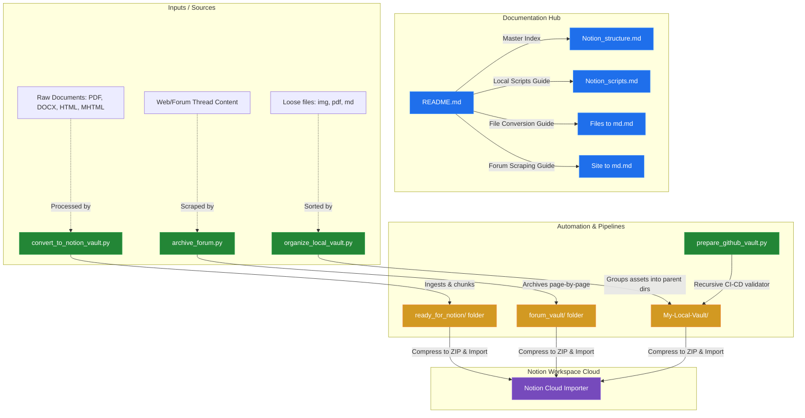

# Notion Backup Structure & Automation Ecosystem

Welcome to the ultimate repository and documentation ecosystem for managing, converting, organizing, and importing Markdown vaults into Notion with pixel-perfect compatibility.

This project outlines how Notion's hierarchical page and database backup model functions, and provides robust, enterprise-ready Python automation utilities to prepare local assets, convert raw document formats, crawl online forums, and validate structures for the Notion Importer.

---

## 1. System Landscape & Repository Directory

The diagram below outlines the entire system landscape of this repository, showing how each script, document, input source, and output directory relates to the Notion Cloud workspace.

---

## 2. Directory Index & Document Guides

### 📂 [Notion_structure.md](Notion_structure.md)
* **Description:** An in-depth analysis of how Notion handles exports and imports.
* **Topics Covered:**
  * Notion's 32-character hexadecimal page ID scheme.
  * Space percent-encoding (`%20`) and link matching rules.
  * Structural page-to-folder mapping and database schema CSV outputs.
* **Mermaid Charts:** Hierarchy Tree diagram, Database Schema class map, and Notion Importer Lifecycle pipeline.

### 📂 [Notion_scripts.md](Notion_scripts.md)
* **Description:** Complete guide and source code for workspace-management scripts.
* **Scripts Contained:**
  1. `organize_local_vault.py`: Automatically groups loose local assets sitting next to parent markdown files into matching folders and edits links accordingly.
  2. `prepare_github_vault.py`: Recursively crawls directory trees, validates reference formats, cleans up relative links, and fixes percent-encoding.
* **Mermaid Charts:** Step-by-step logic flowcharts for both local sorting and remote CI-CD checking processes.

### 📂 [Files to md.md](Files to md.md)
* **Description:** Multi-format local document ingestion pipeline.
* **Script Contained:**
  * `convert_to_notion_vault.py`: Automatically parses `.pdf`, `.docx`, `.html`, and `.mhtml` files, extracts embedded raw images, chunks long documents into sequential sub-pages (e.g. 10 pages per file), and outputs a nested master page with exact relative pointers.
* **Mermaid Charts:** Document Ingestion, Image Extraction, and Paragraph Chunking sequence flow.

### 📂 [Site to md.md](Site to md.md)
* **Description:** Headless forum thread downloader and archiver.
* **Script Contained:**
  * `archive_forum.py`: Connects to online forums (even with authentication payloads), handles session cookie validation, automatically traverses pagination buttons, extracts core content containers, downloads all referenced images, and outputs beautifully formatted sequential markdown files.
* **Mermaid Charts:** Session Scraper and Crawler pagination-loop logic.

---

## 3. How to Use These Tools

### Quick Start: Organizing Loose Assets
1. Copy the script from `Notion_scripts.md` as `organize_local_vault.py` into your unorganized notes folder.
2. Run `python organize_local_vault.py`.
3. Compress the folder as a `.zip` file, and upload it directly to Notion using **Import -> Markdown & CSV**.

### Quick Start: Large Document Conversion
1. Copy the script from `Files to md.md` as `convert_to_notion_vault.py` into a folder with your heavy PDFs or Word files.
2. Ensure you have installed standard parsing libraries: `pip install pymupdf python-docx beautifulsoup4`.
3. Create a `./my_raw_documents` folder next to the script and place your files inside.
4. Run `python convert_to_notion_vault.py` and import the generated zip file.

---

## 4. Key Best Practices for Notion Backups

1. **Avoid Nested Backlinks (`../../`):** Notion's importer fails to resolve paths that escape parent directories. Always reference assets residing in directories adjacent to or below the current Markdown file.
2. **Double-Check Hex Hash Collision:** Never alter the 32-character trailing strings of files if they originate from an export, as those hashes are what Notion uses to rebuild relational links on re-import.
3. **Percent-Encode Spaced Paths:** Keep folder and file names on disk with standard literal spaces, but ensure Markdown links percent-encode spaces as `%20` for smooth parsing.
