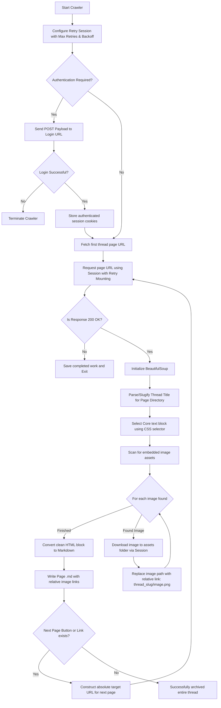

# Forum Site Archiver to Notion-Ready Markdown

This high-performance scraping and archiving utility converts online forum threads, paginated discussions, and adult platforms (such as Literotica, Xossipy, or standard XenForo/vBulletin message boards) into a structured local directory perfectly suited for importing into Notion. Each page of a thread is converted into an independent markdown document, and all embedded images are downloaded into a matching companion folder.

---

## 1. Authentication & Crawling Lifecycle

The following Mermaid diagram displays the architecture of the crawler, showing the retry-mounted session setup, authentication verification, HTML scraping, image downloading with link rewriting, and automated pagination traversal.



---

## 2. Installation & Prerequisites

To handle network requests with automated exponential retries and convert HTML fragments into standard Markdown syntax, install the required packages using:

```bash
pip install requests beautifulsoup4 markdownify urllib3
```

---

## 3. Crawler Script Code (`archive_forum.py`)

Save the script below as `archive_forum.py`. Configure the target thread URL, CSS selector, and optional login credentials at the bottom, then execute it.

```python
import os
import re
import requests
import urllib.parse
from bs4 import BeautifulSoup
from markdownify import markdownify as md
from requests.adapters import HTTPAdapter
from urllib3.util import Retry

def clean_filename(text):
    """Makes text completely safe for local file paths across different operating systems."""
    cleaned = re.sub(r'[\\/*?:"<>|]', "", text.strip())
    return re.sub(r'\s+', "-", cleaned)

def get_retry_session(retries=3, backoff_factor=1, status_forcelist=(500, 502, 503, 504)):
    """Initializes an HTTP Session with mounted adapters for automated exponential backoff retries."""
    session = requests.Session()
    retry_policy = Retry(
        total=retries,
        read=retries,
        connect=retries,
        backoff_factor=backoff_factor,
        status_forcelist=status_forcelist,
        raise_on_status=False
    )
    adapter = HTTPAdapter(max_retries=retry_policy)
    session.mount('http://', adapter)
    session.mount('https://', adapter)
    return session

class ForumArchiver:
    def __init__(self, output_dir="forum_vault"):
        self.session = get_retry_session()
        self.output_dir = os.path.normpath(output_dir)
        os.makedirs(self.output_dir, exist_ok=True)
        # Set standard browser user-agent to bypass primitive blocking headers
        self.session.headers.update({
            'User-Agent': 'Mozilla/5.0 (Windows NT 10.0; Win64; x64) AppleWebKit/537.36 (KHTML, like Gecko) Chrome/115.0.0.0 Safari/537.36'
        })

    def login_to_forum(self, login_url, payload):
        """Transmits POST payload to login, maintaining authenticated cookie state."""
        print(f"Attempting authentication at: {login_url}")
        try:
            response = self.session.post(login_url, data=payload, timeout=15)
            if response.status_code == 200:
                print("Login request sent. Cookie session updated.")
                return True
            print(f"Login failed with status code: {response.status_code}")
        except Exception as e:
            print(f"Network error during authentication: {str(e)}")
        return False

    def download_media(self, img_url, assets_folder):
        """Downloads external media using the robust retry session into the local assets folder."""
        try:
            parsed_img = urllib.parse.urlparse(img_url)
            clean_img_name = os.path.basename(parsed_img.path)
            if not clean_img_name:
                return None
            
            save_path = os.path.normpath(os.path.join(assets_folder, clean_img_name))

            # Traversal security check
            if not os.path.abspath(save_path).startswith(os.path.abspath(assets_folder)):
                print(f"[Media] Traversal attack blocked for asset: {img_url}")
                return None
            
            img_res = self.session.get(img_url, stream=True, timeout=15)
            if img_res.status_code == 200:
                with open(save_path, 'wb') as f:
                    for chunk in img_res.iter_content(4096):
                        f.write(chunk)
                return clean_img_name
        except Exception as e:
            print(f"Failed to download image from {img_url}: {str(e)}")
        return None

    def scrape_thread(self, first_page_url, content_css_selector):
        """
        Crawls a forum thread page-by-page until pagination ends.
        Saves each page as a safe, unquoted markdown file next to standard assets directories.
        """
        current_url = first_page_url
        page_counter = 1
        
        # Pull thread title slug from the initial URL
        parsed_url = urllib.parse.urlparse(current_url)
        url_path = parsed_url.path
        thread_slug = clean_filename(url_path.split('/')[-1].replace('.html', ''))
        if not thread_slug:
            thread_slug = f"thread-archive-{hash(first_page_url)}"

        # Prepare normalized directories
        thread_assets_dir = os.path.normpath(os.path.join(self.output_dir, thread_slug))

        # Traversal check
        if not os.path.abspath(thread_assets_dir).startswith(os.path.abspath(self.output_dir)):
            print(f"[Crawler] Terminated: Target directory resolves outside of vault: {thread_slug}")
            return

        os.makedirs(thread_assets_dir, exist_ok=True)

        while current_url:
            print(f"Archiving Page {page_counter}: {current_url}")
            try:
                res = self.session.get(current_url, timeout=15)
                if res.status_code != 200:
                    print(f"Failed to retrieve page {page_counter} (Status: {res.status_code}). Stopping crawl.")
                    break
            except Exception as e:
                print(f"Network error on page {page_counter}: {str(e)}. Stopping crawl.")
                break

            soup = BeautifulSoup(res.text, 'html.parser')
            
            # Isolate the core page text container (bypassing sidebars, footprints, and ads)
            content_block = soup.select_one(content_css_selector)
            if not content_block:
                print(f"Warning: Selector '{content_css_selector}' not found. Falling back to page body.")
                content_block = soup.body
                if not content_block:
                    print("Error: Empty page body. Skipping page.")
                    break

            # Find and download all images embedded in the content container
            for img_tag in content_block.find_all('img'):
                src_url = img_tag.get('src')
                if src_url and not src_url.startswith('data:'):
                    # Assemble full absolute URL if source is relative
                    if src_url.startswith('//'):
                        src_url = 'https:' + src_url
                    elif src_url.startswith('/'):
                        base_domain = f"{parsed_url.scheme}://{parsed_url.netloc}"
                        src_url = urllib.parse.urljoin(base_domain, src_url)
                    elif not src_url.startswith('http'):
                        src_url = urllib.parse.urljoin(current_url, src_url)
                        
                    local_img_name = self.download_media(src_url, thread_assets_dir)
                    if local_img_name:
                        # Re-point the HTML source to the relative location, safely percent-encoded
                        encoded_thread_slug = urllib.parse.quote(thread_slug)
                        encoded_img_name = urllib.parse.quote(local_img_name)
                        img_tag['src'] = f"{encoded_thread_slug}/{encoded_img_name}"

            # Convert HTML slice into clean Markdown
            markdown_text = md(str(content_block), heading_style="ATX")

            # Save the file cleanly
            md_filename = f"{thread_slug}-Page-{page_counter}.md"
            md_file_path = os.path.normpath(os.path.join(self.output_dir, md_filename))
            
            with open(md_file_path, 'w', encoding='utf-8') as f:
                f.write(f"# Page {page_counter}\n\n")
                f.write(f"Source URL: {current_url}\n\n---\n\n")
                f.write(markdown_text)

            print(f"Saved page file: {md_filename}")

            # Detect next-page button using standard anchor search logic
            next_link_tag = (
                soup.find('a', text=re.compile(r'Next|>', re.IGNORECASE)) or
                soup.find('a', class_=re.compile(r'next', re.IGNORECASE))
            )
            
            if next_link_tag and next_link_tag.get('href'):
                next_href = next_link_tag.get('href')
                current_url = urllib.parse.urljoin(current_url, next_href)
                page_counter += 1
            else:
                current_url = None  # End loop cleanly

        print(f"Crawl completed. Outputs stored in '{self.output_dir}/{thread_slug}'\n")

if __name__ == "__main__":
    archiver = ForumArchiver(output_dir="./forum_vault")

    # Example 1: Authenticated session configuration
    # Check your target site's inspect panel to configure fields like 'username', 'login', etc.
    LOGIN_URL = "https://example-forum-auth.com/login.php"
    LOGIN_DATA = {
        'username': 'YOUR_ACCOUNT_NAME',
        'password': 'YOUR_PASSWORD'
    }
    # archiver.login_to_forum(LOGIN_URL, LOGIN_DATA)

    # Example 2: Target thread and text selection parameters
    # The CSS selector maps to the exact tag containing the story or post content.
    TARGET_THREAD_URL = "https://www.literotica.com/s/example-sample-story-slug"
    CONTENT_SELECTOR = "div.b-story-body-p" 

    # To trigger a sample run, uncomment the line below with a valid target:
    # archiver.scrape_thread(TARGET_THREAD_URL, content_css_selector=CONTENT_SELECTOR)
```
