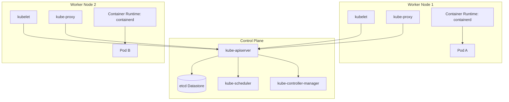

# Advanced Kubernetes & Cloud Native Architecture Cheatsheet

Production-grade cheat sheet covering Kubernetes internals, Operator patterns, Custom Resource Definitions (CRDs), Pod Priority, Affinity/Anti-Affinity, Ingress Controllers, StatefulSets, Network Policies, and Cluster Observability.

---

## 1. Kubernetes Control Plane & Architecture



---

## 2. Pod Scheduling: Node Affinity & Anti-Affinity

Control exact scheduling placements to guarantee high availability and resource affinity.

```yaml
apiVersion: apps/v1
kind: Deployment
metadata:
  name: production-api-server
  namespace: production
spec:
  replicas: 3
  selector:
    matchLabels:
      app: api-server
  template:
    metadata:
      labels:
        app: api-server
    spec:
      affinity:
        # Prefer scheduled nodes with high-performance SSD storage
        nodeAffinity:
          preferredDuringSchedulingIgnoredDuringExecution:
          - weight: 100
            preference:
              matchExpressions:
              - key: disktype
                operator: In
                values:
                - ssd
        # Require Pods to be distributed across distinct Availability Zones
        podAntiAffinity:
          requiredDuringSchedulingIgnoredDuringExecution:
          - labelSelector:
              matchExpressions:
              - key: app
                operator: In
                values:
                - api-server
            topologyKey: topology.kubernetes.io/zone
      containers:
      - name: api
        image: registry.example.com/api:v2.4.0
        resources:
          limits:
            cpu: "2"
            memory: 4Gi
          requests:
            cpu: 500m
            memory: 1Gi
```

---

## 3. Strict Network Policies (Zero Trust Firewall)

Isolate pod traffic using CNI (e.g. Cilium, Calico) NetworkPolicies.

```yaml
apiVersion: networking.k8s.io/v1
kind: NetworkPolicy
metadata:
  name: db-strict-isolation
  namespace: production
spec:
  podSelector:
    matchLabels:
      app: postgres-db
  policyTypes:
  - Ingress
  - Egress
  ingress:
  # Only allow traffic originating from frontend API pods on port 5432
  - from:
    - podSelector:
        matchLabels:
          app: api-server
    ports:
    - protocol: TCP
      port: 5432
  egress:
  # Allow internal DNS queries only
  - to:
    - namespaceSelector: {}
      podSelector:
        matchLabels:
          k8s-app: kube-dns
    ports:
    - protocol: UDP
      port: 53
```

---

## 4. Custom Resource Definition (CRD) & Controller Pattern

```yaml
apiVersion: apiextensions.k8s.io/v1
kind: CustomResourceDefinition
metadata:
  name: databases.infrastructure.example.com
spec:
  group: infrastructure.example.com
  versions:
    - name: v1alpha1
      served: true
      storage: true
      schema:
        openAPIV3Schema:
          type: object
          properties:
            spec:
              type: object
              properties:
                storageGb:
                  type: integer
                  minimum: 10
                engineVersion:
                  type: string
  scope: Namespaced
  names:
    plural: databases
    singular: database
    kind: Database
    shortNames:
    - db
```

---

## 5. Essential `kubectl` Troubleshooting Commands

```bash
# Debug pod pending / failure states with deep details
kubectl describe pod <pod-name> -n <namespace>

# Stream logs across all pods matching a label
kubectl logs -l app=api-server --all-containers=true -f --tail=100 -n production

# Execute ephemeral debug container inside a running pod
kubectl debug -it <pod-name> --image=busybox:1.36 --target=<container-name> -n production

# Inspect cluster resource utilization metrics
kubectl top nodes
kubectl top pods -n production --sort-by=cpu

# Trace API server requests with verbose verbosity
kubectl get pods --v=8
```

---

## Best Practices & Production Standards

1. **Explicit Resource Allocation**: Always declare both `requests` and `limits` for CPU and Memory to prevent OOMKills and ensure predictable QoS classes (`Guaranteed`).
2. **PodDisruptionBudgets (PDB)**: Configure PDBs for critical deployments to preserve quorum during node drains and cluster upgrades.
3. **Readiness & Liveness Probes**: Distinguish Liveness (restarts hanging pods) from Readiness (stops traffic routing during warm-up).

---

## Common Mistakes & Troubleshooting

1. **Using `latest` Container Tags**: Prevents immutability and can break rollbacks. Always pin specific digest hashes or semantic version tags.
2. **Missing Pod Security Standards**: Running containers as `root` user. Always set `securityContext.runAsNonRoot: true` and `readOnlyRootFilesystem: true`.

---

## Core Interview Questions

1. **Q: Explain the difference between `kube-proxy` iptables mode and IPVS/eBPF mode (Cilium).**
   - **A**: `iptables` evaluates rules sequentially $O(N)$, causing high latency at high pod counts. `IPVS` and eBPF (Cilium) use hash tables / kernel BPF maps $O(1)$ for scalable packet routing.

---

## Related Cheatsheets & References

- [Kubernetes Basics Cheatsheet](kubernetes-cheatsheet.md)
- [Docker Cheatsheet](docker-cheatsheet.md)
- [Helm Cheatsheet](helm-cheatsheet.md)
- [GitOps & ArgoCD Cheatsheet](gitops-argocd-cheatsheet.md)
