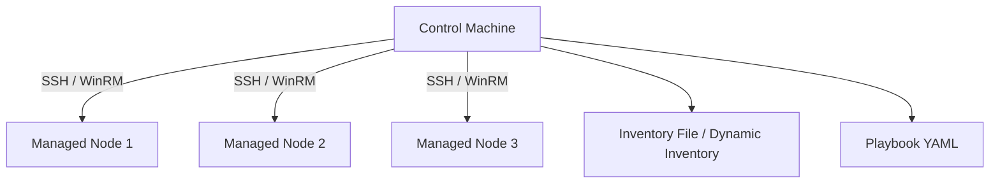

# Ansible Cheatsheet

Ansible is an open-source IT automation engine that automates cloud provisioning, configuration management, application deployment, intra-service orchestration, and many other IT needs.

---

## 1. Architecture & Execution Flow

Ansible works by connecting to your nodes and pushing out small programs, called "Ansible modules" to them. Ansible executes these modules over SSH by default and removes them when finished.



---

## 2. Key Commands & Syntax

### Ad-hoc Commands
```bash
# Ping all hosts in inventory
ansible all -m ping -i inventory.ini

# Check disk space on webservers group
ansible webservers -m command -a "df -h" -i inventory.ini

# Install package with elevate privileges (sudo)
ansible dbservers -m apt -a "name=postgresql state=present" --become -i inventory.ini
```

### Running Playbooks
```bash
# Syntax check
ansible-playbook -i inventory.ini playbook.yml --syntax-check

# Dry-run (Check mode)
ansible-playbook -i inventory.ini playbook.yml --check --diff

# Execute playbook
ansible-playbook -i inventory.ini playbook.yml --become
```

---

## 3. Playbook Example

```yaml
---
- name: Configure Web Server
  hosts: webservers
  become: true
  vars:
    http_port: 80
    max_clients: 200

  tasks:
    - name: Ensure Nginx is installed
      ansible.builtin.apt:
        name: nginx
        state: present
        update_cache: yes

    - name: Copy Nginx configuration
      ansible.builtin.template:
        src: templates/nginx.conf.j2
        dest: /etc/nginx/nginx.conf
      notify: Restart Nginx

    - name: Ensure Nginx is started and enabled
      ansible.builtin.service:
        name: nginx
        state: started
        enabled: true

  handlers:
    - name: Restart Nginx
      ansible.builtin.service:
        name: nginx
        state: restarted
```

---

## Best Practices & Production Standards

1. **Use Roles:** Structure playbooks into roles (`roles/common/tasks/main.yml`) for reusability and clean modular design.
2. **Use Ansible Vault for Secrets:** Encrypt passwords, API keys, and private certificates using `ansible-vault encrypt vars/secrets.yml`.
3. **Ensure Idempotency:** Write tasks so that running them multiple times produces the same outcome without unexpected side effects. Avoid using raw `command` or `shell` modules when standard modules exist.

---

## Common Pitfalls & Troubleshooting

- **SSH Connection Failures:** Ensure public keys are authorized on target nodes (`ssh-copy-id user@host`) and host key checking is configured properly in `ansible.cfg`.
- **YAML Formatting Errors:** Ensure strict 2-space indentation. Avoid mixing tabs and spaces.

---

## Core Interview Questions

1. **Q: What is the difference between `command` and `shell` modules in Ansible?**
   - **A**: The `command` module executes commands without running them through a shell, meaning shell environment variables and operators like `|`, `>`, `<` won't work. The `shell` module executes through `/bin/sh` and supports pipes and redirects.

---

## Related Cheatsheets

- [Master Index](../Cheatsheets.html)
- [Linux Commands Cheatsheet](linux-cheatsheet.md)
- [Terraform Cheatsheet](terraform-cheatsheet.md)
- [Docker Cheatsheet](docker-cheatsheet.md)
