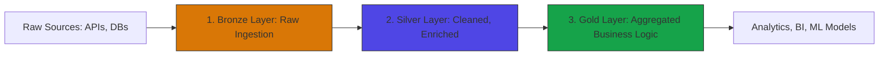

# Data Engineering Cheatsheet

Data Engineering is the practice of designing, building, testing, and maintaining systems for collecting, storing, transforming, and analyzing data at scale.

---

## 1. Relational (OLTP) vs Analytical (OLAP) Systems

| Feature | OLTP (On-Line Transactional Processing) | OLAP (On-Line Analytical Processing) |
|---|---|---|
| **Primary Use** | Real-time database operations (Inserts/Updates) | Heavy analytics, trend analysis, reporting |
| **Data Schema** | Highly normalized (3rd Normal Form) to avoid redundancy | Denormalized (Star / Snowflake schemas) |
| **Storage Style** | Row-oriented (e.g., PostgreSQL, MySQL) | Column-oriented (e.g., Snowflake, BigQuery, Redshift) |
| **Query Profile** | Fast lookup of single records by primary key | Multi-column aggregations over millions of rows |

---

## 2. Distributed Compute Core Concepts

To process massive datasets that exceed the memory and storage capacity of a single machine, analytical systems distribute the workload across a cluster of nodes.

```text
               Driver / Master Node
             /          |           \
     Worker Node    Worker Node    Worker Node
```

* **Partitioning:** Splitting a massive table into smaller physical chunks (files/directories) based on a partition column (e.g., `year` or `date`). This allows query engines to skip unneeded data, speeding up execution and reducing costs.
* **Shuffling:** The process of redistributing data across worker nodes in a cluster (typically during a join or group-by operation). Shuffling requires heavy network I/O and is the most common performance bottleneck in distributed compute engines like Apache Spark.
* **Broadcast Join:** An optimized join strategy where the master node sends a copy of a small table to all worker nodes. This allows them to join the small table to partition subsets of a large table locally, completely avoiding a shuffle step.

---

## 3. The Medallion Lakehouse Architecture

The Medallion Architecture describes a series of data layers that denote the structure and quality of data stored in a modern data lakehouse (e.g., delta lake, Apache Iceberg).



1. **Bronze Layer (Raw):** Replicates the source system data exactly as-is. It preserves full historical fidelity and contains raw payloads, timestamps, and unmatched schemas.
2. **Silver Layer (Cleaned & Conformed):** Data is parsed, validated, de-duplicated, and conformed to a clean relational schema. Silver tables represent the "single source of truth" for enterprise-wide queries.
3. **Gold Layer (Curated & Aggregated):** High-level business-level aggregations and star-schema dimensional modeling. Gold tables are highly optimized for direct business intelligence, reporting, and dashboard consumption.

---

## 4. Advanced Partitioning vs. Clustering Strategies

When structuring large analytical tables, optimizing file layouts is crucial:

* **Partitioning:** Grouping files physically into nested directory structures on disk (e.g., `/year=2026/month=03/`).
  * *Best for:* Columns with **low cardinality** (typically < 100 distinct values) like `region`, `year`, or `status`.
  * *Avoid:* High cardinality columns (e.g., `user_id` or `timestamp`), which lead to the **"Small File Problem"** (millions of tiny files causing extreme metadata overhead on the storage client).
* **Clustering (Z-Ordering / Liquid Clustering):** Sorting data within physical files to co-locate related records.
  * *Best for:* Columns with **high cardinality** that are frequently filtered in SQL `WHERE` clauses (e.g., `user_id`, `product_id`). It allows query engines to skip blocks of data within files.

---

## 5. Batch vs. Stream Processing

| Feature | Batch Processing (e.g., Spark Batch, dbt) | Stream Processing (e.g., Flink, Spark Streaming, Kafka) |
|---|---|---|
| **Data Boundary** | Bounded (historical collections) | Unbounded (infinite live events) |
| **Latency** | Hours, days, or minutes | Sub-second to seconds |
| **State Management** | Simple, run-and-done execution | Complex, requires stateful checkpoints |
| **Typical Use Cases** | Daily financial consolidation, monthly reports | Live fraud detection, real-time dashboard updates |

---

## 6. Troubleshooting & Debugging Spark OOM (Out Of Memory)

When Apache Spark jobs fail with `java.lang.OutOfMemoryError`, apply these diagnostic steps:

1. **Identify the Memory Category:**
   * **Driver OOM:** Often caused by calling `.collect()` on a large DataFrame, bringing millions of records into the single driver node's memory. *Fix: Use `.take(n)` or write aggregations directly to cloud storage.*
   * **Executor OOM:** Caused by memory leaks, high concurrency, or massive partition skew during shuffling.
2. **Mitigate Data Skew:**
   * If one worker node takes 10x longer and runs out of memory, look for skewed keys in join/group operations.
   * *Fix: Implement **Salting** (appending a random integer suffix to skew keys to distribute them evenly across partition targets).*
3. **Adjust Executor Memory Configurations:**
   ```properties
   spark.executor.memory = 8g
   spark.executor.cores = 4
   spark.sql.shuffle.partitions = 200
   ```

---

## 7. Common Mistakes & Antipatterns

* **The Small File Problem:** Ingestion systems writing small files (e.g., 10KB every minute) directly to a data lake. Reading 10,000 files of 10KB is up to 100x slower than reading one consolidated 100MB file. *Solution: Schedule routine file compaction (Optimize/Vacuum jobs).*
* **Hardcoded Schemas in Pipelines:** Designing pipelines that crash immediately when a source database adds or modifies a column. *Solution: Implement robust Schema Evolution or parse payloads dynamically using semi-structured types (JSON/JSONB).*
* **Over-Partitioning:** Partitioning a table by both `day` and `user_id`, creating millions of empty physical subdirectories. *Solution: Keep total partitions under a few thousand maximum.*

---

## 8. Core Interview Questions & Answers

* **Q: Explain the difference between ETL (Extract, Transform, Load) and ELT (Extract, Load, Transform).**
  * **A:** **ETL** performs transformations on an external compute server *before* loading the cleaned data into the target database. It is useful for legacy systems with limited processing power. **ELT** loads raw data directly into the target cloud data warehouse first and uses the massive distributed compute power of the modern warehouse (e.g., Snowflake, BigQuery) to perform transformations (often using SQL/dbt).
* **Q: What is data skew in distributed systems, and how do you resolve it?**
  * **A:** Data skew occurs when data is unevenly distributed across partitions. For example, if we group by `country` and 90% of our customers are in the `US`, the worker node processing the `US` partition will do 90% of the work, while other workers sit idle. It can be resolved by **salting** the join key (adding random numbers to distribute the keys) or utilizing broadcast joins for small side tables.

---

## Related Cheatsheets & References

- [ETL & ELT Cheatsheet](etl-elt-cheatsheet.md)
- [SQL Cheatsheet](sql-cheatsheet.md)
- [Database Comparison Cheatsheet](database-comparison-cheatsheet.md)
- [PostgreSQL Cheatsheet](postgres-cheatsheet.md)
- [Multi-Cloud Cost Optimization Cheatsheet](multi-cloud-cost-optimization-cheatsheet.md)
- [Master Directory Index](../Cheatsheets.html)
- [Knowledge Hub Portal](../Knowledge%2021cb6c26d9ba808da8d4f72eb2193ca2.html)
