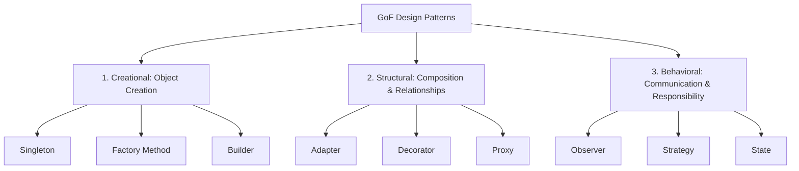
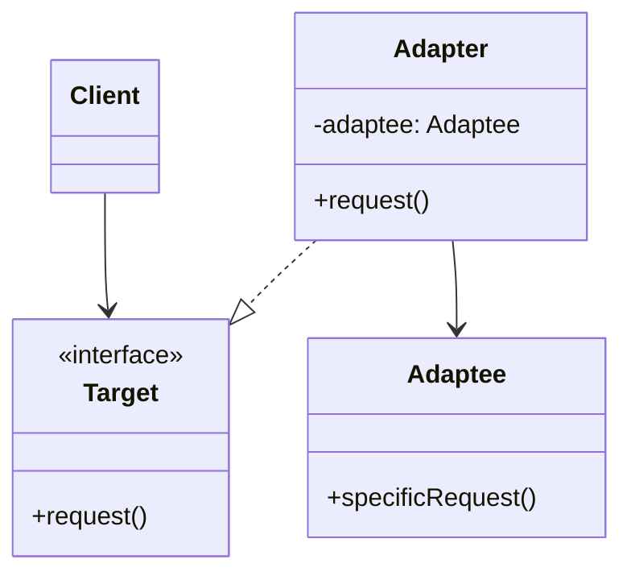

# Software Design Patterns Cheatsheet

A developer's guide to reusable software design patterns, categorized into Creational, Structural, and Behavioral styles. Each pattern includes definitions, code implementations in Python/TypeScript, real-world use cases, and structural diagrams.

---

## 1. Classification Overview

Design patterns are divided into three primary categories based on how they solve software complexity:



---

## 2. Creational Patterns

Creational patterns handle object creation mechanisms, optimizing reuse and decoupling client code from instantiation logic.

### Singleton
Guarantees a class has only one instance and provides a global access point to it.
* **Use Case:** Database connection pools, Logger classes, Configuration managers.

#### Python Implementation
```python
class SingletonMeta(type):
    _instances = {}
    def __call__(cls, *args, **kwargs):
        if cls not in cls._instances:
            cls._instances[cls] = super().__call__(*args, **kwargs)
        return cls._instances[cls]

class DatabaseConnectionPool(metaclass=SingletonMeta):
    def __init__(self):
        self.connected = True
```

### Factory Method
Defines an interface for creating an object, but lets subclasses decide which class to instantiate.
* **Use Case:** Payment gateway integrations (Stripe, PayPal, ApplePay) initialized dynamically at runtime based on user preference.

#### TypeScript Implementation
```typescript
interface PaymentGateway {
  processPayment(amount: number): void;
}

class StripeGateway implements PaymentGateway {
  processPayment(amount: number) { console.log(`Stripe processed $${amount}`); }
}

class PayPalGateway implements PaymentGateway {
  processPayment(amount: number) { console.log(`PayPal processed $${amount}`); }
}

class GatewayFactory {
  static createGateway(type: "stripe" | "paypal"): PaymentGateway {
    if (type === "stripe") return new StripeGateway();
    if (type === "paypal") return new PayPalGateway();
    throw new Error("Unknown gateway type");
  }
}
```

---

## 3. Structural Patterns

Structural patterns explain how to assemble objects and classes into larger structures while keeping these structures flexible and efficient.

### Adapter (Wrapper)
Allows objects with incompatible interfaces to collaborate.
* **Use Case:** Integrating third-party XML/JSON libraries, legacy system migrations.



### Decorator (Wrapper)
Attaches new behaviors to objects dynamically by placing them inside special wrapper objects.
* **Use Case:** Middlewares in web frameworks, logging decorators, stream processing buffers.

#### Python Implementation
```python
import functools

def log_transaction(func):
    @functools.wraps(func)
    def wrapper(*args, **kwargs):
        print("[AUDIT] Transaction started.")
        result = func(*args, **kwargs)
        print("[AUDIT] Transaction completed successfully.")
        return result
    return wrapper

@log_transaction
def transfer_funds(amount: float):
    print(f"Transferred ${amount}")
```

---

## 4. Behavioral Patterns

Behavioral patterns focus on algorithms and the assignment of responsibilities between objects.

### Observer (Publish-Subscribe)
Defines a subscription mechanism to notify multiple objects about any events that happen to the object they're observing.
* **Use Case:** Real-time push notifications, event-driven web sockets, state management (RxJS, Redux).

#### TypeScript Implementation
```typescript
interface Observer {
  update(message: string): void;
}

class UserClient implements Observer {
  constructor(private username: string) {}
  update(message: string) {
    console.log(`[Notification for ${this.username}]: ${message}`);
  }
}

class NotificationService {
  private observers: Observer[] = [];

  subscribe(obs: Observer) { this.observers.push(obs); }
  unsubscribe(obs: Observer) {
    this.observers = this.observers.filter(o => o !== obs);
  }
  notify(message: string) {
    this.observers.forEach(obs => obs.update(message));
  }
}
```

### Strategy
Defines a family of algorithms, encapsulates each one, and makes them interchangeable. Strategy lets the algorithm vary independently of the clients that use it.
* **Use Case:** Sorting algorithms, routing engines (fastest path vs eco path), image compression formats.

---

## 5. Summary Cheat Sheet

| Design Pattern | Category | Intent | Real-world Analogy / Use Case |
| :--- | :---: | :--- | :--- |
| **Singleton** | Creational | Unique global instance. | Configuration load / Memory logging |
| **Factory Method**| Creational | Subclasses defer instantiation. | Dynamic UI elements or payment connectors |
| **Builder** | Creational | Step-by-step complex construction. | HTML Document Generator, SQL query builder |
| **Adapter** | Structural | Interface compatibility. | Memory card reader to USB port |
| **Decorator** | Structural | Dynamic behavior addition. | Coffee base + Milk + Sugar additives |
| **Facade** | Structural | Simplified portal to complex subsystems. | A remote controller or unified payment API |
| **Proxy** | Structural | Access control & caching agent. | Content Delivery Network (CDN) caching layer |
| **Observer** | Behavioral | One-to-many state propagation. | YouTube channel notify subscribers |
| **Strategy** | Behavioral | Interchangeable algorithms. | Selecting GPS routes (walk, drive, fly) |
| **State** | Behavioral | State-dependent class actions. | Vending machine (has coin, out of stock, dispensing) |

---

## 6. Common Mistakes & Pitfalls

1. **Over-engineering:** Applying complex patterns (like Abstract Factory or Strategy) where a simple `if/else` block or plain function call is sufficient. Keep code as simple as possible.
2. **Abusing Singletons:** Singletons can introduce global state, making unit testing difficult due to shared state pollution between tests. Prefer Dependency Injection (DI) instead.
3. **Violating LSP (Liskov Substitution Principle):** Creating structural hierarchies or adapters that crash or throw errors when substituted for parent interfaces.

---

## 7. Architectural Pattern Interview Questions

1. **Q: What is the difference between Factory Method and Abstract Factory?**
   - **A**: Factory Method uses inheritance to defer object instantiation to subclasses. Abstract Factory uses composition, providing an interface to instantiate families of related or dependent objects without specifying their concrete classes.
2. **Q: How does the Strategy pattern differ from the State pattern?**
   - **A**: They share similar structures (both rely on composition and delegate work to concrete class interfaces). However, in the **Strategy** pattern, strategies are completely independent and don't know about each other; the client chooses the strategy. In the **State** pattern, the states can trigger transitions to other states dynamically under context conditions.

---

## Related Cheatsheets & References

- [System Design Cheatsheet](system-design-cheatsheet.md)
- [Microservices Cheatsheet](microservices-cheatsheet.md)
- [TypeScript Cheatsheet](typescript-cheatsheet.md)
- [Master Directory Index](../Cheatsheets.html)
