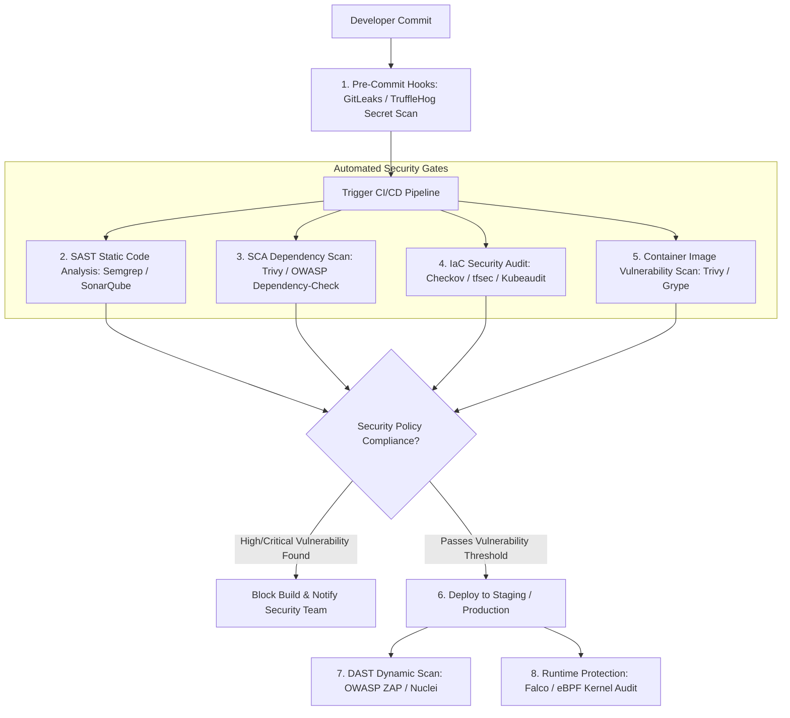

# DevSecOps & Cloud Security Engineering Cheatsheet

DevSecOps embeds automated security checks, vulnerability scanning, secret detection, container hardening, and compliance policies into every phase of the CI/CD software development lifecycle (SDLC).

---

## 1. Automated DevSecOps CI/CD Security Pipeline



---

## 2. Supply Chain Security & Container Hardening

### Multi-Stage Distroless Dockerfile (`Dockerfile`)
```dockerfile
# Stage 1: Build & Compile Environment
FROM golang:1.22-alpine AS builder
WORKDIR /app
COPY go.mod go.sum ./
RUN go mod download
COPY . .
RUN CGO_ENABLED=0 GOOS=linux go build -ldflags="-s -w" -o server .

# Stage 2: Hardened Runtime Distroless (Non-Root User)
FROM gcr.io/distroless/static-debian12:nonroot
WORKDIR /
COPY --from=builder /app/server /server
USER nonroot:nonroot
EXPOSE 8080
ENTRYPOINT ["/server"]
```

---

## 3. GitHub Actions DevSecOps Pipeline (`.github/workflows/security.yml`)

```yaml
name: DevSecOps Automated Security Scan

on:
  push:
    branches: [main, develop]
  pull_request:

jobs:
  security-audit:
    runs-on: ubuntu-latest
    steps:
      - name: Checkout Source Code
        uses: actions/checkout@v4
        with:
          fetch-depth: 0

      - name: 1. Secret Scanning with GitLeaks
        uses: gitleaks/gitleaks-action@v2
        env:
          GITHUB_TOKEN: ${{ secrets.GITHUB_TOKEN }}

      - name: 2. SAST Code Scanning with Semgrep
        uses: returntocorp/semgrep-action@v1
        with:
          config: p/ci p/security-audit p/owasp-top-10

      - name: 3. IaC Security Audit with Checkov
        uses: bridgecrewio/checkov-action@master
        with:
          directory: ./terraform
          framework: terraform

      - name: 4. Build Docker Image
        run: docker build -t app/vault-service:${{ github.sha }} .

      - name: 5. Container Scanning with Trivy
        uses: aquasecurity/trivy-action@master
        with:
          image-ref: 'app/vault-service:${{ github.sha }}'
          format: 'table'
          exit-code: '1'
          ignore-unfixed: true
          vuln-type: 'os,library'
          severity: 'CRITICAL,HIGH'
```

---

## 4. Infrastructure as Code (IaC) Security with Checkov

### Scanning Terraform & Kubernetes Code
```bash
# Scan Terraform directory for misconfigurations
checkov -d ./terraform --framework terraform

# Scan Kubernetes manifests & Helm charts
checkov -d ./k8s --framework kubernetes

# Fail build only on High and Critical severity issues
checkov -d . --severity-threshold HIGH
```

---

## Related Cheatsheets

- [Master Index](../Cheatsheets.md)
- [Web Security Cheatsheet](web-security-cheatsheet.md)
- [Docker Cheatsheet](docker-cheatsheet.md)
- [GitHub Actions Cheatsheet](github-actions-cheatsheet.md)
