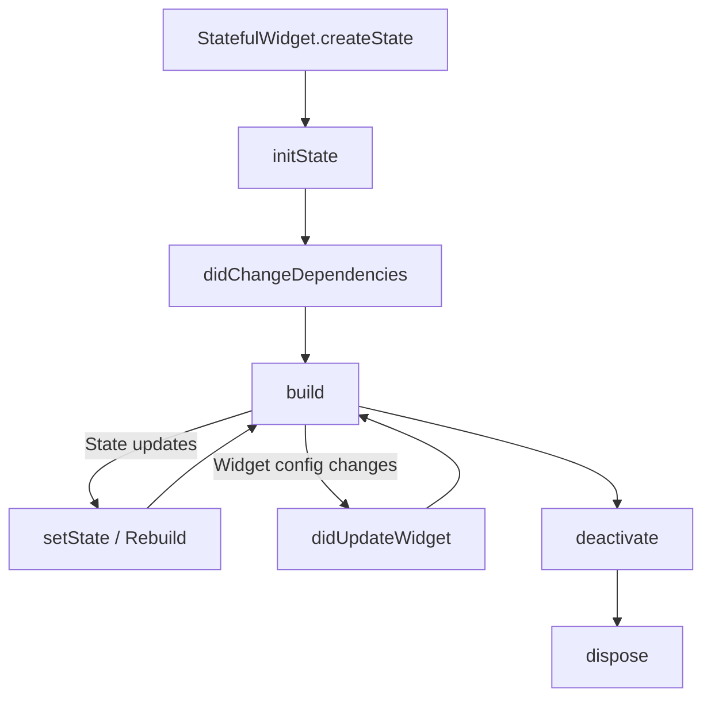

# Flutter & Dart Cheatsheet

Flutter is Google's UI toolkit for building beautiful, natively compiled applications for mobile, web, desktop, and embedded devices from a single codebase. Dart is the client-optimized programming language behind Flutter.

---

## 1. Dart Language Essentials

Dart is class-based, garbage-collected, and features sound null safety.

```dart
// Variables & Null Safety
String name = "Flutter";
int version = 3;
String? nullableString; // Can be null
String nonNullable = nullableString ?? "Default Value"; // Null fallback operator

// Functions
int add(int a, int b) => a + b; // Arrow syntax

// Collection structures
List<int> numbers = [1, 2, 3];
Map<String, int> scores = {'Alice': 95, 'Bob': 90};
Set<String> uniqueTags = {'mobile', 'web', 'desktop'};

// Collections operations & Cascade
var user = User()
  ..id = 1
  ..name = "Subbarao"
  ..loadData(); // Cascade operator (..)
```

---

## 2. Widget Lifecycle in Flutter

Widgets are the basic building blocks of a Flutter user interface.

### StatelessWidget
Immutable widgets that only rely on their configuration info and parent builders.
```dart
import 'package:flutter/material.dart';

class SimpleCard extends StatelessWidget {
  final String title;
  const SimpleCard({super.key, required this.title});

  @override
  Widget build(BuildContext context) {
    return Card(
      child: Padding(
        padding: const EdgeInsets.all(16.0),
        child: Text(title),
      ),
    );
  }
}
```

### StatefulWidget Lifecycle
Stateful widgets maintain state across rebuilds. Below is the sequential execution lifecycle of their state objects:



```dart
class CounterWidget extends StatefulWidget {
  const CounterWidget({super.key});

  @override
  State<CounterWidget> createState() => _CounterWidgetState();
}

class _CounterWidgetState extends State<CounterWidget> {
  int _counter = 0;

  @override
  void initState() {
    super.initState();
    // 1. Initial configuration, stream listeners, controllers init
  }

  @override
  void didChangeDependencies() {
    super.didChangeDependencies();
    // 2. Called when InheritedWidgets dependencies change
  }

  @override
  void didUpdateWidget(covariant CounterWidget oldWidget) {
    super.didUpdateWidget(oldWidget);
    // 3. Called when parent widget configuration updates
  }

  @override
  Widget build(BuildContext context) {
    // 4. Builds widget sub-tree
    return Text('Count: $_counter');
  }

  @override
  void deactivate() {
    // 5. Called when element is removed from the widget tree
    super.deactivate();
  }

  @override
  void dispose() {
    // 6. Final cleanup. Close controllers, cancel streams, timers
    super.dispose();
  }
}
```

---

## 3. Async Programming (Futures & Streams)

Dart uses an event loop structure for managing asynchronous tasks.

### Future (Single Async Result)
```dart
Future<String> fetchUserToken() async {
  await Future.delayed(const Duration(seconds: 2));
  return "tkn_8871ab93";
}

// Consuming Futures in Widgets via FutureBuilder
FutureBuilder<String>(
  future: fetchUserToken(),
  builder: (context, snapshot) {
    if (snapshot.connectionState == ConnectionState.waiting) {
      return const CircularProgressIndicator();
    } else if (snapshot.hasError) {
      return Text('Error: ${snapshot.error}');
    }
    return Text('Token: ${snapshot.data}');
  },
);
```

### Stream (Multiple Async Events)
```dart
Stream<int> countSeconds() async* {
  for (int i = 1; i <= 10; i++) {
    await Future.delayed(const Duration(seconds: 1));
    yield i; // yield values sequentially
  }
}
```

---

## 4. State Management Patterns

Managing application state cleanly across widget trees is a primary architecting concern in Flutter.

### 1. Provider Pattern (Simple & Clean)
Extends `ChangeNotifier` to dispatch updates to listeners.
```dart
import 'package:flutter/material.dart';

class CounterModel extends ChangeNotifier {
  int _count = 0;
  int get count => _count;

  void increment() {
    _count++;
    notifyListeners(); // Rebuilds listening widgets
  }
}

// Consuming inside build:
// final counter = Provider.of<CounterModel>(context);
// Text('${counter.count}');
```

### 2. Riverpod (Modern, Compile-Safe, Independent of BuildContext)
```dart
import 'package:flutter_riverpod/flutter_riverpod.dart';

final counterProvider = StateProvider<int>((ref) => 0);

class RiverpodCounter extends ConsumerWidget {
  const RiverpodCounter({super.key});

  @override
  Widget build(BuildContext context, WidgetRef ref) {
    final count = ref.watch(counterProvider);
    return ElevatedButton(
      onPressed: () => ref.read(counterProvider.notifier).state++,
      child: Text('Count: $count'),
    );
  }
}
```

---

## Best Practices & Production Standards

1. **Keep Builders Pure:** Never initiate fetch/network API triggers directly inside a widget's `build` method. Doing so spawns repeated network requests on every tick/re-render.
2. **Close Stream Controllers:** Always cancel stream subscriptions and close `TextEditingController` or `AnimationController` instances inside `dispose` to prevent severe memory leaks.
3. **Use Const Constructors:** Declare compile-time static widgets as `const` where possible. This tells Flutter to skip rebuilding those nodes entirely during UI refreshes.
4. **Use ListViews with `.builder`:** For infinite or long lists, always prefer `ListView.builder` over a standard column or un-templated `ListView`. The builder dynamically recycles views on scroll to maintain stable 60/120 FPS.

---

## Common Mistakes & Antipatterns

1. **Unbounded Layout Constraints:** Nesting a vertical `ListView` inside a standard vertical `Column` without constraints, causing a runtime layout exception ("Vertical viewport was given unbounded height"). Use `shrinkWrap: true` or wrap inside an `Expanded` widget.
2. **Calling setState after dispose:** Triggering asynchronous operations that call `setState` after the widget state is unmounted. Always guard with `if (mounted)` checking:
   ```dart
   if (mounted) {
     setState(() { _data = result; });
   }
   ```

---

## Troubleshooting & Debugging Guide

1. **Locating Overflows (Yellow/Black Bar):** If widgets exceed screens or parent containers, Flutter displays an overflow warning box. Wrap the overflowing elements inside `SingleChildScrollView` or use flexible layouts like `Flexible` or `Expanded`.
2. **Inspecting App Rendering via DevTools:** Open Flutter DevTools to inspect widget layout trees, memory allocations, CPU performance bottlenecks, or view frame rendering pipelines.

---

## Core Interview Questions & Answers

1. **Q: What is the difference between Hot Reload and Hot Restart in Flutter?**
   - **A**: **Hot Reload** compiles modified code files and injects them into the Dart Virtual Machine (VM) instantly. It updates classes/functions while keeping the current app state intact. **Hot Restart** loads code changes, resets the application state entirely, and restarts the Dart app, which takes slightly longer but guarantees clean structural sync.
2. **Q: Explain the role of Keys in Flutter (e.g., ValueKey, UniqueKey, GlobalKey).**
   - **A**: Keys preserve widget states when they are moved around in the widget tree. `ValueKey` compares widgets by concrete values (e.g. items in a list), `UniqueKey` forces a rebuild with a guaranteed unique identifier every render, and `GlobalKey` uniquely identifies elements across the entire app and allows fetching their state or element definitions directly.

---

## Related Cheatsheets & References

- [Kotlin & Android Cheatsheet](kotlin-cheatsheet.md)
- [Swift & SwiftUI Cheatsheet](swift-cheatsheet.md)
- [Master Directory Index](../Cheatsheets.html)
- [Knowledge Hub Portal](../Knowledge%2021cb6c26d9ba808da8d4f72eb2193ca2.html)
