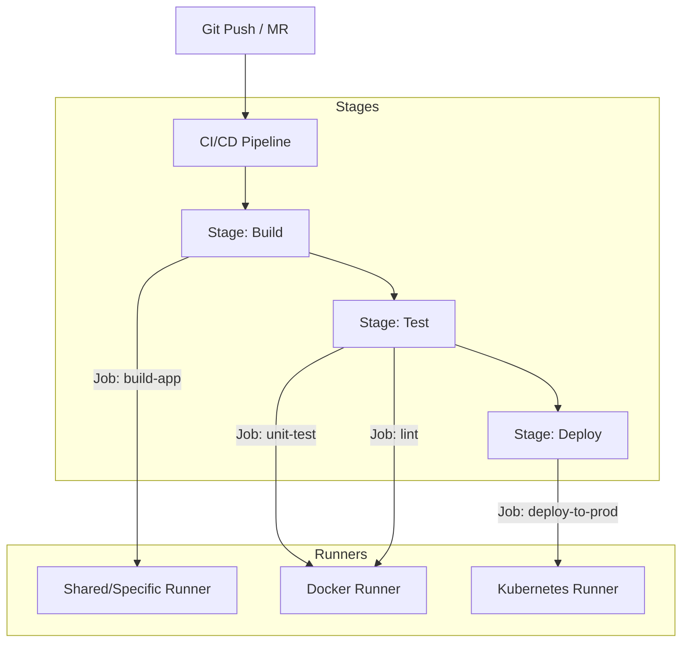

# GitLab CI/CD Cheatsheet

GitLab CI/CD is a powerful, integrated tool for software development using continuous integration, continuous delivery, and continuous deployment. It uses a declarative YAML configuration file (`.gitlab-ci.yml`) placed at the repository root.

---

## 1. Core Architecture Diagram

This diagram displays how a GitLab CI/CD Pipeline processes stages and jobs on various runners.



---

## 2. GitLab CI/CD YAML Components

| Key | Description |
|---|---|
| `stages` | Definition of the stages (order of execution) of the pipeline. |
| `image` | Specifies the Docker image used to execute the jobs (e.g. `python:3.12`). |
| `before_script` | Commands to run before each job's script. |
| `script` | Core shell commands to execute within the job runner environment. |
| `after_script` | Cleanup or reporting scripts to run after job execution (independent of success/failure). |
| `variables` | Global or job-level environment variables. |

---

## 3. Production-Ready `.gitlab-ci.yml` Template

Below is a fully functional, structured, and production-ready configuration file demonstrating caching, artifacts, manual triggers, and environment isolation.

```yaml
stages:
  - build
  - test
  - deploy

variables:
  DOCKER_DRIVER: overlay2
  POSTGRES_DB: test_db
  POSTGRES_USER: runner
  POSTGRES_PASSWORD: password123

default:
  image: node:20-alpine
  before_script:
    - npm ci --cache .npm/

cache:
  key:
    files:
      - package-lock.json
  paths:
    - .npm/
    - node_modules/

# --- BUILD JOB ---
build-app:
  stage: build
  script:
    - npm run build
  artifacts:
    name: "dist-artifact-$CI_COMMIT_REF_SLUG"
    paths:
      - dist/
    expire_in: 1 week

# --- TEST JOB ---
unit-tests:
  stage: test
  image: python:3.12-slim
  services:
    - name: postgres:15-alpine
      alias: db
  variables:
    DATABASE_URL: "postgresql://runner:password123@db:5432/test_db"
  before_script:
    - pip install -r requirements.txt
  script:
    - pytest tests/

# --- DEPLOY JOB ---
deploy-prod:
  stage: deploy
  image: alpine:latest
  script:
    - echo "Deploying application to Kubernetes cluster..."
    - apk add --no-cache curl
  rules:
    - if: '$CI_COMMIT_BRANCH == "main"'
      when: manual
  environment:
    name: production
    url: https://my-production-app.com
```

---

## 4. Cache vs Artifacts (Key Differences)

| Feature | Cache | Artifacts |
|---|---|---|
| **Primary Use** | Speeding up builds by reusing dependencies (e.g., packages, node_modules). | Passing build results (e.g., compiled binaries, dist bundle) between stages. |
| **Integrity** | Best-effort; not guaranteed to be present on the runner. | Guaranteed to exist and pass downstream. |
| **Storage** | Stored on the runner or distributed storage; can expire. | Uploaded to GitLab coordinator; can be browsed and downloaded from GitLab UI. |

---

## 5. Security & Best Practices

1. **Protect Variables**: Mark credentials, secrets, API tokens, and deployment keys as **Masked and Protected** in GitLab Settings (`Settings -> CI/CD -> Variables`).
2. **Never hardcode secrets**: Inject secrets from HashiCorp Vault or AWS Secrets Manager dynamically, or use GitLab's built-in JWT integration.
3. **Pin Docker Images**: Avoid using `latest` (e.g., use `alpine:3.19` instead of `alpine:latest`) to guarantee pipeline repeatability.
4. **Fast Failures**: Put fast, lightweight tests (linting, static analysis) in the earliest stage so pipelines abort quickly.

---

## 6. Interview Q&A

1. **Q: What is a GitLab Runner, and what are its types?**
   - **A**: A GitLab Runner is an isolated application that executes pipeline jobs.
     - **Shared Runners**: Available to all projects on GitLab.
     - **Group Runners**: Specific to all projects within a parent organization or group.
     - **Specific Runners**: Linked directly to a single specific repository for dedicated compute tasks.

2. **Q: How does `rules` compare with the older `only/except` syntax?**
   - **A**: `rules` is the modern and highly flexible replacement for `only/except`. It allows evaluate complex expressions, branch checks, files change detection, and variable checks to control job execution.

---

## Related Cheatsheets & References

- [Git Version Control Cheatsheet](git-cheatsheet.md)
- [Docker Containers Cheatsheet](docker-cheatsheet.md)
- [Kubernetes (K8s) Cheatsheet](kubernetes-cheatsheet.md)
- [Master Directory Index](../Cheatsheets.html)
