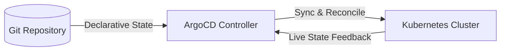

# GitOps & ArgoCD Cheatsheet

A production-ready reference guide for GitOps principles, ArgoCD architecture, deployment topologies, application lifecycle, sync policies, CLI usage, troubleshooting, and best practices.

---

## 1. Core GitOps Principles

GitOps is an operational framework that takes DevOps best practices used for application development—such as version control, collaboration, compliance, and CI/CD—and applies them to infrastructure and application deployment.



1. **Declarative State**: The entire system must be described declaratively (e.g., Kubernetes manifests, Helm charts, Kustomize).
2. **Version Controlled & Immutable**: The desired state is stored in Git, serving as the single source of truth.
3. **Automated Pull/Sync**: Approved changes in Git are automatically pulled and applied to the target environment.
4. **Continuous Reconciliation**: An automated agent (like ArgoCD) continuously monitors the live state and reconciles it with the desired state in Git, detecting and self-healing configuration drift.

---

## 2. ArgoCD Architecture Under the Hood

ArgoCD runs as a controller on a Kubernetes cluster. It consists of three primary components:

* **API Server**: A gRPC/REST server that exposes the Web UI, CLI, and integration APIs. It handles authentication, authorization (RBAC), and application operations.
* **Repository Server (`argocd-repo-server`)**: An internal service that maintains local clones of Git repositories containing manifests. It generates declarative Kubernetes manifests from tools like Helm, Kustomize, or raw YAML.
* **Application Controller**: A Kubernetes controller that continuously monitors running applications, compares their live state with the desired state (provided by the Repo Server), and performs sync/reconciliation when requested.

---

## 3. Application Manifest Specification (YAML)

An ArgoCD Application is defined as a Custom Resource Definition (CRD) inside Kubernetes.

```yaml
apiVersion: argoproj.io/v1alpha1
kind: Application
metadata:
  name: billing-service-prod
  namespace: argocd
  finalizers:
    - resources-finalizer.argocd.argoproj.io # Deletes resources on application deletion
spec:
  project: default
  source:
    repoURL: 'https://github.com/enterprise-org/kubernetes-gitops.git'
    targetRevision: HEAD
    path: apps/billing-service/overlays/production
    # For Helm-based applications:
    # helm:
    #   valueFiles:
    #     - values-prod.yaml
  destination:
    server: 'https://kubernetes.default.svc' # Target cluster URL
    namespace: billing-prod
  syncPolicy:
    automated:
      prune: true       # Automatically deletes resources no longer present in Git
      selfHeal: true    # Automatically overrides live drift to match Git
    syncOptions:
      - CreateNamespace=true # Creates billing-prod namespace if missing
      - ApplyOutOfSyncOnly=true # Improves sync performance
```

---

## 4. ArgoCD Sync Options & Sync Waves

### Sync Waves and Hooks
You can order the creation of resources within an application using **Sync Waves** via annotations. Waves are ordered from lowest to highest value (e.g., `-5` runs before `0` which runs before `10`).

```yaml
metadata:
  annotations:
    argocd.argoproj.io/sync-wave: "5"
```

### Sync Hooks
Hooks let you run scripts/jobs before, during, or after a synchronization:

* `PreSync`: Runs before manifests are applied. Good for DB migrations or backups.
* `Sync`: Runs concurrently with manifest application.
* `PostSync`: Runs after all resources are healthy. Useful for slack notifications or integration tests.
* `SyncFail`: Runs if the sync operation fails.

```yaml
metadata:
  annotations:
    argocd.argoproj.io/hook: PostSync
    argocd.argoproj.io/hook-delete-policy: HookSucceeded
```

---

## 5. ArgoCD Command Line Interface (CLI)

Ensure you are authenticated with the API server first:

```bash
# Log in to ArgoCD Server
argocd login argocd.internal.net --username admin --password my-secret-password --grpc-web

# List all applications
argocd app list

# Retrieve detailed application status
argocd app get billing-service-prod

# Manually trigger a synchronization
argocd app sync billing-service-prod --prune --force

# Rollback an application to a previous Git revision or release
argocd app rollback billing-service-prod 3

# Add a remote target cluster to ArgoCD management
argocd cluster add context-name-from-kubeconfig
```

---

## 6. Enterprise Best Practices & Security Standards

1. **Strict Repository Separation**: Separate your application source code repositories from your Kubernetes GitOps manifest repositories. This prevents security leaks and avoids infinite deployment build loops.
2. **App-of-Apps Pattern**: Manage multiple related applications via a single root ArgoCD Application that points to a folder of other application resources.
3. **Disable Manual Syncing in Production**: Enforce automated `prune` and `selfHeal` on production systems to guarantee that any manual changes or "hotfixes" on the live cluster are instantly overwritten by the Git source of truth.
4. **Declarative RBAC Configuration**: Define granular user permissions in the `argocd-cm` ConfigMap instead of using the local admin password.
5. **Pin Target Revisions**: Never point your applications to `HEAD` or `latest` branch in production. Always pin to specific semantic versions, git tags, or commit hashes (`targetRevision: v1.4.2`).

---

## 7. Common Troubleshooting & Diagnostics

### Application is Stuck in "OutOfSync" but has no apparent diffs
* **Reason**: Often caused by Kubernetes dynamically mutating values (e.g., default fields inserted by admission controllers or mutating webhooks).
* **Fix**: Use `ignoreDifferences` in the application spec to tell ArgoCD to ignore dynamic fields (like replica counts altered by HPAs).

```yaml
spec:
  ignoreDifferences:
    - group: apps
      kind: Deployment
      jsonPointers:
        - /spec/replicas
```

### Application Sync is Stuck in "Terminating"
* **Reason**: A resource finalizer is blocked because resources cannot be deleted (e.g., PVs or namespaces with active resources inside).
* **Fix**: Force clear finalizers on the blocked resource using kubectl:
  `kubectl patch app billing-service-prod -p '{"metadata":{"finalizers":null}}' --type=merge`

---

## 8. Core Interview Questions & Answers

1. **Q: What is the difference between Pull-based (ArgoCD) and Push-based (Jenkins/GitLab CI) pipelines?**
   - **A**: In a Push-based system, a CI/CD pipeline runs commands externally to connect to the Kubernetes API server and apply changes. This requires exposing credentials to the CI agent. In a Pull-based system, an agent runs *inside* the cluster, monitors Git changes, and pulls manifests natively, keeping credentials secure within the cluster perimeter.

2. **Q: What is "Configuration Drift" and how does ArgoCD handle it?**
   - **A**: Configuration drift happens when someone manually mutates a Kubernetes resource (e.g., scaling replicas via kubectl). ArgoCD detects this because the live state no longer matches Git, showing the app as "OutOfSync". If `selfHeal` is enabled, ArgoCD instantly overwrites the drift with the desired Git state.

---

## Related Cheatsheets & References

* [Kubernetes Cheatsheet](kubernetes-cheatsheet.md)
* [Docker Cheatsheet](docker-cheatsheet.md)
* [Terraform Cheatsheet](terraform-cheatsheet.md)
* [GitHub Actions Cheatsheet](github-actions-cheatsheet.md)
