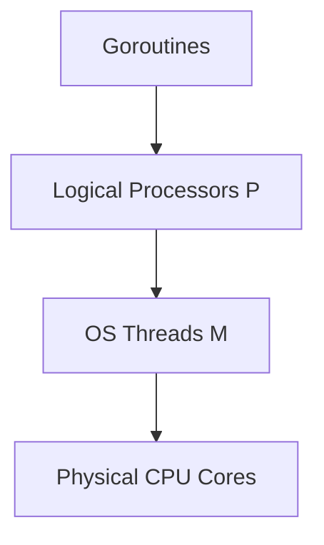

# Go (Golang) Cheatsheet

Go is an open-source programming language created by Google that makes it easy to build simple, reliable, and efficient software.

---

## 1. Syntax Basics

```go
package main

import "fmt"

func main() {
    // Variable declarations
    var x int = 42
    var s = "automatic inference"
    y := 10 // Short variable declaration (only inside functions)

    fmt.Println(x, s, y)
}
```

### Basic Types
- `bool`
- `string`
- `int`, `int8`, `int16`, `int32`, `int64`
- `uint`, `uint8`, `uint16`, `uint32`, `uint64`, `uintptr`
- `byte` (alias for `uint8`)
- `rune` (alias for `int32`, represents a Unicode code point)
- `float32`, `float64`
- `complex64`, `complex128`

### Collections: Arrays, Slices, and Maps
```go
// Arrays (fixed length)
var arr [5]int
arr[0] = 100

// Slices (dynamic length)
slice := []int{1, 2, 3}
slice = append(slice, 4, 5)

// Maps (key-value store)
m := make(map[string]int)
m["one"] = 1
val, exists := m["two"] // check key existence
```

---

## 2. Control Flow

### Loops
Go has only one looping construct: `for`.
```go
// Standard loop
for i := 0; i < 10; i++ {
    fmt.Println(i)
}

// "While" loop
for x < 100 {
    x += 10
}

// Infinite loop
for {
    break
}

// Range loop over slices/maps
for index, value := range slice {
    fmt.Printf("Index: %d, Value: %d\n", index, value)
}
```

### Conditionals & Switch
```go
if x > 0 {
    // ...
} else if x == 0 {
    // ...
} else {
    // ...
}

switch os := runtime.GOOS; os {
case "darwin":
    fmt.Println("macOS")
case "linux":
    fmt.Println("Linux")
default:
    fmt.Println("Other OS")
}
```

---

## 3. Pointers, Structs, and Methods

```go
// Pointer basics
x := 10
p := &x // p contains the memory address of x
*p = 20 // dereferencing to change value of x

// Structs
type User struct {
    ID   int
    Name string
}

// Pointer Receiver Method (can modify struct values)
func (u *User) UpdateName(newName string) {
    u.Name = newName
}

// Value Receiver Method (reads values, cannot modify original)
func (u User) GetName() string {
    return u.Name
}
```

---

## 4. Interfaces & Duck Typing

Interfaces are implemented implicitly. There is no explicit `implements` keyword.

```go
type Shaper interface {
    Area() float64
}

type Circle struct {
    Radius float64
}

// Circle implements Shaper because it defines the Area() method
func (c Circle) Area() float64 {
    return 3.14159 * c.Radius * c.Radius
}
```

---

## 5. Concurrency (Goroutines & Channels)

Concurrency is built directly into the core language.

```go
// Goroutine
go someWorkerTask()

// Channels
ch := make(chan int) // unbuffered channel
go func() {
    ch <- 42 // Send value to channel
}()

val := <-ch // Receive value from channel

// Buffered Channel
bufferedCh := make(chan string, 2)
bufferedCh <- "hello"
bufferedCh <- "world"

// Select Statement
select {
case msg1 := <-ch1:
    fmt.Println("Received", msg1)
case ch2 <- 100:
    fmt.Println("Sent 100 to ch2")
case <-time.After(time.Second):
    fmt.Println("Timed out")
}
```

---

## 6. Error Handling & Testing

### Error Handling Protocol
```go
func Divide(a, b float64) (float64, error) {
    if b == 0 {
        return 0, fmt.Errorf("division by zero")
    }
    return a / b, nil
}

// Caller site
result, err := Divide(10, 0)
if err != nil {
    log.Fatalf("Error occurred: %v", err)
}
```

### Defer, Panic, and Recover
- `defer`: Schedules a function call to run immediately before the surrounding function returns.
- `panic`: Stops the normal execution flow and starts panicking.
- `recover`: Recovers control from a panicking goroutine (used inside deferred functions).

```go
func safeProcess() {
    defer func() {
        if r := recover(); r != nil {
            fmt.Println("Recovered from panic:", r)
        }
    }()
    panic("something went catastrophically wrong!")
}
```

### Standard Unit Testing (`*_test.go`)
```go
package main

import "testing"

func TestDivide(t *testing.T) {
    res, err := Divide(10, 2)
    if err != nil {
        t.Errorf("Expected no error, got %v", err)
    }
    if res != 5 {
        t.Errorf("Expected 5, got %f", res)
    }
}
```

---

## 7. Useful CLI Commands

```bash
go run main.go            # compile and run Go code on the fly
go build -o app main.go   # build executable binary
go test ./...             # recursively run all unit tests in package
go fmt ./...              # auto-format all package source files
go get github.com/x/y     # fetch and add remote dependency
go mod tidy               # remove unused and add missing modules
go tool cover -html=c.out # analyze visual code coverage representation
```


---

## Best Practices & Production Standards

1. **Prevent Goroutine Leaks**: Always pair goroutines with contexts or cancel channels to guarantee correct resource teardowns.
2. **Explicit Error Checks**: Never ignore returned errors; verify error variables before continuing business flows.
3. **Pre-allocate Slices**: Provide size capacities inside `make([]T, 0, capacity)` when building sequences to prevent unnecessary slice re-allocations.

---

## Common Mistakes & Antipatterns

1. **Sharing Memory directly**: Accessing variables concurrently from multiple goroutines without explicit channel communication or Mutex locking.
2. **Forgetting to Close Channels**: Leaving active channels open when readers expect close triggers, resulting in deadlocks.
3. **Closure capturing in Loops**: Capturing loop index variables inside nested goroutines, causing concurrency errors (fixed natively in Go 1.22+).

---

## Troubleshooting & Debugging Guide

1. **Detecting Race Conditions**: Run application builds using the `-race` flag to automatically capture and trace overlapping thread access.
2. **Analyzing Thread Starvation**: Use Go's `pprof` profile analyzer to locate CPU bottlenecks or blocked execution paths.

---

## Core Interview Questions & Answers

1. **Q: Describe Go's MPG Concurrency scheduler model.**
   - **A**: Go scheduler maps **G**oroutines (logical lightweight threads) to **M** (OS threads) executing on **P** (Logical Processors/Cores). It dynamically performs work-stealing and network polling to multiplex millions of goroutines across cores.
2. **Q: What is the difference between buffered and unbuffered channels?**
   - **A**: Unbuffered channels block the sender until a receiver is ready to read, guaranteeing synchronous handshakes. Buffered channels allow senders to write values up to the buffer capacity without blocking, decoupling sender-receiver execution.

---

## Technical Architecture Diagram



---

## Related Cheatsheets & References

- [Rust Cheatsheet](rust-cheatsheet.md)
- [Docker Cheatsheet](docker-cheatsheet.md)
- [Master Directory Index](../Cheatsheets.html)
- [Knowledge Hub Portal](../Knowledge%2021cb6c26d9ba808da8d4f72eb2193ca2.html)
