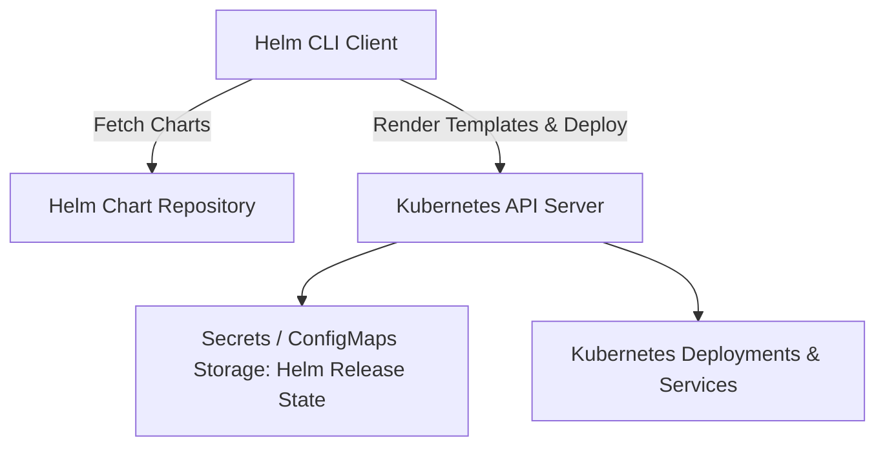

# Helm Kubernetes Cheatsheet

Helm is the package manager for Kubernetes. Helm uses a packaging format called charts (a collection of files that describe a related set of Kubernetes resources).

---

## 1. Helm Architecture & Concept

Helm streamlines installed applications on Kubernetes using declarative templates and release management.



---

## 2. Essential Commands

### Chart Repository Management
```bash
# Add a chart repository
helm repo add bitnami https://charts.bitnami.com/bitnami

# Search repositories
helm repo search bitnami nginx

# Update local chart cache
helm repo update
```

### Release Lifecycle Commands
```bash
# Install a chart
helm install my-release bitnami/nginx --set service.type=ClusterIP

# Dry-run render
helm install my-release bitnami/nginx --dry-run --debug

# Upgrade release with atomic rollback on failure
helm upgrade my-release bitnami/nginx -f custom-values.yaml --atomic --timeout 5m

# Rollback release to previous revision
helm rollback my-release 1

# List releases
helm list -A

# Uninstall release
helm uninstall my-release
```

---

## 3. Chart Structure & Template Syntax

```
mychart/
├── Chart.yaml          # Chart metadata (name, version, appVersion)
├── values.yaml         # Default configuration values
├── charts/             # Chart dependencies
└── templates/          # Kubernetes manifest templates
    ├── _helpers.tpl    # Named template snippets
    ├── deployment.yaml
    └── service.yaml
```

### Template Expression Example
```yaml
apiVersion: v1
kind: Service
metadata:
  name: {{ include "mychart.fullname" . }}
  labels:
    app.kubernetes.io/name: {{ .Values.appName | quote }}
spec:
  type: {{ .Values.service.type | default "ClusterIP" }}
  ports:
    - port: {{ .Values.service.port }}
      targetPort: http
```

---

## Best Practices & Edge Cases

1. **Pin Chart Versions:** Always pin chart versions in production playbooks or GitOps manifests to prevent breaking changes on updates.
2. **Use Helm Secrets or External Secrets:** Never commit plaintext passwords in `values.yaml`. Use `helm-secrets` plugin or Kubernetes External Secrets Operator.
3. **Values Schema Validation:** Provide a `values.schema.json` file in your custom charts to enforce type validation on user inputs.

---

## Troubleshooting & Debugging

- **Template Rendering Issues:** Run `helm template . -f values.yaml` locally to inspect the generated Kubernetes YAML before applying.
- **Pending Release Locks:** If a release is stuck in `pending-upgrade`, inspect release secrets (`kubectl get secrets -l owner=helm`) and delete stuck revision secrets cautiously.

---

## Core Interview Question

1. **Q: Where does Helm 3 store release information?**
   - **A**: Helm 3 stores release metadata in Kubernetes Secrets (or ConfigMaps) in the namespace of the release itself, eliminating the need for a server-side Tiller pod.

---

## Related Cheatsheets

- [Master Index](../Cheatsheets.html)
- [Kubernetes Cheatsheet](kubernetes-cheatsheet.md)
- [Docker Cheatsheet](docker-cheatsheet.md)
- [GitOps & ArgoCD Cheatsheet](gitops-argocd-cheatsheet.md)
