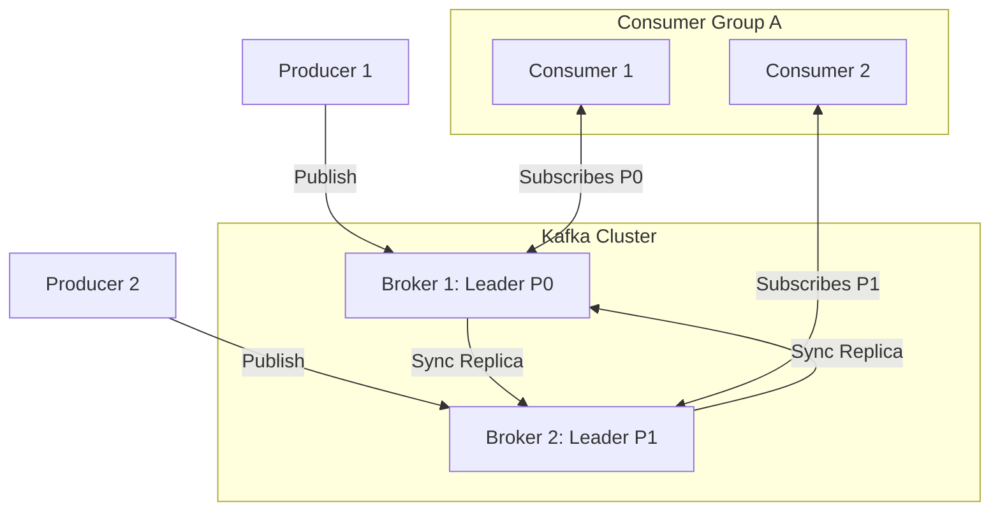

# Apache Kafka Cheatsheet

Apache Kafka is an open-source, distributed event streaming platform used by thousands of companies for high-performance data pipelines, streaming analytics, data integration, and mission-critical applications.

---

## 1. Core Architecture Diagram

This diagram shows how producers, brokers, partitions, consumer groups, and consumers interact.



---

## 2. Core Concepts & Terminology

| Term | Description |
|---|---|
| **Producer** | Client application that publishes (writes) events to Kafka topics. |
| **Consumer**| Client application that subscribes to (reads) and processes events. |
| **Broker**| A single server in the Kafka cluster that stores and serves messages. |
| **Topic** | A logical stream of messages (similar to a table in a database). |
| **Partition**| Physical split of a topic on disk. Partitions allow horizontal scaling, parallelism, and ordering guarantees within the partition. |
| **Offset** | A unique, sequential integer assigned to each message within a partition. |
| **Consumer Group** | A group of consumers working together to consume a topic's partitions in parallel. |

---

## 3. Essential CLI Commands (Production-Ready)

### Topic Management
```bash
# 1. Create a Topic with Partitions & Replication Factor
kafka-topics.sh --bootstrap-server localhost:9092 --create --topic order-events --partitions 6 --replication-factor 3

# 2. List All Topics
kafka-topics.sh --bootstrap-server localhost:9092 --list

# 3. Describe a Topic (Check partition leader, replicas, ISR status)
kafka-topics.sh --bootstrap-server localhost:9092 --describe --topic order-events

# 4. Alter Partitions (Only increase, decreasing partitions is not supported!)
kafka-topics.sh --bootstrap-server localhost:9092 --alter --topic order-events --partitions 12

# 5. Delete a Topic
kafka-topics.sh --bootstrap-server localhost:9092 --delete --topic order-events
```

### Console Producer & Consumer
```bash
# 1. Start Console Producer (interactive writing)
kafka-console-producer.sh --bootstrap-server localhost:9092 --topic order-events --property parse.key=true --property key.separator=:

# 2. Start Console Consumer (read from beginning)
kafka-console-consumer.sh --bootstrap-server localhost:9092 --topic order-events --from-beginning

# 3. Start Console Consumer with Consumer Group
kafka-console-consumer.sh --bootstrap-server localhost:9092 --topic order-events --group group-billing --from-beginning
```

### Consumer Group Management
```bash
# 1. List All Consumer Groups
kafka-consumer-groups.sh --bootstrap-server localhost:9092 --list

# 2. Describe Consumer Group (Check lag, offsets, partitions, host clients)
kafka-consumer-groups.sh --bootstrap-server localhost:9092 --describe --group group-billing

# 3. Reset Offsets to Earliest for Group
kafka-consumer-groups.sh --bootstrap-server localhost:9092 --group group-billing --reset-offsets --to-earliest --execute --topic order-events
```

---

## 4. Producer & Consumer Configurations

### Critical Producer Properties
- `acks=all`: Best durability guarantee. Broker response succeeds only when all in-sync replicas (ISR) acknowledge receipt.
- `retries=2147483647`: Re-attempts writing on transient network errors.
- `max.in.flight.requests.per.connection=5`: Prevents message re-ordering when retrying (safest value is `1` for absolute ordering, or `5` with idempotence enabled).
- `enable.idempotence=true`: Enables deduplication on broker. Guarantees "exactly-once" delivery per producer session.

### Critical Consumer Properties
- `enable.auto.commit=false`: Disables automatic offset commit. Committing manually ensures no data loss before processing completes.
- `session.timeout.ms=45000`: Threshold to detect client heartbeats.
- `heartbeat.interval.ms=3000`: Heartbeat frequency. Usually set to $1/3$ of `session.timeout.ms`.
- `max.poll.interval.ms=300000`: Maximum duration between consumer polls. If processing takes longer than this, the client is considered dead, prompting a rebalance.

---

## 5. Performance Tuning & Best Practices

### Low-Latency Tuning
- **Compression**: Use `lz4` or `zstd` compression on the producer to reduce network traffic.
- **Batching**: Increase `batch.size` (e.g., `32KB` or `64KB`) and adjust `linger.ms` (e.g., `5-20ms`) to allow larger, more efficient batch sizes instead of single message transfers.

### High Throughput & Partitions Scaling
- Set partition counts based on physical parallelism requirements ($Partitions = \max(\text{Producer Throughput}, \text{Consumer Throughput})$).
- Keep broker partition counts below 10,000 per broker to avoid performance degradation.

---

## 6. Common Mistakes & Troubleshooting

### Client rebalances repeatedly
- **Issue**: A consumer is taking too long to process a single batch, breaching `max.poll.interval.ms`.
- **Troubleshooting**: Increase `max.poll.interval.ms`, reduce `max.poll.records`, or optimize downstream processing (e.g. using worker pools).

### Topic metadata updates stall
- **Issue**: ZooKeeper or Kraft metadata coordination fails, or brokers are unreachable.
- **Troubleshooting**: Inspect JVM garbage collection logs on the brokers, verify network route availability via `telnet localhost 9092`, and check `controlled.shutdown.enable=true` configuration.

---

## 7. Interview Q&A

1. **Q: How does Kafka achieve extremely high throughput?**
   - **A**:
     1. **Sequential I/O**: Append-only log design leveraging physical sequential disk writes.
     2. **Zero-Copy Optimization**: Uses OS-level Page Cache and `sendfile` API to transfer bytes directly from kernel page cache to network socket without context switching into application memory.
     3. **Batching & Compression**: Aggregates payloads into batches.

2. **Q: Explain the difference between "At-least-once", "At-most-once", and "Exactly-once" processing.**
   - **A**:
     - *At-most-once*: Offsets are committed *before* processing message. Messages might be lost if processing fails.
     - *At-least-once*: Offsets committed *after* successful processing. No data is lost, but duplicates can occur on retries.
     - *Exactly-once*: Accomplished through transactional producers/consumers and idempotent writing.

---

## Related Cheatsheets & References

- [System Design Cheatsheet](system-design-cheatsheet.md)
- [Microservices Cheatsheet](microservices-cheatsheet.md)
- [Docker Cheatsheet](docker-cheatsheet.md)
- [Master Directory Index](../Cheatsheets.html)
