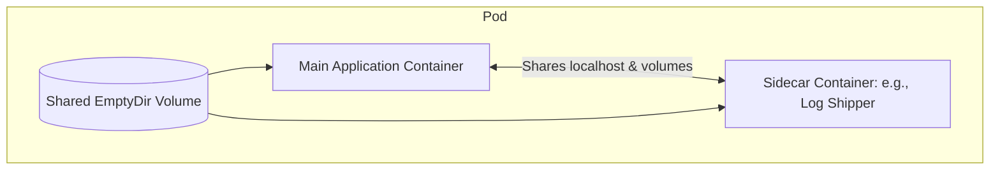
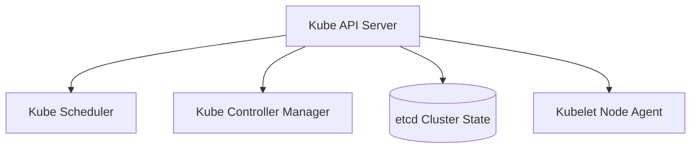

# Kubernetes (K8s) Cheatsheet

Kubernetes is an open-source container orchestration platform designed to automate application deployment, scaling, and management.

---

## 1. Core Kubectl Commands

```bash
# Cluster Information
kubectl cluster-info                     # Display cluster info
kubectl get nodes                        # List nodes in the cluster
kubectl describe node <node-name>        # Show detailed node information

# Resource Creation & Management
kubectl apply -f manifest.yaml           # Create/update resource(s) from a manifest file
kubectl delete -f manifest.yaml          # Delete resource(s) defined in a manifest
kubectl delete pod <pod-name>            # Delete a specific pod
```

---

## 2. Viewing & Inspecting Resources

```bash
# Get Commands (List resources)
kubectl get pods                         # List all pods in the active namespace
kubectl get pods -A                      # List all pods across all namespaces
kubectl get services                     # List services
kubectl get deployments                  # List deployments
kubectl get namespaces                   # List namespaces

# Output Formatting
kubectl get pods -o wide                 # List pods with more detailed columns (IP, Node)
kubectl get pod <pod-name> -o yaml       # Output the pod definition in YAML format
kubectl get pods --sort-by='.metadata.creationTimestamp' # Sort list by creation date

# Describe (Deep dive)
kubectl describe pod <pod-name>          # Deep inspect pod events and specifications
kubectl describe deployment <deploy-name># Deep inspect deployment
```

---

## 3. Debugging & Troubleshooting

```bash
# Logging
kubectl logs <pod-name>                  # Stream logs from a single-container pod
kubectl logs <pod-name> -c <container>   # Stream logs for a specific container in a pod
kubectl logs -f <pod-name>               # Follow log stream (real-time tail)
kubectl logs --tail=100 <pod-name>       # Print the last 100 lines of logs

# Shell Execution
kubectl exec -it <pod-name> -- /bin/sh   # Open interactive shell inside pod
kubectl exec -it <pod-name> -c <container> -- /bin/bash # Open shell inside multi-container pod

# Networking & Port Forwarding
kubectl port-forward <pod-name> 8080:80  # Forward local port 8080 to pod port 80
kubectl port-forward svc/<service> 8080:80 # Forward local port 8080 to service port 80
```

---

## 4. Multi-Container Pod Patterns

Kubernetes supports multiple containers sharing the same Pod network and volume namespaces.



### 1. Sidecar Pattern
An auxiliary container enhances the main container (e.g., streaming logs, syncing configurations, or downloading assets).
```yaml
apiVersion: v1
kind: Pod
metadata:
  name: sidecar-example
spec:
  containers:
    - name: main-app
      image: alpine
      command: ["/bin/sh", "-c", "while true; do echo $(date) 'User log' >> /var/log/app.log; sleep 5; done"]
      volumeMounts:
        - name: log-vol
          mountPath: /var/log
    - name: sidecar-shipper
      image: alpine
      command: ["/bin/sh", "-c", "tail -f /var/log/app.log"]
      volumeMounts:
        - name: log-vol
          mountPath: /var/log
  volumes:
    - name: log-vol
      emptyDir: {}
```

---

## 5. Standard Manifest Examples

### Deployment Manifest with SecurityContext
```yaml
apiVersion: apps/v1
kind: Deployment
metadata:
  name: frontend-deployment
  labels:
    app: frontend
spec:
  replicas: 3
  selector:
    matchLabels:
      app: frontend
  template:
    metadata:
      labels:
        app: frontend
    spec:
      securityContext:
        runAsNonRoot: true
        runAsUser: 1000
      containers:
        - name: web-app
          image: nginx:alpine
          securityContext:
            allowPrivilegeEscalation: false
            readOnlyRootFilesystem: true
          ports:
            - containerPort: 80
          resources:
            requests:
              memory: "64Mi"
              cpu: "250m"
            limits:
              memory: "128Mi"
              cpu: "500m"
```

### NetworkPolicy Specification
By default, Kubernetes pods accept traffic from any source. A `NetworkPolicy` isolates traffic.
```yaml
apiVersion: networking.k8s.io/v1
kind: NetworkPolicy
metadata:
  name: allow-frontend-only
  namespace: database
spec:
  podSelector:
    matchLabels:
      role: db
  policyTypes:
    - Ingress
  ingress:
    - from:
        - podSelector:
            matchLabels:
              role: frontend
      ports:
        - protocol: TCP
          port: 5432
```

---

## 6. Storage Provisioning (PV & PVC)

Dynamic volume provisioning lets cluster administrators define `StorageClasses` so that physical disks are provisioned automatically on demand.

```yaml
apiVersion: v1
kind: PersistentVolumeClaim
metadata:
  name: pg-storage-pvc
spec:
  accessModes:
    - ReadWriteOnce
  storageClassName: standard  # Maps to cloud provider storage driver
  resources:
    requests:
      storage: 10Gi
```

---

## 7. Helm Charts Usage

Helm is the package manager for Kubernetes, packaging resource manifests into standardized templates.

```bash
# Add a repository
helm repo add bitnami https://charts.bitnami.com/bitnami
helm repo update

# Install a chart
helm install my-postgres bitnami/postgresql --set auth.database=prod_db

# Upgrade an existing deployment
helm upgrade my-postgres bitnami/postgresql --values overrides.yaml

# List active releases
helm list
```

---

## 8. Common Gotchas & Troubleshooting Steps

1. **`CrashLoopBackOff`:** The container starts, crashes, restarts, and crashes again. Check logs immediately with `kubectl logs <pod-name>`. Often caused by incorrect commands, missing environment variables, or application errors.
2. **`ImagePullBackOff`:** Kubernetes is unable to pull the container image. Check image name capitalization, spelling, tag/version, and ensure pull secrets are present if using a private registry.
3. **Namespace Scope:** If you cannot find your resource, you might be in the wrong namespace. Append `-n <namespace>` to check, or use `-A` to see everything.
4. **Service Matching Labels:** A Service forwards traffic to Pods via selector matching. If your Service is not routing traffic, verify that `spec.selector` matches the labels defined on your Pods exactly.

---

## Best Practices & Production Standards

1. **Enforce Resource Limits**: Always declare explicit CPU/Memory `requests` and `limits` to enable stable pod scheduling.
2. **Configure Health Probes**: Define robust `livenessProbes`, `readinessProbes`, and `startupProbes` to enable automated pod self-healing.
3. **Enforce Namespace Isolation**: Partition cluster resources into logical Namespaces, and lock down communication using NetworkPolicies.

---

## Common Mistakes & Antipatterns

1. **Deploying with Hardcoded NodePorts**: Exposing service endpoints with high NodePort numbers on master nodes instead of using standard Ingress resources.
2. **Using `:latest` Image Tags**: Deploying container deployments without deterministic tags, causing mismatched running image versions on pod restarts.
3. **Mixing Config and Code**: Storing secret variables in base manifests instead of deploying them as highly-typed Secrets or ConfigMaps.

---

## Troubleshooting & Debugging Guide

1. **CrashLoopBackOff Diagnostics**: Call `kubectl logs <pod-name>` to read boot-time errors, and run `kubectl describe pod <pod-name>` to analyze scheduling events, volumes, and probe failures.
2. **Inbound Routing Failures**: Check services and selectors. Run `kubectl get endpoints` to verify pods are mapped correctly to target services.

---

## Core Interview Questions & Answers

1. **Q: Describe the role of the Kubernetes Control Plane and Worker Nodes.**
   - **A**: The Control Plane manages cluster state (API Server, etcd, Scheduler, Controller Manager). Worker Nodes run container applications and include the Kubelet agent, Kube-Proxy router, and Container Runtime (e.g., containerd).
2. **Q: What is the difference between a Liveness and a Readiness probe?**
   - **A**: A Liveness probe determines if a container is alive; if it fails, Kubernetes kills and restarts the pod. A Readiness probe determines if a container is ready to serve network traffic; if it fails, Kubernetes removes the pod from service endpoints.

---

## Technical Architecture Diagram



---

## Related Cheatsheets & References

- [Docker Cheatsheet](docker-cheatsheet.md)
- [Terraform Cheatsheet](terraform-cheatsheet.md)
- [GitOps & ArgoCD Cheatsheet](gitops-argocd-cheatsheet.md)
- [Master Directory Index](../Cheatsheets.html)
- [Knowledge Hub Portal](../Knowledge%2021cb6c26d9ba808da8d4f72eb2193ca2.html)
