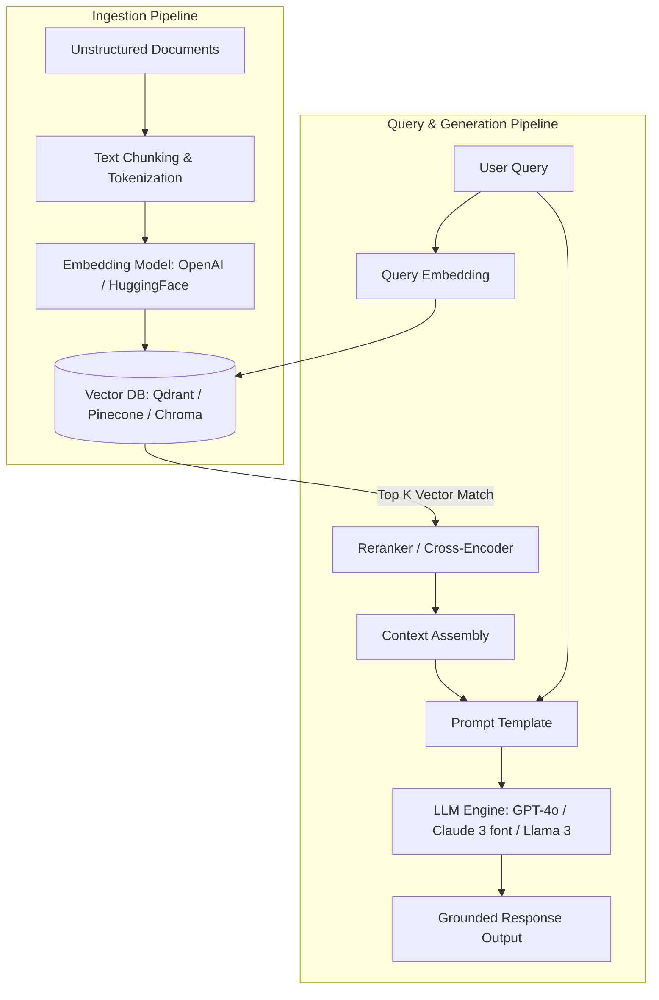

# LLM & RAG Engineering Cheatsheet

A production-ready reference guide for Large Language Model (LLM) integration, Retrieval-Augmented Generation (RAG) pipelines, vector search strategies, chunking strategies, prompt optimization, and evaluation metrics.

---

## 1. RAG Architecture Landscape

Retrieval-Augmented Generation (RAG) connects external dynamic knowledge bases to static frozen LLMs, eliminating hallucinations and enabling real-time context injection.



---

## 2. Text Chunking & Tokenization Strategies

Choosing the right chunking strategy determines context fidelity and retrieval precision.

### Comparison Table

| Strategy | Ideal Use Case | Pros | Cons |
| :--- | :--- | :--- | :--- |
| **Fixed-Size Chunking** | Short standard prose. | Fast, predictable length. | Breaks semantic context mid-sentence. |
| **Recursive Character** | Code, Markdown, nested docs. | Preserves natural boundaries (`\n\n`, `\n`, ` `). | Requires tuning chunk size/overlap. |
| **Document-Aware (AST)** | Source code parsing. | Keeps functions, classes, and scopes intact. | Language-dependent parser overhead. |
| **Semantic Chunking** | Heterogeneous text, books. | Splits on cosine similarity drop between sentences.| Slower due to extra embedding calls. |

### Python Recursive Chunking Example

```python
from langchain_text_splitters import RecursiveCharacterTextSplitter

def chunk_markdown_document(text: str, chunk_size: int = 500, chunk_overlap: int = 50):
    splitter = RecursiveCharacterTextSplitter(
        chunk_size=chunk_size,
        chunk_overlap=chunk_overlap,
        separators=["\n## ", "\n### ", "\n\n", "\n", " ", ""]
    )
    return splitter.split_text(text)

sample_md = "# Architecture\n\nSystem design details go here...\n\n## Component 1\nDetails..."
chunks = chunk_markdown_document(sample_md)
print(f"Generated {len(chunks)} chunks.")
```

---

## 3. Vector Embeddings & Similarity Metrics

### Similarity Formulas

1. **Cosine Similarity**: Measures vector direction angle (normalized range $[-1, 1]$).
   $$ \text{Cosine}(A, B) = \frac{A \cdot B}{\|A\| \|B\|} $$
2. **Dot Product**: Direction and magnitude (fastest when vectors are normalized).
   $$ \text{Dot}(A, B) = A \cdot B $$
3. **Euclidean Distance ($L_2$)**: Straight-line distance between vector tips.
   $$ D_{L2}(A, B) = \sqrt{\sum_{i=1}^n (A_i - B_i)^2} $$

### Fast Similarity Scoring in Python (Numpy)

```python
import numpy as np

def cosine_similarity(v1: np.ndarray, v2: np.ndarray) -> float:
    dot_product = np.dot(v1, v2)
    norm_v1 = np.linalg.norm(v1)
    norm_v2 = np.linalg.norm(v2)
    return dot_product / (norm_v1 * norm_v2)

# Example 1536-dim embedding vectors
query_vector = np.random.randn(1536)
doc_vector = np.random.randn(1536)

score = cosine_similarity(query_vector, doc_vector)
print(f"Cosine Similarity Score: {score:.4f}")
```

---

## 4. Advanced RAG Techniques

### Hybrid Search (BM25 + Dense Vector Search)

Combines keyword lexical matching (BM25) with semantic vector search using Reciprocal Rank Fusion (RRF).

$$ \text{RRF\_Score}(d) = \sum_{m \in M} \frac{1}{k + r_m(d)} $$

```python
def reciprocal_rank_fusion(dense_rankings: list[str], sparse_rankings: list[str], k: int = 60) -> dict[str, float]:
    rrf_map = {}
    for rank, doc_id in enumerate(dense_rankings):
        rrf_map[doc_id] = rrf_map.get(doc_id, 0.0) + 1.0 / (k + rank + 1)
    for rank, doc_id in enumerate(sparse_rankings):
        rrf_map[doc_id] = rrf_map.get(doc_id, 0.0) + 1.0 / (k + rank + 1)
    return dict(sorted(rrf_map.items(), key=lambda x: x[1], reverse=True))

dense_res = ["doc_1", "doc_2", "doc_3"]
sparse_res = ["doc_3", "doc_1", "doc_4"]
print(reciprocal_rank_fusion(dense_res, sparse_res))
```

---

## 5. Production RAG Evaluation (RAGAS Metrics)

| Metric | Target | Formula / Description |
| :--- | :--- | :--- |
| **Faithfulness** | $>0.90$ | Measures if the generated answer is strictly grounded in the retrieved context (no hallucinations). |
| **Answer Relevance** | $>0.85$ | Measures how directly the generated answer addresses the user query. |
| **Context Recall** | $>0.90$ | Measures if all ground-truth context facts needed for the answer were retrieved. |
| **Context Precision**| $>0.80$ | Measures the signal-to-noise ratio in top-$K$ retrieved chunks. |

---

## Best Practices & Production Standards

1. **Reranking**: Always pass the top-20 retrieved chunks through a Cross-Encoder reranker (e.g. `bge-reranker-large`) to select the top-3 to top-5 most relevant chunks before passing to LLM.
2. **Metadata Filtering**: Index document metadata (tenant ID, creation date, category) alongside vector payloads to enforce strict tenant isolation and scope filtering.
3. **Structured Outputs**: Require LLMs to return JSON validated against a Pydantic schema using instructor or native tool calling (`response_format={"type": "json_object"}`).

---

## Common Mistakes & Troubleshooting

1. **Lost in the Middle Problem**: LLMs pay higher attention to text at the very beginning and very end of long contexts. Place key instructions and critical context at the boundaries.
2. **Chunk Overlap Mismatch**: Setting zero chunk overlap causes semantic splitting across critical phrases. Keep overlap between $10\%$ and $20\%$ of chunk size.

---

## Core Interview Questions

1. **Q: How do dense and sparse vector retrievers differ, and why combine them in Hybrid Search?**
   - **A**: Dense retrievers (embeddings) capture semantic context but miss exact keywords (part numbers, UUIDs). Sparse retrievers (BM25) match exact keywords. Hybrid Search via Reciprocal Rank Fusion combines the strengths of both.

---

## Related Cheatsheets & References

- [LangChain Cheatsheet](langchain-cheatsheet.md)
- [LangGraph Cheatsheet](langgraph-cheatsheet.md)
- [Qdrant Vector DB Cheatsheet](qdrant-cheatsheet.md)
- [Vector Databases Cheatsheet](vector-databases-cheatsheet.md)
