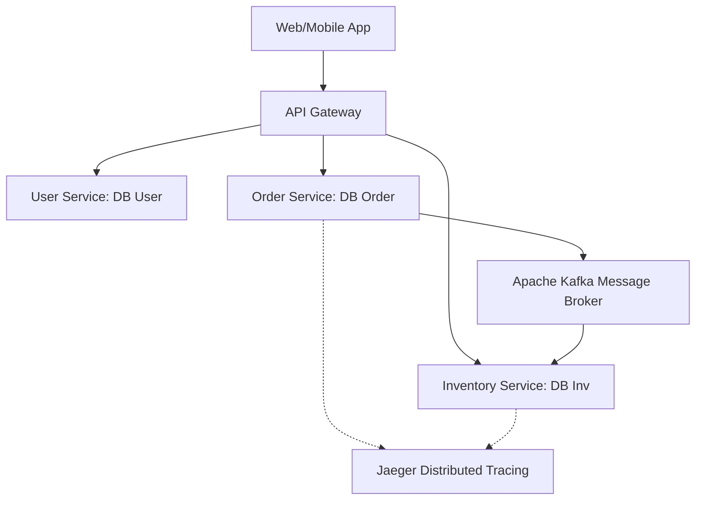

# Microservices Cheatsheet

Microservices is an architectural style that structures an application as a collection of small, autonomous services modeled around business domains.

---

## 1. Synchronous vs Asynchronous Communication

| Attribute | Synchronous (e.g., HTTP/gRPC) | Asynchronous (e.g., Kafka/RabbitMQ) |
| :--- | :--- | :--- |
| **Coupling** | High temporal coupling (sender waits for response). | Low coupling; services exist independently in time. |
| **Performance** | Blocked threads; vulnerable to latency spikes. | Non-blocking; immediate fire-and-forget message publishing. |
| **Failure Scope** | Cascading failures if downstream service fails. | Durable message queues handle downstream outages. |
| **Typical Protocols** | REST APIs, gRPC, GraphQL. | AMQP (RabbitMQ), Event Streams (Apache Kafka). |

---

## 2. Core Microservices Design Patterns

### API Gateway
A single entry point for all clients. Handles cross-cutting concerns: authentication, SSL termination, request routing, rate limiting, and response aggregation.

### Service Discovery & Registry
Allows services to dynamically locate each other within a fluid containerized cluster. (e.g., Consul, Eureka, or Kubernetes DNS).

### Circuit Breaker Pattern
Prevents a failing downstream service from cascading across the entire application cluster.
- **Closed State:** Requests flow normally.
- **Open State:** Downstream failures exceed the threshold; requests fail-fast immediately without hitting the downstream service.
- **Half-Open State:** Periodically attempts to route a small portion of traffic to verify if the downstream service has recovered.

### CQRS & Event Sourcing
- **CQRS (Command Query Responsibility Segregation):** Separates database read models and write operations to scale them independently.
- **Event Sourcing:** Stores every state change as a sequence of immutable events rather than overwriting current state rows.

---

## 3. Distributed Transactions & The Saga Pattern

Since microservices hold isolated, independent databases, standard 2-Phase Commit (2PC) transactions introduce high latency and single points of failure. The **Saga Pattern** solves this using a sequence of local transactions:

1. Each service executes its local transaction.
2. If any step fails, the Saga orchestrates **Compensating Transactions** backward to undo previous updates.
- **Saga Types:**
  - *Choreography:* Decentralized reactive event triggers.
  - *Orchestration:* Central controller mapping transaction paths.

---

## Best Practices & Production Standards

1. **Database-per-Service:** Enforce strict data isolation. Never allow multiple services to directly read or write to the same database tables.
2. **Implement Circuit Breakers:** Wrap all external HTTP or gRPC client calls with resilient circuit breakers (e.g., Resilience4j) to shield system components.
3. **Automate CI/CD Pipelines:** Compile, test, package, and deploy each microservice independently into production container slots.
4. **Use Distributed Tracing:** Intercept every incoming request at the API Gateway and inject a unique `Trace ID` to monitor processing hops across container nodes.

---

## Common Mistakes & Antipatterns

1. **Distributed Monolith:** Building heavily coupled services that must be developed, tested, and deployed as a single collective release unit.
2. **Shared Database Access:** Multiple microservices sharing database credentials and modifying tables directly, breaking encapsulation.
3. **Mismatched Boundaries:** Defining microservices too small (nano-services), causing massive network latency spikes and coordination overhead.

---

## Troubleshooting & Debugging Guide

1. **Locating Slow Network Hops:** Trace request graphs using Jaeger/Zipkin. Look for long-running spans or circular API dependencies.
2. **Resolving Network Cascades:** Inspect circuit breaker dashboards. Ensure timeouts are configured tightly for all outbound downstream integrations.

---

## Core Interview Questions & Answers

1. **Q: What is the Saga Pattern and how does it compare to 2-Phase Commit (2PC)?**
   - **A**: 2PC is a synchronous, blocking protocol that coordinates commit consensus across multiple databases (ensures strong consistency but degrades availability). The Saga Pattern is an asynchronous, event-driven orchestration of independent local transactions that guarantees eventual consistency using compensating actions if a step fails.
2. **Q: How does gRPC improve microservices communication compared to standard REST?**
   - **A**: gRPC runs over HTTP/2 (supports multiplexing and streaming), serializes structured payloads using Protocol Buffers (smaller binary payload sizes, fast CPU parsing), and provides strictly typed contracts natively compiled into service clients.

---

## Technical Architecture Diagram

---

## Related Cheatsheets & References

- [Master Index](../Cheatsheets.html)
- [Apache Kafka Cheatsheet](kafka-cheatsheet.md)
- [System Design Cheatsheet](system-design-cheatsheet.md)
- [Web Security Cheatsheet](web-security-cheatsheet.md)
