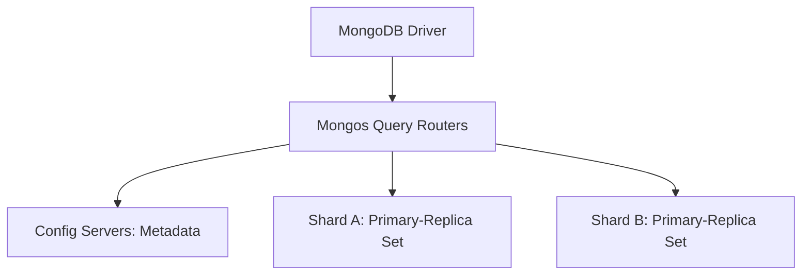

# MongoDB & Mongoose Cheatsheet

## 1. Mongo Shell Core CRUD Operations

```javascript
// Connect and switch database context
use dev_database

// Create (Insert)
db.users.insertOne({
  name: "Jules Verne",
  email: "jules@verne.org",
  skills: ["Writing", "Adventure", "Planning"],
  isActive: true,
  createdAt: new Date()
})

db.users.insertMany([
  { name: "Isaac Asimov", email: "isaac@asimov.com", skills: ["SciFi", "Robotics"], isActive: true },
  { name: "Arthur C. Clarke", email: "arthur@clarke.com", skills: ["SciFi", "Space"], isActive: false }
])

// Read (Find)
db.users.find({ isActive: true })                    // Find active users
db.users.find({ name: /asimov/i })                   // Case-insensitive regex search
db.users.findOne({ email: "jules@verne.org" })       // Fetch first match only
db.users.find().sort({ name: 1 }).limit(10)          // Sort ascending (1) or descending (-1), limit output

// Update
db.users.updateOne(
  { email: "jules@verne.org" },
  { $set: { isActive: false }, $push: { skills: "Oceanography" } }
)

db.users.updateMany(
  { skills: "SciFi" },
  { $set: { isFuturist: true } }
)

// Delete
db.users.deleteOne({ email: "jules@verne.org" })
db.users.deleteMany({ isActive: false })
```

---

## 2. Shell Query & Update Operators Reference

### Comparison Query Operators
- `$eq`: Matches values that are equal to a specified value.
- `$ne`: Matches all values that are not equal to a specified value.
- `$gt` / `$gte`: Matches values that are greater than (or equal to) a specified value.
- `$lt` / `$lte`: Matches values that are less than (or equal to) a specified value.
- `$in`: Matches any of the values specified in an array. `db.users.find({ role: { $in: ["admin", "moderator"] } })`
- `$nin`: Matches none of the values specified in an array.

### Logical Query Operators
- `$and` / `$or` / `$nor`: Joins query clauses with logical AND/OR/NOR.
- `$not`: Inverts the effect of a query expression.

```javascript
// Example: Find active users with age between 21 and 40 OR having admin role
db.users.find({
  $or: [
    { isActive: true, age: { $gte: 21, $lte: 40 } },
    { role: "admin" }
  ]
})
```

---

## 3. High-Performance Indexing

Indexes provide high-performance query lookups. Without indexes, MongoDB must scan every document in a collection.

```javascript
// Create Single Field Index (ascending: 1, descending: -1)
db.users.createIndex({ email: 1 }, { unique: true }) // Forces unique values

// Create Compound Index
db.users.createIndex({ role: 1, lastLogin: -1 })

// Create Partial / Sparse Indexes (indexes only documents containing the field)
db.users.createIndex({ secondaryPhone: 1 }, { sparse: true })

// List All Indexes
db.users.getIndexes()

// Drop Index
db.users.dropIndex("email_1")
```

---

## 4. Aggregation Pipeline Stages

Aggregation pipelines process documents in sequential stages, similar to data assembly pipelines.

```javascript
db.orders.aggregate([
  // Stage 1: Filter active orders above $50
  {
    $match: {
      status: "completed",
      totalPrice: { $gt: 50.0 }
    }
  },

  // Stage 2: Join with customer database (SQL Left Outer Join equivalent)
  {
    $lookup: {
      from: "customers",
      localField: "customerId",
      foreignField: "_id",
      as: "customerDetails"
    }
  },

  // Stage 3: Deconstruct customerDetails array to flat object
  { $unwind: "$customerDetails" },

  // Stage 4: Group by customer email, count orders and sum purchases
  {
    $group: {
      _id: "$customerDetails.email",
      totalOrders: { $sum: 1 },
      totalSpent: { $sum: "$totalPrice" }
    }
  },

  // Stage 5: Sort group output by spent sum descending
  { $sort: { totalSpent: -1 } },

  // Stage 6: Limit output list
  { $limit: 10 }
])
```

---

## 5. Modern Mongoose ORM (Node.js Integration)

Mongoose is an elegant, schema-based modeling tool for MongoDB in Node.js.

### Schema Definition & Validation (`models/User.js`)
```javascript
import mongoose from 'mongoose';

const UserSchema = new mongoose.Schema({
  username: {
    type: String,
    required: [true, 'Username is required'],
    unique: true,
    trim: true,
    minlength: [3, 'Username must be at least 3 characters']
  },
  email: {
    type: String,
    required: true,
    unique: true,
    match: [/.+\@.+\..+/, 'Please fill a valid email address']
  },
  role: {
    type: String,
    enum: ['user', 'moderator', 'admin'],
    default: 'user'
  },
  age: {
    type: Number,
    min: 18,
    max: 120
  }
}, {
  timestamps: true // Auto-adds createdAt and updatedAt fields
});

// Pre-save Middleware (Hook) - e.g., Hashing password before save
UserSchema.pre('save', async function(next) {
  if (!this.isModified('password')) return next();
  // Hash password logic here
  next();
});

// Custom Query Helper Instance Method
UserSchema.methods.isAdmin = function() {
  return this.role === 'admin';
};

const User = mongoose.model('User', UserSchema);
export default User;
```

### Performing Queries in Node.js
```javascript
import User from './models/User.js';

// 1. Create User
async function createUser() {
  try {
    const user = new User({
      username: 'verne',
      email: 'jules@verne.org',
      age: 42
    });
    await user.save();
    console.log('User created:', user._id);
  } catch (err) {
    console.error('Validation Error:', err.message);
  }
}

// 2. Fetch with filters & projection
async function getAdminEmails() {
  const admins = await User.find({ role: 'admin' }, 'username email')
    .sort({ username: 1 })
    .lean(); // Returns plain JS objects instead of mongoose documents (faster!)
  return admins;
}

// 3. Update with validators
await User.findByIdAndUpdate(
  userId,
  { $set: { age: 35 } },
  { new: true, runValidators: true } // Return updated object, trigger validations
);
```


---

## Best Practices & Production Standards

1. **Avoid Unbounded Arrays**: Design schemas to prevent arrays from growing indefinitely within a single document, which violates the 16MB document size boundary.
2. **Compound Index Prefix Rule**: Align compound index layouts with the exact search sorting and filtering field ordering.
3. **Aggregation Memory Limits**: Use pagination or `$limit` stages early in aggregation pipelines to keep memory footprints below the 100MB query RAM limit.

---

## Common Mistakes & Antipatterns

1. **SQL-Style Normalization**: Designing schemas with deep document references requiring multiple queries, failing to leverage MongoDB's nested document structures.
2. **Indexing All Fields**: Creating too many indexes, which slows down write throughput and exhausts RAM.
3. **Missing Index Hints**: Performing sort operations on non-indexed fields, forcing expensive in-memory blocking sorts.

---

## Troubleshooting & Debugging Guide

1. **Slow Query Diagnostics**: Enable MongoDB's Profiler and use `.explain("executionStats")` to inspect scanned documents vs. returned documents ratios.
2. **Write Conflicts under High Load**: Monitor lock wait queues and throughput limits. Shard collections to distribute write loads evenly across shards.

---

## Core Interview Questions & Answers

1. **Q: Explain Sharding and how MongoDB ensures uniform data distribution across shards.**
   - **A**: MongoDB distributes collection data across multiple shards using a shard key. It maps data ranges (ranged sharding) or hash values (hashed sharding) into chunks, and a balancer process migrates chunks dynamically to maintain even distribution.
2. **Q: When should you embed documents vs. reference documents in MongoDB schema design?**
   - **A**: Embed documents for 1-to-1 or 1-to-many relationships where children are always read alongside parents, and relationships are bounded. Reference documents for high-concurrency data, unbounded 1-to-many structures, or many-to-many relationships to prevent document size exhaustion.

---

## Technical Architecture Diagram



---

## Related Cheatsheets & References

- [Database Comparison Cheatsheet](database-comparison-cheatsheet.md)
- [Redis Cheatsheet](redis-cheatsheet.md)
- [Master Directory Index](../Cheatsheets.html)
- [Knowledge Hub Portal](../Knowledge%2021cb6c26d9ba808da8d4f72eb2193ca2.html)
