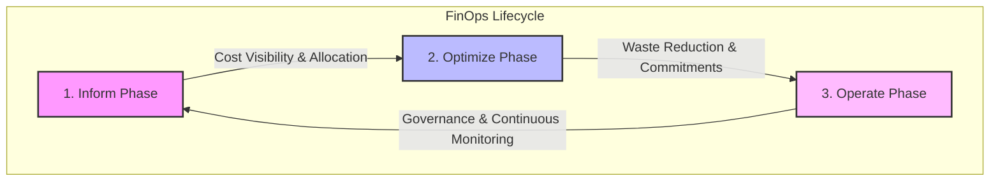

# Multi-Cloud Cost Optimization Cheatsheet

Multi-cloud cost optimization is the systematic practice of analyzing, controlling, and reducing cloud infrastructure spending across multiple public cloud service providers (AWS, Azure, GCP) while maintaining or improving system performance, scalability, and reliability.

---

## 1. Cloud-Specific Cost Optimization Strategies

### AWS Cost Optimization
* **S3 Storage Tier Lifecycle Policies:** Move raw bronze-layer datasets to Glacier Flexible or Deep Archive after 30 to 90 days based on object age and access frequency.
* **Compute Savings Plans & Reserved Instances (RIs):** Commit to a 1-year or 3-year term for predictable EC2, RDS, and Fargate usage to save up to 72% over On-Demand rates.
* **AWS Graviton Processors:** Migrate EC2 instances, RDS databases, and AWS Lambda serverless functions from legacy x86 to Graviton (ARM-based) processors to achieve up to 40% better price-performance.
* **Auto-Scaling Group Dynamic Policies:** Configure auto-scaling based on target tracking metrics (e.g., maintaining average CPU utilization at 60%) to prevent resource over-provisioning during off-peak hours.
* **Identify Idle Resources:** Establish automated scripts or use AWS Trusted Advisor to delete unattached Elastic IPs, terminate idle EC2 instances (CPU < 5% over 14 days), and clean up orphaned EBS volumes.

### Azure Cost Optimization
* **Azure Hybrid Benefit (AHUB):** Reuse on-premises Windows Server and SQL Server licenses on Azure Virtual Machines to save up to 85% compared to standard pay-as-you-go rates.
* **Azure Spot VMs:** Utilize unused Azure compute capacity for fault-tolerant, batch, or non-production development workloads at up to a 90% discount (subject to a 30-second eviction notice).
* **Blob Storage Archive Tier:** Use Azure Storage lifecycle management rules to transition cold database backups and historical snapshots to the Archive storage tier.
* **Autoscale with Azure Virtual Machine Scale Sets (VMSS):** Automatically adjust the number of VM instances running your application based on actual demand, CPU thresholds, or request counts.

### GCP Cost Optimization
* **Committed Use Discounts (CUDs):** Secure major savings (up to 70%) on Compute Engine VM cores and RAM by committing to a 1-year or 3-year resource plan.
* **Sustained Use Discounts (SUDs):** Automatically receive incremental discounts (up to 30%) on Compute Engine VMs that run for a significant portion of a billing month without requiring upfront commits.
* **GCS Autoclass:** Enable Autoclass on Google Cloud Storage buckets to let GCP automatically transition objects to colder, cheaper storage tiers (Nearline, Coldline, Archive) based on access patterns.
* **GKE Autopilot:** Let Google Kubernetes Engine manage cluster sizing, node provisioning, and bin-packing. You pay only for the CPU, memory, and storage requested by active pods, eliminating worker node waste and idle allocation overhead.

---

## 2. Advanced Multi-Cloud Cost Optimization Techniques

To effectively manage multiple clouds, engineering teams must implement unified cost control patterns:

| Strategy | Implementation Pattern | Cost Reduction Impact |
|---|---|---|
| **Egress Cost Mitigation** | Use Content Delivery Networks (CDNs), compress payloads, and route inter-cloud traffic via private peering services (AWS Direct Connect, Azure ExpressRoute, GCP Interconnect) instead of the public Internet. | **30% - 50%** reduction in network egress fees. |
| **Unified Tagging & Labeling** | Enforce a strict global tagging schema (e.g., `Owner`, `Environment`, `CostCenter`, `Project`) using infrastructure-as-code linting (Terraform tflint/OPA) across all clouds. | **15% - 25%** improvement in cost allocation accuracy. |
| **Multi-Cloud Billing Pipelines** | Aggregate AWS CUR (Cost & Usage Report), Azure Consumption API, and GCP Billing Export (BigQuery) into a single centralized data warehouse (e.g., Snowflake) for global dashboarding. | **High** strategic visibility and anomalies detection. |

---

## 3. The FinOps Framework Lifecycle

FinOps is an operational framework and cultural practice that maximizes cloud business value by helping engineering, finance, technology, and business teams collaborate on data-driven spending decisions.

1. **Inform Phase:** Providing cost visibility, allocation, and benchmarking to teams. This involves setting up budget alerts, building dashboards, and mapping expenditures back to specific business units.
2. **Optimize Phase:** Identifying cost-saving opportunities. This includes rightsizing underutilized virtual machines, purchasing reservation commitments, and configuring storage lifecycles.
3. **Operate Phase:** Continuous execution and governance. Integrating cost control directly into CI/CD pipelines, automating resource scheduling, and reviewing spend metrics daily.

---

## 4. Troubleshooting & Debugging Unexplained Cost Spikes

When an unexpected budget alert triggers, execute this diagnostic checklist:

1. **Locate the Cloud Provider's Detailed Report:**
   * **AWS:** Open Cost Explorer, group by **Usage Type** or **Service**, and filter by the specific date range.
   * **Azure:** Go to Cost Management + Billing, use **Cost Analysis**, and group by **Resource**.
   * **GCP:** Go to Billing reports, group by **SKU** or **Service**, and review the daily usage trends.
2. **Scan for Orphaned and Unused Resources:**
   * Run a CLI script or cloud policy engine (e.g., Cloud Custodian) to search for:
     - Unattached EBS/Managed Disk block volumes.
     - Orphaned database snapshots and old VM images.
     - Active load balancers routing zero traffic.
3. **Analyze Network Traffic Patterns:**
   * Check for high inter-zone or cross-region network transfers (e.g., databases communicating with applications in different availability zones without regional endpoint routing).

---

## 5. Common Mistakes & Antipatterns

* **Ignoring Data Egress Fees:** Architecting systems where massive raw data chunks are continuously sent from AWS to GCP or Azure, resulting in huge network egress bills. *Solution: Keep high-throughput processing within a single cloud provider boundary.*
* **Over-Provisioning "Just in Case":** Provisioning a 16-core, 64GB VM for a simple background cron job that peaks at 5% CPU usage. *Solution: Adopt serverless containers (Fargate, Cloud Run) or perform baseline sizing first.*
* **Setting up Static Dev/Test Environments:** Leaving staging and development databases and environments running 24/7 over the weekend when no developers are online. *Solution: Configure cron-based auto-shutdown policies (e.g., stop VMs at 7:00 PM and start at 8:00 AM).*

---

## 6. Core Interview Questions & Answers

* **Q: What is "Cloud Egress" and why is it a significant factor in multi-cloud architecture?**
  * **A:** Cloud egress refers to the network traffic leaving a cloud provider's network to the public internet or another provider. While ingress (data entry) is typically free, egress is charged per gigabyte. In multi-cloud setups, continuous data replication or chatty APIs between clouds can incur high egress fees. It can be mitigated by compressing payloads, utilizing local caching, or setting up dedicated private interconnects.
* **Q: How do you choose between Reserved Instances (RIs) / committed use discounts and Spot/Preemptible VMs?**
  * **A:** Use RIs or Savings Plans for predictable, stateful, production-grade workloads that must run continuously (e.g., primary databases, core transactional microservices). Use Spot or Preemptible VMs for fault-tolerant, stateless, batch-processing workloads that can easily restart if the provider evicts the node (e.g., CI/CD runners, rendering jobs, distributed analytical workers).

---

## Related Cheatsheets & References

- [FinOps & DevOps Cheatsheet](finops-devops-cheatsheet.md)
- [AWS Cloud Services Cheatsheet](aws-cloud-services-cheatsheet.md)
- [Azure Cloud Services Cheatsheet](azure-cloud-services-cheatsheet.md)
- [GCP Cloud Services Cheatsheet](gcp-cloud-services-cheatsheet.md)
- [Data Engineering Cheatsheet](data-engineering-cheatsheet.md)
- [Master Directory Index](../Cheatsheets.html)
- [Knowledge Hub Portal](../Knowledge%2021cb6c26d9ba808da8d4f72eb2193ca2.html)
