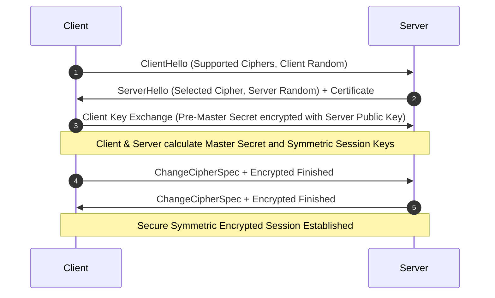
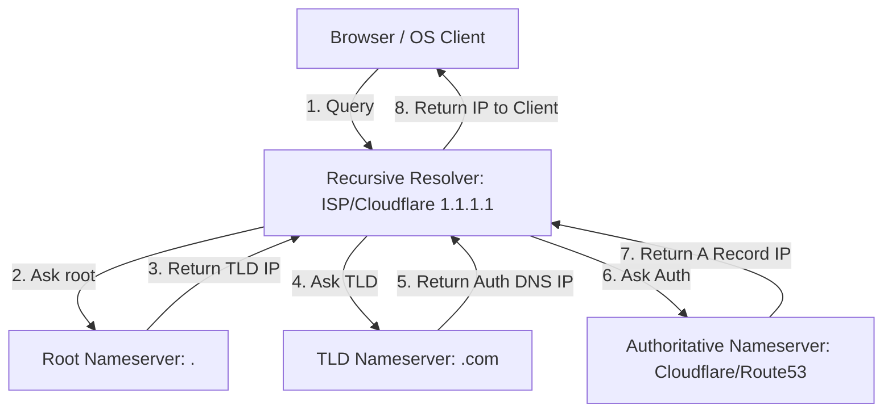

# Computer Networking Cheatsheet

A production-grade reference for computer networking architectures, protocols, models, handshakes, command-line utilities, and troubleshooting.

---

## 1. Network Models: OSI vs. TCP/IP

The OSI (Open Systems Interconnection) model has 7 layers, while the simplified TCP/IP model has 4 layers.

| OSI Layer | OSI Name | PDU (Protocol Data Unit) | TCP/IP Layer | Key Protocols / Examples |
| :---: | :--- | :--- | :---: | :--- |
| **7** | Application | Data | **Application** | HTTP, HTTPS, DNS, SMTP, FTP, SSH, gRPC |
| **6** | Presentation | Data | — | SSL, TLS, JPEG, ASCII, JSON |
| **5** | Session | Data | — | SOCKS, NetBIOS, RPC |
| **4** | Transport | Segment (TCP) / Datagram (UDP) | **Transport** | TCP, UDP, QUIC |
| **3** | Network | Packet | **Internet** | IP (IPv4, IPv6), ICMP, IPsec, BGP |
| **2** | Data Link | Frame | **Network Access** | Ethernet, Wi-Fi (802.11), ARP, PPP |
| **1** | Physical | Bits | — | Cables (Fiber, Cat6), Hubs, Repeaters, DSL |

---

## 2. Core Transport Protocols: TCP vs. UDP

### TCP (Transmission Control Protocol)
- **Connection-oriented:** Handshake required before transmitting data.
- **Reliable:** Guarantees packet delivery, ordering, and error-checking.
- **Flow Control & Congestion Control:** Adjusts transmission speed based on network congestion.
- **Use Cases:** Web browsers (HTTP), Email (SMTP), Secure Shell (SSH), Databases.

### UDP (User Datagram Protocol)
- **Connectionless:** Simply sends packets without establishing a connection.
- **Unreliable / Best-effort:** No delivery guarantees, retransmissions, or ordering.
- **Fast / Lightweight:** Minimal header overhead (8 bytes vs TCP's 20-60 bytes).
- **Use Cases:** Live video streaming (RTP), Online gaming, DNS queries, DHCP, VoIP.

---

## 3. The SSL/TLS Handshake (TLS 1.2 vs 1.3)

The TLS handshake establishes a secure, encrypted session key between client and server.

### TLS 1.2 Handshake (2 Round Trips)
1. **ClientHello:** Cipher suites supported, client random string, TLS version.
2. **ServerHello:** Selected cipher suite, server random string, digital certificate containing public key.
3. **Key Exchange:** Client verifies certificate, sends pre-master secret encrypted with server's public key.
4. **Session Keys:** Both derive symmetric session keys.
5. **Finished:** Encrypted "Finished" messages exchanged to confirm handshake.

### TLS 1.3 Handshake (1 Round Trip)
Combines Hello and key-share exchange in the first message, reducing latency by 1 RTT and deprecating insecure cipher suites.

### TLS 1.2 Sequence Flow Diagram



---

## 4. Modern Web Protocols: HTTP/2, HTTP/3, WebSockets, & gRPC

### HTTP Protocol Progression
- **HTTP/1.1:** Keep-Alive connections, but suffers from Head-of-Line (HoL) blocking (requests queue up sequentially).
- **HTTP/2:** Multiplexing over a single TCP connection, binary framing, header compression (HPACK), and server push. Still suffers from TCP-level HoL blocking.
- **HTTP/3:** Runs over **QUIC** (UDP-based). Eliminates TCP Head-of-Line blocking; faster connection establishment (0-RTT resumption) and connection migration.

### WebSockets vs gRPC
- **WebSockets:** Full-duplex bidirectional TCP communication channel. Best for highly interactive web clients (real-time chat, dashboards, gaming).
- **gRPC:** High-performance, low-overhead RPC framework designed by Google. Uses HTTP/2 for transport and **Protocol Buffers (Protobuf)** for payload serialization. Best for internal microservices communication and mobile apps.

---

## 5. Domain Name System (DNS) Resolution Flow

When querying a domain name (e.g., `example.com`), the lookup traverses recursive and authoritative servers.



---

## 6. Command-Line Networking Utilities

Essential tools for debugging, tracing, and resolving network connection bottlenecks.

### `ping` (ICMP Echo Request)
Test reachability and round-trip latency to a host.
```bash
ping -c 4 google.com
```

### `traceroute` / `tracert` (TTL Exceeded hops)
Trace the path packets take to reach a host.
```bash
traceroute google.com
```

### `curl` (HTTP Client)
Inspect HTTP response headers and transfer details.
```bash
curl -Iv https://example.com
```

### `nslookup` & `dig` (DNS Lookup)
Perform DNS lookups to query nameservers and record values.
```bash
dig example.com A
dig +trace example.com
```

### `netstat` / `ss` (Socket Statistics)
Show active socket connections, listening ports, and routing tables.
```bash
ss -tulpn
```

---

## 7. Troubleshooting & Common Issues

1. **DNS Resolution Failures (`NXDOMAIN` or timeouts):**
   - Check local `/etc/resolv.conf` or network interface DNS settings.
   - Flush local DNS cache (`sudo systemd-resolve --flush-caches` on Linux, `dscacheutil -flushcache` on macOS).
2. **Connection Timed Out (`SYN_SENT` status in ss/netstat):**
   - Indicates packets are sent but no response is received. Likely caused by a firewall drop rule, security group restriction, or an inactive backend service.
3. **Connection Refused (`RST` packet returned):**
   - The host is reachable, but nothing is listening on the target port, or the listener's backlog queue is completely full.
4. **SSL/TLS Certificate Name Mismatch (`ERR_SSL_VERSION_OR_CIPHER_MISMATCH`):**
   - Verify the certificate presented by the server contains the correct common name (CN) or subject alternative name (SAN) for the domain.

---

## 8. SRE & Network Interview Questions

1. **Q: What happens when you type `https://example.com` into your browser and press Enter?**
   - **A**: The browser parses the URL, performs a DNS lookup (local cache -> hosts file -> recursive resolver -> Root -> TLD -> Authoritative Nameserver), initiates a TCP 3-way handshake with the server IP on port 443, executes the SSL/TLS handshake to agree on session keys, sends an encrypted HTTP GET request, receives the HTML resource, and renders the webpage.
2. **Q: Explain the difference between Latency, Throughput, and Bandwidth.**
   - **A**:
     - *Bandwidth:* The theoretical maximum capacity of the link (e.g., 1 Gbps fiber).
     - *Throughput:* The actual amount of data successfully transferred over the link in a given time frame (e.g., 850 Mbps).
     - *Latency:* The time delay for a data packet to travel from source to destination (e.g., 15 ms).

---

## Related Cheatsheets & References

- [Web Security Cheatsheet](web-security-cheatsheet.md)
- [REST API Cheatsheet](rest-api-cheatsheet.md)
- [SRE & Monitoring Cheatsheet](sre-monitoring-cheatsheet.md)
- [Master Directory Index](../Cheatsheets.html)
