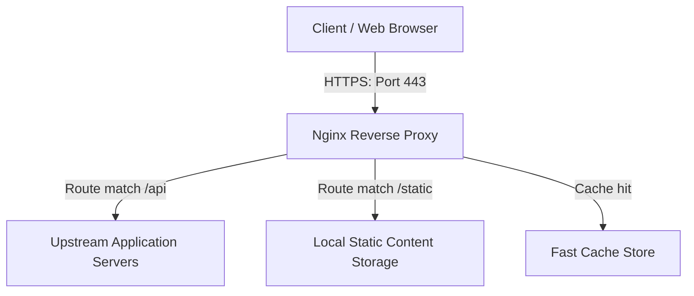

# Nginx Cheatsheet

Nginx (pronounced "engine-x") is a high-performance web server, reverse proxy, load balancer, mail proxy, and HTTP cache. It uses an asynchronous, event-driven, non-blocking architecture, which provides extremely low memory footprint and high concurrency.

---

## Architecture & Concept Flow

The diagram below outlines how client requests flow through an Nginx proxy server to downstream applications:



---

## 1. Directory Structure & Key Files

In standard Linux installations (Ubuntu/Debian), Nginx configurations are organized as follows:

- `/etc/nginx/nginx.conf`: The primary Nginx configuration file.
- `/etc/nginx/sites-available/`: Directories where server block configurations are stored.
- `/etc/nginx/sites-enabled/`: Symbolic links to configurations in `sites-available` that are actively loaded by Nginx.
- `/var/log/nginx/access.log`: Logs every client request processed by Nginx.
- `/var/log/nginx/error.log`: Logs server errors, warnings, and diagnostic information.

---

## 2. Basic Server Block Configuration

A basic server block configures Nginx to listen on a specific port, match a domain name, and serve static assets or delegate dynamic requests:

```nginx
server {
    listen 80;
    listen [::]:80;
    server_name example.com www.example.com;

    root /var/www/example.com/html;
    index index.html index.htm;

    # Handle Static File requests
    location / {
        try_files $uri $uri/ =404;
    }

    # Custom Error Pages
    error_page 404 /404.html;
    location = /404.html {
        internal;
    }

    error_page 500 502 503 504 /50x.html;
    location = /50x.html {
        internal;
    }
}
```

---

## 3. Reverse Proxy Configuration

Nginx is commonly deployed as a reverse proxy to forward requests to application servers (such as Node.js, FastAPI, Gunicorn, or Go apps):

```nginx
server {
    listen 80;
    server_name api.example.com;

    location / {
        proxy_pass http://127.0.0.1:8000;

        # Standard proxy headers
        proxy_set_header Host $host;
        proxy_set_header X-Real-IP $remote_addr;
        proxy_set_header X-Forwarded-For $proxy_add_x_forwarded_for;
        proxy_set_header X-Forwarded-Proto $scheme;

        # WebSockets support
        proxy_http_version 1.1;
        proxy_set_header Upgrade $http_upgrade;
        proxy_set_header Connection "upgrade";

        # Timeouts
        proxy_connect_timeout 60s;
        proxy_send_timeout 60s;
        proxy_read_timeout 60s;
    }
}
```

---

## 4. Load Balancing Configuration

Configure Nginx to distribute incoming client traffic among multiple application server instances using the `upstream` directive:

```nginx
upstream backend_servers {
    # Default is Round-Robin
    server 10.0.0.10:8080;
    server 10.0.0.11:8080 backup;
    server 10.0.0.12:8080 max_fails=3 fail_timeout=30s;

    # Optional balancing algorithms:
    # ip_hash;       # clients stick to same server based on IP
    # least_conn;    # routes requests to server with fewest active connections
}

server {
    listen 80;
    server_name app.example.com;

    location / {
        proxy_pass http://backend_servers;
        proxy_set_header Host $host;
    }
}
```

---

## 5. Security & SSL/TLS Configuration (HTTPS)

Setting up secure SSL/TLS blocks with custom headers for enhanced server protection:

```nginx
server {
    listen 80;
    server_name example.com www.example.com;

    # Redirect all HTTP requests to HTTPS
    return 301 https://$host$request_uri;
}

server {
    listen 443 ssl http2;
    server_name example.com www.example.com;

    ssl_certificate /etc/letsencrypt/live/example.com/fullchain.pem;
    ssl_certificate_key /etc/letsencrypt/live/example.com/privkey.pem;

    # Strong SSL settings
    ssl_protocols TLSv1.2 TLSv1.3;
    ssl_prefer_server_ciphers on;
    ssl_ciphers 'ECDHE-ECDSA-AES128-GCM-SHA256:ECDHE-RSA-AES128-GCM-SHA256:ECDHE-ECDSA-AES256-GCM-SHA384:ECDHE-RSA-AES256-GCM-SHA384:DHE-RSA-AES128-GCM-SHA256:DHE-RSA-AES256-GCM-SHA384';

    # Security Headers (OWASP Recommended)
    add_header X-Frame-Options "SAMEORIGIN" always;
    add_header X-XSS-Protection "1; mode=block" always;
    add_header X-Content-Type-Options "nosniff" always;
    add_header Referrer-Policy "no-referrer-when-downgrade" always;
    add_header Content-Security-Policy "default-src 'self' http: https: data: blob: 'unsafe-inline'" always;
    add_header Strict-Transport-Security "max-age=31536000; includeSubDomains; preload" always;

    location / {
        root /var/www/example.com/html;
        index index.html;
    }
}
```

---

## 6. Static Asset Caching Configuration

Improve loading performance and Core Web Vitals by instructing browsers to cache static assets locally:

```nginx
server {
    listen 80;
    server_name example.com;

    # Cache aggressive media & static assets
    location ~* \.(jpg|jpeg|png|gif|ico|css|js|pdf|woff|woff2|ttf|svg)$ {
        root /var/www/example.com/html;
        expires 365d;
        add_header Cache-Control "public, no-transform";
        log_not_found off;
        access_log off;
    }
}
```

---

## 7. Nginx Command Reference (CLI)

```bash
# Check configuration syntax correctness (Run before reloading!)
sudo nginx -t

# Test configuration and print configuration details
sudo nginx -T

# Reload configuration gracefully without dropping connections
sudo systemctl reload nginx
# or
sudo nginx -s reload

# Hard stop Nginx
sudo systemctl stop nginx
# or
sudo nginx -s stop

# Start Nginx
sudo systemctl start nginx

# Restart Nginx (fully drops connections and restarts daemon)
sudo systemctl restart nginx

# View active status of Nginx process
sudo systemctl status nginx
```

---

## 8. Common Mistakes & Pitfalls

1. **Not running `nginx -t` before reloading**: Reloading Nginx with broken configurations will cause syntax errors, and a full restart could leave the server offline.
2. **Missing `proxy_set_header Host`**: Without this, the downstream application might not resolve request hostnames correctly, resulting in bad redirects.
3. **Improper slash routing**:
   - `location /api { proxy_pass http://localhost:8000; }` matches `/api` and `/api-endpoint`.
   - `location /api/ { proxy_pass http://localhost:8000/; }` handles paths relatively. Be precise with trailing slashes.

---

## 9. Troubleshooting Tips

- **502 Bad Gateway**: This means Nginx is functioning but cannot connect to the backend/upstream application. Check if the app server (FastAPI, Node.js) is actually running and listening on the specified IP and port.
- **504 Gateway Timeout**: The backend server is slow and didn't respond within Nginx's proxy timeout window. Increase `proxy_read_timeout`.
- **403 Forbidden**: Permission issue. Verify that the Nginx user (`www-data` on Ubuntu) has read permissions on the directory path specified under `root`.

---

## Related Cheatsheets & References

- [Docker Cheatsheet](docker-cheatsheet.md)
- [Docker Compose Cheatsheet](docker-compose-cheatsheet.md)
- [Web Performance Optimization Cheatsheet](web-performance-optimization-cheatsheet.md)
- [Web Security Cheatsheet](web-security-cheatsheet.md)
- [Master Directory Index](../Cheatsheets.html)
- [Knowledge Hub Portal](../Knowledge%2021cb6c26d9ba808da8d4f72eb2193ca2.html)
