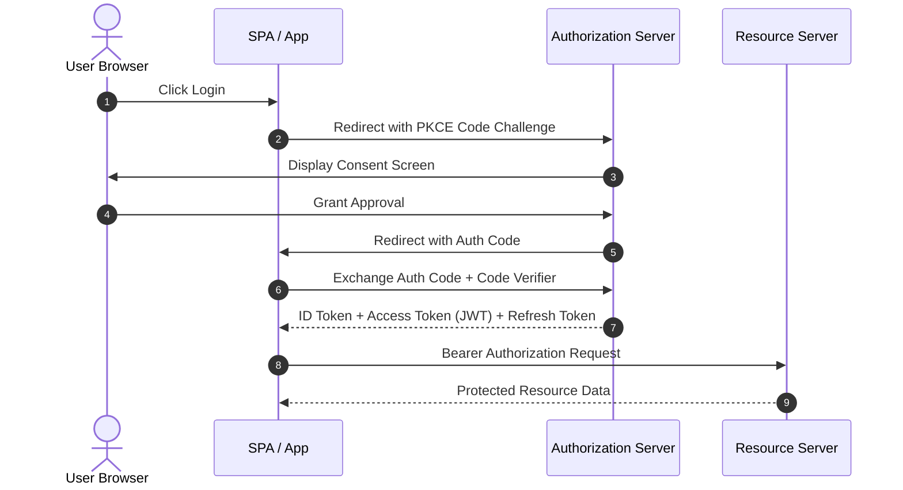

# OAuth2 & JWT Security Cheatsheet

OAuth 2.0 is an authorization framework that enables third-party applications to obtain limited access to an HTTP service. JSON Web Token (JWT) is a compact, URL-safe means of representing claims between two parties.

---

## 1. OAuth2 Grant Flows

---

## 2. JWT Anatomy

A JWT consists of three parts separated by dots (`.`): `Header.Payload.Signature`

- **Header:** Algorithm & token type (`{"alg": "RS256", "typ": "JWT"}`)
- **Payload:** Standard claims (`sub`, `iss`, `exp`, `iat`, `aud`, custom roles)
- **Signature:** Hash calculated with private key or secret.

---

## Best Practices & Security Guidelines

1. **Use PKCE for Public Clients:** Always use Proof Key for Code Exchange (PKCE) for SPAs and Mobile Apps.
2. **Short Token Lifetimes:** Keep access tokens short-lived (e.g., 15 minutes) and refresh tokens strictly bound to secure HTTP-only cookies.
3. **Use Asymmetric Signing:** Sign tokens using RS256/ES256 (Public/Private key pair) so Resource Servers can verify signatures without knowing the private key.

---

## Related Cheatsheets

- [Master Index](../Cheatsheets.html)
- [Web Security Cheatsheet](web-security-cheatsheet.md)
- [REST API Cheatsheet](rest-api-cheatsheet.md)
