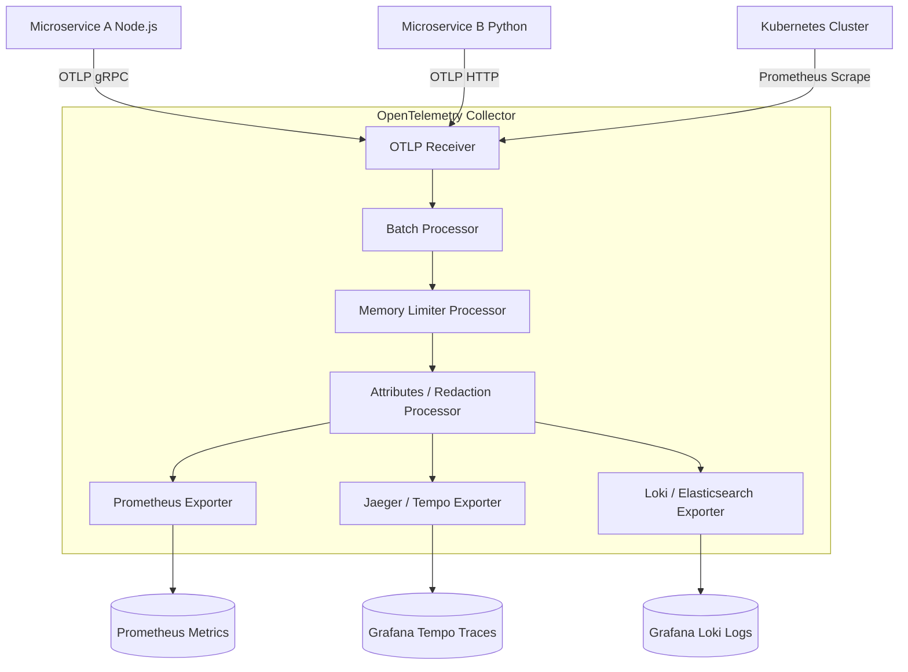

# OpenTelemetry (OTel) & Distributed Observability Cheatsheet

OpenTelemetry (OTel) is a vendor-neutral, CNCF-incubated observability framework for generating, collecting, transforming, and exporting telemetry data (Traces, Metrics, and Logs) across cloud-native microservices.

---

## 1. OpenTelemetry Collector Architecture & Pipeline



---

## 2. The Three Pillars of Observability

- **Traces:** Record the lifecycle of requests traversing multi-tier distributed microservice architectures (Spans, Trace IDs, Span IDs).
- **Metrics:** Numeric aggregated measurements captured at regular intervals (Counters, Gauges, Histograms, Summaries).
- **Logs:** Timestamped structured event records carrying context attributes and trace context bindings (`trace_id`, `span_id`).

---

## 3. Python OpenTelemetry SDK Implementation

```python
from opentelemetry import trace, metrics
from opentelemetry.sdk.trace import TracerProvider
from opentelemetry.sdk.trace.export import BatchSpanProcessor
from opentelemetry.exporter.otlp.proto.grpc.trace_exporter import OTLPSpanExporter
from opentelemetry.sdk.resources import Resource

# 1. Initialize OTel Resource with Service Metadata
resource = Resource.create(attributes={
    "service.name": "vault-payment-service",
    "service.version": "2.4.0",
    "deployment.environment": "production"
})

# 2. Configure Trace Provider & OTLP Exporter
provider = TracerProvider(resource=resource)
processor = BatchSpanProcessor(OTLPSpanExporter(endpoint="http://otel-collector:4317", insecure=True))
provider.add_span_processor(processor)
trace.set_tracer_provider(provider)

tracer = trace.get_tracer("payment_module")

# 3. Create Custom Spans with Attributes & Events
def process_payment(account_id: str, amount: float):
    with tracer.start_as_current_span("process_payment") as span:
        span.set_attribute("payment.account_id", account_id)
        span.set_attribute("payment.amount", amount)

        try:
            # Nested Span
            with tracer.start_as_current_span("stripe_gateway_call"):
                # Simulate payment processing call
                span.add_event("Payment authorized successfully", {"auth_code": "AUTH_99823"})
                return True
        except Exception as e:
            span.record_exception(e)
            span.set_status(trace.Status(trace.StatusCode.ERROR, str(e)))
            raise
```

---

## 4. Node.js Auto-Instrumentation Configuration

```typescript
import { NodeSDK } from '@opentelemetry/sdk-node';
import { getNodeAutoInstrumentations } from '@opentelemetry/auto-instrumentations-node';
import { OTLPTraceExporter } from '@opentelemetry/exporter-trace-otlp-grpc';

const sdk = new NodeSDK({
  serviceName: 'vault-frontend-api',
  traceExporter: new OTLPTraceExporter({
    url: 'grpc://otel-collector.monitoring:4317',
  }),
  instrumentations: [getNodeAutoInstrumentations({
    '@opentelemetry/instrumentation-fs': { enabled: false }, // Reduce noisy file system spans
  })],
});

sdk.start();
```

---

## 5. Collector Configuration (`otel-collector-config.yaml`)

```yaml
receivers:
  otlp:
    protocols:
      grpc:
        endpoint: 0.0.0.0:4317
      http:
        endpoint: 0.0.0.0:4318

processors:
  batch:
    timeout: 1s
    send_batch_size: 1024
  memory_limiter:
    check_interval: 1s
    limit_percentage: 80
    spike_limit_percentage: 20

exporters:
  otlp/tempo:
    endpoint: tempo:4317
    tls:
      insecure: true
  prometheus:
    endpoint: 0.0.0.0:8889

service:
  pipelines:
    traces:
      receivers: [otlp]
      processors: [memory_limiter, batch]
      exporters: [otlp/tempo]
    metrics:
      receivers: [otlp]
      processors: [memory_limiter, batch]
      exporters: [prometheus]
```

---

## Related Cheatsheets

- [Master Index](../Cheatsheets.md)
- [SRE Monitoring Cheatsheet](sre-monitoring-cheatsheet.md)
- [Kubernetes Cheatsheet](kubernetes-cheatsheet.md)
- [Microservices Cheatsheet](microservices-cheatsheet.md)
