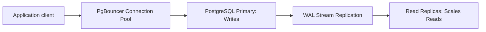

# PostgreSQL Cheatsheet

PostgreSQL is a powerful, open-source object-relational database system with over 35 years of active development.

---

## 1. Core SQL & DDL Operations

### Table Design with Constraints
```sql
CREATE TABLE departments (
    id SERIAL PRIMARY KEY,
    name VARCHAR(100) NOT NULL UNIQUE,
    created_at TIMESTAMPTZ DEFAULT CURRENT_TIMESTAMP
);

CREATE TABLE employees (
    id UUID PRIMARY KEY DEFAULT gen_random_uuid(),
    first_name VARCHAR(50) NOT NULL,
    last_name VARCHAR(50) NOT NULL,
    email VARCHAR(255) NOT NULL UNIQUE CHECK (email ~* '^[A-Za-z0-9._%-]+@[A-Za-z0-9.-]+\.[A-Za-z]{2,4}$'),
    department_id INT REFERENCES departments(id) ON DELETE SET NULL,
    salary NUMERIC(12, 2) NOT NULL CHECK (salary > 0),
    is_active BOOLEAN DEFAULT TRUE,
    tags JSONB DEFAULT '[]'::jsonb,
    search_vector TSVECTOR,
    updated_at TIMESTAMPTZ DEFAULT CURRENT_TIMESTAMP
);
```

---

## 2. Indexing Deep Dive (B-Tree, GIN, BRIN, Partial)

Postgres supports multiple index types optimized for specific access patterns.

```sql
-- 1. Standard B-Tree Index (Default)
CREATE INDEX idx_employees_last_name ON employees(last_name);

-- 2. Covering Index (using INCLUDE to add payload columns directly in the index nodes)
CREATE INDEX idx_employees_department_salary ON employees(department_id) INCLUDE (salary);

-- 3. Partial Index (Filters out inactive users, keeping index size small)
CREATE INDEX idx_employees_active_salary ON employees(salary) WHERE is_active = TRUE;

-- 4. Multi-Column Index (Leftmost prefix rule applies)
CREATE INDEX idx_employees_name_compound ON employees(last_name, first_name);

-- 5. GIN (Generalized Inverted Index) - Optimized for JSONB or Array content querying
CREATE INDEX idx_employees_tags_gin ON employees USING gin (tags);

-- 6. Expression Index (Indexes the calculated lower-case text)
CREATE INDEX idx_employees_lower_email ON employees (lower(email));
```

---

## 3. Query Analysis & Optimization (EXPLAIN ANALYZE)

Use `EXPLAIN ANALYZE` to inspect how Postgres executes queries under the hood.

```sql
EXPLAIN ANALYZE
SELECT department_id, avg(salary)
FROM employees
WHERE is_active = TRUE AND last_name = 'Verne'
GROUP BY department_id;
```

### Key Execution Node Metrics to Watch:
- **Seq Scan (Sequential Scan):** Scans the entire table from disk. Bad on large datasets; indicates a missing index.
- **Index Scan:** Traverses the index tree and reads matched rows from table pages.
- **Index Only Scan:** Returns result directly from index nodes without hitting table pages (very fast).
- **Bitmap Heap Scan / Bitmap Index Scan:** Used when fetching many matches; dynamically maps matched row IDs in memory.

---

## 4. Concurrency Control & MVCC (Multi-Version Concurrency Control)

Postgres uses MVCC to allow readers to query without being blocked by writers, and vice-versa.

### Transaction Isolation Levels
```sql
-- 1. Read Committed (Default)
BEGIN TRANSACTION ISOLATION LEVEL READ COMMITTED;

-- 2. Repeatable Read (Guarantees data won't change within the transaction scope)
BEGIN TRANSACTION ISOLATION LEVEL REPEATABLE READ;

-- 3. Serializable (Full isolation, highest guarantees, but can fail on concurrent write dependencies)
BEGIN TRANSACTION ISOLATION LEVEL SERIALIZABLE;
```

### Explicit Table & Row Locking
```sql
-- Lock rows in a transaction to prevent concurrent updates (pessimistic lock)
BEGIN;
SELECT * FROM employees WHERE id = 'uuid-goes-here' FOR UPDATE;
-- Do operations...
COMMIT;
```

---

## 5. Maintenance & Garbage Collection (VACUUM)

MVCC leaves dead row versions ("dead tuples") when data is updated or deleted. `VACUUM` reclaims this space.

```sql
-- Reclaim space from deleted tuples and update the visibility map
VACUUM employees;

-- Reclaim space and collect new statistics for the query planner
VACUUM ANALYZE employees;

-- Full lock cleanup (locks table, rebuilds files, reclaims maximum disk space)
VACUUM FULL employees;
```


---

## Best Practices & Production Standards

1. **Index Optimization**: Use GIN indexes for array and JSONB queries, Partial indexes to omit rows that are rarely queried, and Covering indexes (`INCLUDE`) to bypass heap scans.
2. **Connection Pooling**: Always employ an external pooler like PgBouncer in production to restrict connection state overheads.
3. **Explicit Query Planning**: Constantly monitor planning outputs using `EXPLAIN (ANALYZE, BUFFERS)` to diagnose heavy sequential scans or bad hash joins.

---

## Common Mistakes & Antipatterns

1. **Failing to VACUUM**: Neglecting dead tuple cleanup, which causes table bloat and query slowing in MVCC systems.
2. **Querying Unbounded Selects**: Running `SELECT *` across huge tables without a limit, offset, or index boundaries.
3. **Unindexed Foreign Keys**: Forgetting to index foreign key constraints, resulting in heavy table scans during cascades or joins.

---

## Troubleshooting & Debugging Guide

1. **Lock Contention / Deadlocks**: Query `pg_stat_activity` and `pg_locks` to identify blocked transactions, transaction durations, and lock locks.
2. **High CPU Utilization**: Use `pg_stat_statements` to capture the most resource-intensive SQL queries and identify missing indexes or bad joins.

---

## Core Interview Questions & Answers

1. **Q: How does PostgreSQL implement Multi-Version Concurrency Control (MVCC)?**
   - **A**: When rows are updated or deleted, Postgres writes a new version of the row (tuple) with visibility headers (`xmin`, `xmax`). Active transactions only see rows whose transactions have committed. Old rows are collected asynchronously by the `VACUUM` process.
2. **Q: Compare a B-Tree index with a GIN (Generalized Inverted Index) index in Postgres.**
   - **A**: B-Tree is optimized for scalar, ordered data (equality and range queries). GIN is an inverted index optimized for multi-valued elements (like array items, JSONB document keys, or text search tokens), mapping components back to rows.

---

## Technical Architecture Diagram



---

## Related Cheatsheets & References

- [SQL Cheatsheet](sql-cheatsheet.md)
- [Database Comparison Cheatsheet](database-comparison-cheatsheet.md)
- [Master Directory Index](../Cheatsheets.html)
- [Knowledge Hub Portal](../Knowledge%2021cb6c26d9ba808da8d4f72eb2193ca2.html)
