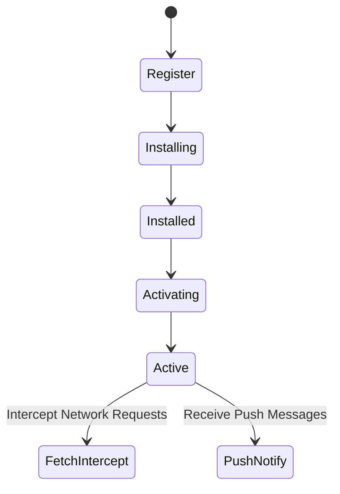
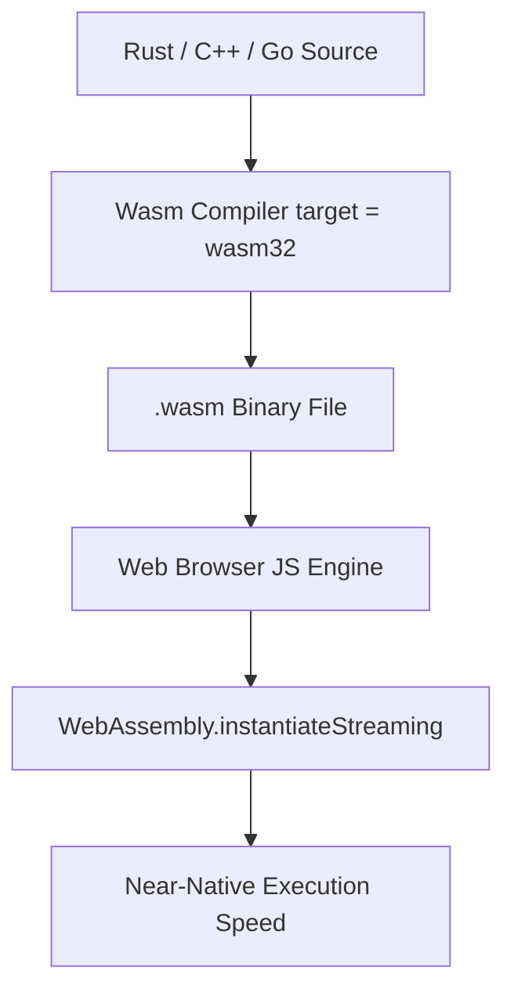

# Progressive Web Apps (PWA) & WebAssembly (Wasm) Cheatsheet

Progressive Web Apps (PWAs) combine native app capabilities with web reach. WebAssembly (Wasm) provides a binary instruction format for near-native code execution speed in web browsers.

---

## 1. PWA & Service Worker Lifecycle



---

## 2. WebAssembly (Wasm) Execution Flow



---

## Key Snippets

### Registering Service Worker
```javascript
if ('serviceWorker' in navigator) {
  window.addEventListener('load', () => {
    navigator.serviceWorker.register('/sw.js').then(reg => {
      console.log('ServiceWorker registered:', reg.scope);
    });
  });
}
```

### Instantiating WebAssembly
```javascript
WebAssembly.instantiateStreaming(fetch('module.wasm'), {})
  .then(results => {
    const { add } = results.instance.exports;
    console.log('Wasm result:', add(10, 20));
  });
```

---

## Related Cheatsheets

- [Master Index](../Cheatsheets.html)
- [Web Performance Optimization Cheatsheet](web-performance-optimization-cheatsheet.md)
- [Rust Cheatsheet](rust-cheatsheet.md)
- [JavaScript Cheatsheet](javascript-cheatsheet.md)
