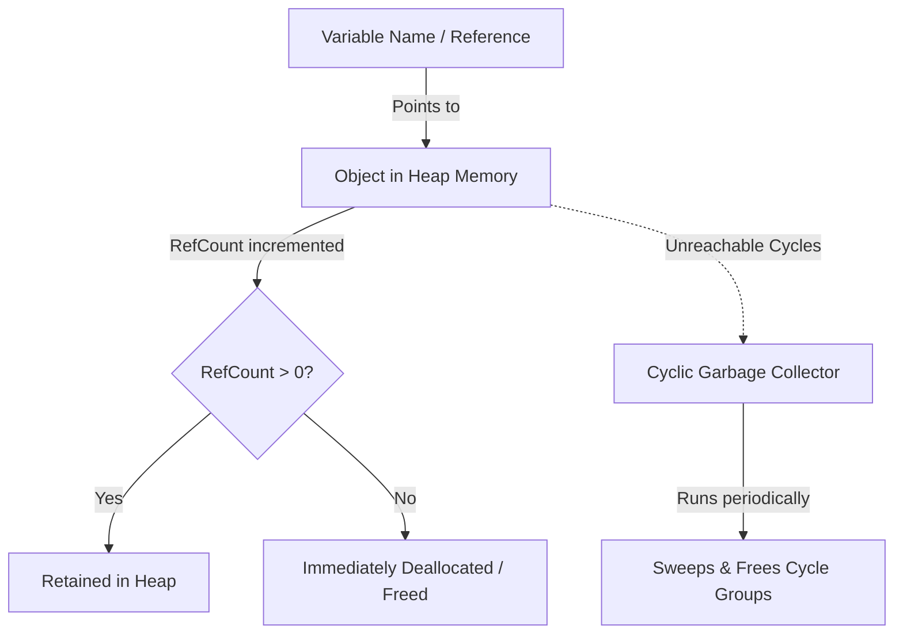
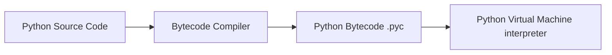

# Python Cheatsheet

## Basics

```python
# Variables & types
x = 5                  # int
y = 3.14                # float
s = "hello"              # str
b = True                  # bool
n = None                   # NoneType

type(x)                # <class 'int'>
isinstance(x, int)     # True

# f-strings
name = "Rao"
print(f"Hello, {name}! {1+2=}")   # Hello, Rao! 1+2=3

# Multiple assignment
a, b = 1, 2
a, b = b, a             # swap
x, *rest = [1, 2, 3, 4]  # x=1, rest=[2,3,4]
```

## Data Structures

```python
# List
lst = [1, 2, 3]
lst.append(4)
lst.extend([5, 6])
lst.insert(0, 0)
lst.pop()               # removes & returns last
lst.remove(2)            # removes first matching value
lst[::-1]                 # reversed
lst.sort(key=lambda x: -x)
sorted(lst, reverse=True)

# Tuple (immutable)
t = (1, 2, 3)

# Dict
d = {"a": 1, "b": 2}
d.get("c", 0)            # default if missing
d.setdefault("c", 0)
d.update({"d": 4})
d.keys(); d.values(); d.items()
{k: v for k, v in d.items() if v > 1}   # dict comprehension

# Set
s1 = {1, 2, 3}
s1 | {3, 4}              # union
s1 & {2, 3}               # intersection
s1 - {1}                   # difference
s1 ^ {3, 4}                 # symmetric difference

# Comprehensions
squares = [x**2 for x in range(10)]
evens = [x for x in range(10) if x % 2 == 0]
matrix_flat = [x for row in matrix for x in row]
gen = (x**2 for x in range(10))   # generator expression, lazy
```

## Control Flow

```python
if x > 0:
    ...
elif x == 0:
    ...
else:
    ...

for i, val in enumerate(lst):
    print(i, val)

for k, v in d.items():
    print(k, v)

for a, b in zip(list1, list2):
    print(a, b)

while condition:
    ...
    if stop_now:
        break
    if skip:
        continue
else:
    ...  # runs if loop completes without break

# Match statement (3.10+)
match command:
    case "start":
        ...
    case "stop" | "halt":
        ...
    case [x, y]:
        ...
    case {"key": value}:
        ...
    case _:
        ...
```

## Functions

```python
def greet(name, greeting="Hello", *args, **kwargs):
    return f"{greeting}, {name}!"

# Type hints & Advanced Typing
from typing import Optional, Union, List, Dict, Callable, Any, TypeVar, Generic

T = TypeVar('T')

class Stack(Generic[T]):
    def __init__(self) -> None:
        self.items: List[T] = []
    def push(self, item: T) -> None:
        self.items.append(item)
    def pop(self) -> T:
        return self.items.pop()

def add(a: int, b: int) -> int:
    return a + b

# Lambda
square = lambda x: x**2

# *args / **kwargs
def f(*args, **kwargs):
    print(args, kwargs)

# Unpacking into a call
f(*[1, 2, 3], **{"key": "val"})

# Default mutable arg trap — avoid this:
def bad(x, lst=[]):        # BAD: shared across calls
    lst.append(x)
    return lst

def good(x, lst=None):     # correct pattern
    if lst is None:
        lst = []
    lst.append(x)
    return lst

# Decorators
def timer(func):
    import time, functools
    @functools.wraps(func)
    def wrapper(*args, **kwargs):
        start = time.time()
        result = func(*args, **kwargs)
        print(f"{func.__name__} took {time.time()-start:.4f}s")
        return result
    return wrapper

@timer
def slow_function():
    ...
```

## Classes & OOP

```python
class Animal:
    species_count = 0            # class variable

    def __init__(self, name, sound):
        self.name = name          # instance variable
        self.sound = sound
        Animal.species_count += 1

    def speak(self):
        return f"{self.name} says {self.sound}"

    def __repr__(self):
        return f"Animal({self.name!r})"

    def __eq__(self, other):
        return self.name == other.name

    @staticmethod
    def is_valid_sound(sound):
        return isinstance(sound, str)

    @classmethod
    def create_dog(cls, name):
        return cls(name, "Woof")

    @property
    def upper_name(self):
        return self.name.upper()

class Dog(Animal):                 # inheritance
    def __init__(self, name):
        super().__init__(name, "Woof")

# Dataclasses (cleaner boilerplate)
from dataclasses import dataclass, field

@dataclass
class Point:
    x: int
    y: int
    tags: list = field(default_factory=list)

p = Point(1, 2)  # __init__, __repr__, __eq__ auto-generated

# Memory Optimization: __slots__
class OptimizedPoint:
    __slots__ = ['x', 'y']  # prevents dynamic dict creation, reducing memory footprint
    def __init__(self, x, y):
        self.x = x
        self.y = y
```

## Error Handling

```python
try:
    risky()
except ValueError as e:
    print(f"Value error: {e}")
except (TypeError, KeyError) as e:
    print(f"Other: {e}")
else:
    print("No exception occurred")
finally:
    print("Always runs")

# Raising
raise ValueError("bad input")
raise ValueError("bad input") from original_exception

# Custom exceptions
class MyError(Exception):
    pass

# Context managers
with open("file.txt") as f:
    data = f.read()

class MyContext:
    def __enter__(self):
        print("enter")
        return self
    def __exit__(self, exc_type, exc_val, exc_tb):
        print("exit")
        return False   # False = don't suppress exceptions

# contextlib shortcuts
from contextlib import contextmanager, closing, suppress

@contextmanager
def my_context():
    print("enter")
    yield "resource"
    print("exit")

# suppress example: ignore specific exceptions safely
with suppress(FileNotFoundError):
    os.remove("nonexistent_file.txt")
```

## Iterators & Generators

```python
def counter(start=0):
    n = start
    while True:
        yield n
        n += 1

gen = counter()
next(gen)         # 0
next(gen)         # 1

# yield from (delegate to sub-generator)
def chain(*iterables):
    for it in iterables:
        yield from it

# Custom iterator protocol
class Countdown:
    def __init__(self, n):
        self.n = n
    def __iter__(self):
        return self
    def __next__(self):
        if self.n <= 0:
            raise StopIteration
        self.n -= 1
        return self.n + 1
```

## String Handling

```python
s = "Hello, World!"
s.lower(); s.upper(); s.strip(); s.split(",")
s.replace("Hello", "Hi")
s.startswith("Hello"); s.endswith("!")
",".join(["a", "b", "c"])
s.find("World")           # index or -1
s.format(name="Rao")
"{:.2f}".format(3.14159)  # "3.14"
f"{3.14159:.2f}"           # "3.14"
f"{42:05d}"                 # "00042"
f"{1000000:,}"                # "1,000,000"

# Regex
import re
re.match(r"^\d+$", "123")
re.search(r"\d+", "abc123")
re.findall(r"\d+", "a1b22c333")
re.sub(r"\s+", " ", "too   many   spaces")
re.split(r",\s*", "a, b,c")
pattern = re.compile(r"\d+")   # compile once, reuse
```

## File I/O

```python
with open("file.txt", "r") as f:
    text = f.read()
    lines = f.readlines()
    for line in f:
        ...

with open("out.txt", "w") as f:
    f.write("hello\n")

with open("out.txt", "a") as f:   # append
    f.write("more\n")

import json
with open("data.json") as f:
    obj = json.load(f)
json.dumps(obj, indent=2)

import csv
with open("data.csv") as f:
    reader = csv.DictReader(f)
    for row in reader:
        print(row)

import pathlib
p = pathlib.Path("some/dir/file.txt")
p.exists(); p.is_file(); p.parent; p.stem; p.suffix
p.read_text(); p.write_text("content")
list(pathlib.Path(".").glob("*.py"))
```

## Standard Library Highlights

```python
from collections import Counter, defaultdict, OrderedDict, namedtuple, deque

Counter("mississippi")               # {'i': 4, 's': 4, 'p': 2, 'm': 1}
defaultdict(list)                     # auto-creates missing keys
dq = deque([1, 2, 3])
dq.appendleft(0); dq.popleft()        # O(1) both ends

Point = namedtuple("Point", ["x", "y"])
p = Point(1, 2)

import itertools
itertools.chain([1, 2], [3, 4])
itertools.combinations([1, 2, 3], 2)
itertools.permutations([1, 2, 3], 2)
itertools.product([1, 2], ["a", "b"])
itertools.groupby(sorted(data), key=lambda x: x.category)
itertools.islice(gen, 5)              # take first 5 from an iterator

import functools
functools.reduce(lambda a, b: a + b, [1, 2, 3, 4])
functools.lru_cache(maxsize=128)      # memoization decorator
functools.partial(func, arg1=val)

import datetime
now = datetime.datetime.now()
datetime.datetime.strptime("2026-07-17", "%Y-%m-%d")
now.strftime("%Y-%m-%d %H:%M:%S")
datetime.timedelta(days=7)
```

## Concurrency

```python
# Threading (good for I/O-bound work; GIL limits CPU-bound gains)
import threading
t = threading.Thread(target=func, args=(1, 2))
t.start(); t.join()

lock = threading.Lock()
with lock:
    ...  # critical section

# Multiprocessing (good for CPU-bound work; bypasses the GIL)
from multiprocessing import Pool
with Pool(4) as pool:
    results = pool.map(func, items)

# concurrent.futures (unified interface)
from concurrent.futures import ThreadPoolExecutor, ProcessPoolExecutor
with ThreadPoolExecutor(max_workers=4) as ex:
    futures = [ex.submit(func, i) for i in items]
    results = [f.result() for f in futures]

# asyncio (single-threaded, cooperative concurrency)
import asyncio

async def fetch(url):
    await asyncio.sleep(1)
    return url

async def main():
    results = await asyncio.gather(*[fetch(u) for u in urls])
    # or with timeout:
    result = await asyncio.wait_for(fetch(url), timeout=5.0)

asyncio.run(main())
```

## Virtual Environments & Packaging

```bash
python -m venv .venv
source .venv/bin/activate          # Linux/Mac
.venv\Scripts\activate               # Windows

pip install requests
pip install -r requirements.txt
pip freeze > requirements.txt

# Modern tooling
pip install uv
uv venv
uv pip install -r requirements.txt

# pyproject.toml is the modern standard for package config
```

## Testing

```python
# pytest
def test_addition():
    assert 1 + 1 == 2

import pytest

@pytest.fixture
def sample_data():
    return [1, 2, 3]

def test_sum(sample_data):
    assert sum(sample_data) == 6

@pytest.mark.parametrize("a,b,expected", [(1,2,3), (2,3,5)])
def test_add(a, b, expected):
    assert a + b == expected

with pytest.raises(ValueError):
    int("not a number")
```

## Useful Idioms

```python
# Walrus operator (3.8+)
if (n := len(data)) > 10:
    print(f"too long: {n}")

# Ternary
result = "even" if x % 2 == 0 else "odd"

# Chained comparisons
if 0 < x < 10:
    ...

# Unpacking in function calls / assignments
first, *middle, last = [1, 2, 3, 4, 5]

# String multiplication / repetition
"-" * 40

# Enumerate with start
for i, val in enumerate(lst, start=1):
    ...

# Any / all
any(x > 5 for x in lst)
all(x > 0 for x in lst)

# Sorting with multiple keys
sorted(people, key=lambda p: (p.age, p.name))

# Type checking pattern
from typing import Optional, Union, List, Dict, Callable
def process(items: List[int], mapper: Optional[Callable] = None) -> Dict[str, int]:
    ...
```

## Advanced Python Optimization & Internals

```python
# 1. Bytecode & Disassembly
import dis
def calc():
    return [x * 2 for x in range(1000)]
dis.dis(calc) # Inspects stack-based operations under the hood

# 2. Garbage Collection Control
import gc
gc.disable()  # Can boost raw performance in massive bulk batch runs
# gc.collect() triggers manual GC run

# 3. Dynamic Attribute Binding & __slots__ Optimization
class PointSlots:
    __slots__ = ("x", "y") # Skips self.__dict__ generation for major memory savings

# 4. Context Manager (Generator & Decorator patterns)
from contextlib import contextmanager
@contextmanager
def transaction():
    print("BEGIN TRANSACTION")
    try:
        yield
        print("COMMIT")
    except Exception:
        print("ROLLBACK")
        raise

# 5. Async Iterators & Generators (Python 3.5+)
import asyncio

class AsyncCounter:
    def __init__(self, limit):
        self.limit = limit
        self.count = 0
    def __aiter__(self):
        return self
    async def __anext__(self):
        if self.count >= self.limit:
            raise StopAsyncIteration
        await asyncio.sleep(0.1)  # Simulate I/O bound wait
        self.count += 1
        return self.count

# Async Generator function
async def async_generator(limit):
    for i in range(limit):
        await asyncio.sleep(0.1)
        yield i

# Usage:
# async for num in async_generator(5):
#     print(num)

# 6. Advanced Structural Pattern Matching (Python 3.10+)
def process_event(event):
    match event:
        case {"type": "click", "position": (x, y)}:
            return f"Clicked at {x}, {y}"
        case {"type": "keypress", "key": str(key)} if len(key) == 1:
            return f"Single key pressed: {key}"
        case {"type": "keypress", "key": key}:
            return f"Special key pressed: {key}"
        case _:
            return "Unknown event"

# 7. Modern Generic Type Syntax (PEP 695 - Python 3.12+)
# Python 3.12 introduces a new, cleaner syntax for defining generic classes, generic functions, and custom type aliases.

# New generic function syntax:
def get_first_element[T](items: list[T]) -> T:
    return items[0]

# New generic class syntax:
class Box[T]:
    def __init__(self, content: T) -> None:
        self.content = content
    def get_content(self) -> T:
        return self.content

# New type alias syntax (replaces typing.TypeVar and typing.Union for aliasing):
type Point3D = tuple[float, float, float]
type IntOrString = int | str
type NumericList[T: (int, float)] = list[T] # Generic alias with type constraints

# 8. Advanced Metaprogramming & Class Construction
# Custom Metaclasses control class creation at runtime by overriding __new__ or __init__.
class CustomMeta(type):
    def __new__(cls, name, bases, attrs):
        # Intercept and modify attributes during class definition
        attrs["custom_attribute"] = "Added by CustomMeta"
        return super().__new__(cls, name, bases, attrs)

class MyMetaClassedClass(metaclass=CustomMeta):
    pass

# __init_subclass__ allows customizing subclass creation without a full metaclass
class ParentClass:
    def __init_subclass__(cls, **kwargs):
        super().__init_subclass__(**kwargs)
        cls.is_customized = True

class ChildClass(ParentClass):
    pass

# 9. Descriptor Protocol
# Descriptors manage attribute access (__get__, __set__, __delete__) in a reusable way.
class NonNegative:
    def __init__(self, name):
        self.name = name

    def __get__(self, instance, owner):
        if instance is None:
            return self
        return instance.__dict__.get(self.name, 0)

    def __set__(self, instance, value):
        if value < 0:
            raise ValueError(f"{self.name} cannot be negative")
        instance.__dict__[self.name] = value

class Product:
    price = NonNegative("price")
    quantity = NonNegative("quantity")

    def __init__(self, price, quantity):
        self.price = price
        self.quantity = quantity
```

### Memory Profiling & Optimization Techniques

Python handles memory via dynamic reference counting and a cyclic garbage collector. In high-throughput production systems, tracking and reducing memory footprint is vital.

#### 1. Estimating Object Size with `sys.getsizeof`
The `sys.getsizeof` function returns the memory size of an object in bytes. Note that it only reports the memory directly allocated to the object, not the memory of nested objects it references (shallow size).

```python
import sys

# Empty list vs filled list
empty_list = []
filled_list = [1, 2, 3]

print(sys.getsizeof(empty_list))   # ~56 bytes (platform dependent)
print(sys.getsizeof(filled_list))  # ~88 bytes
```

#### 2. Deep Memory Profiling with `tracemalloc`
To trace memory allocations across lines of code or detect leaks, use the built-in `tracemalloc` module.

```python
import tracemalloc

# Start tracing
tracemalloc.start()

# Run your code
snapshot1 = tracemalloc.take_snapshot()
large_list = [x for x in range(100000)]
snapshot2 = tracemalloc.take_snapshot()

# Compare snapshots
top_stats = snapshot2.compare_to(snapshot1, 'lineno')
for stat in top_stats[:3]:
    print(stat)
```

#### 3. Object Reference and Garbage Collection Lifecycle



---

## 10. Advanced Dynamic Type Analysis & Protocols

Static types in Python are checked at build/commit time via MyPy, but can also be dynamically verified or enforced at runtime.

### Runtime Structural Subtyping: `typing.Protocol`
Unlike normal abstract base classes (`abc.ABC`) which require explicit subclassing, `Protocol` implements structural subtyping (Duck Typing) that satisfies static checkers.

```python
from typing import Protocol, runtime_checkable

@runtime_checkable
class Renderable(Protocol):
    def render(self) -> str:
        ...

class Button:
    def render(self) -> str:
        return "<button>Click Me</button>"

class Label:
    # Notice: No explicit inheritance from Renderable
    def render(self) -> str:
        return "<label>Username</label>"

# Verification
b = Button()
isinstance(b, Renderable) # Returns True because @runtime_checkable was supplied
```

---

## 11. Custom Dict Metaprogramming: __missing__ hook

To create specialized key fallback or default behaviors without overriding every dictionary method, utilize the specific `__missing__` hook supported natively by Python's `dict` base class.

```python
class AutoLowerDict(dict):
    """Automatically converts string keys to lowercase when accessed, preventing key collisions."""
    def __missing__(self, key):
        if isinstance(key, str):
            lower_key = key.lower()
            if lower_key in self:
                return self[lower_key]
        raise KeyError(key)

d = AutoLowerDict()
d["user_name"] = "jules_verne"

print(d["USER_NAME"]) # Outputs: jules_verne
```


---

## Best Practices & Production Standards

1. **Enforce PEP 8 Formatting**: Use robust linters (Flake8, Black, Ruff) to maintain consistent formatting standards.
2. **Prefer Generators for Iterables**: Utilize generators (`yield`) instead of list comprehensions when processing huge streams to preserve RAM.
3. **Use Context Managers**: Always wrap database, socket, or file streams inside `with` blocks to guarantee correct file descriptor release.

---

## Common Mistakes & Antipatterns

1. **Mutable Default Arguments**: Defining default arguments as lists or dicts (`def append_to(val, lst=[])`), leading to shared mutable state across invocations.
2. **Modifying Sequences inside Loops**: Mutating a list while iterating over it, causing unpredictable indices and missing elements.
3. **Imprecise Exception Catching**: Catching global base exceptions (`except Exception:`) instead of highly-typed exceptions, masking bugs.

---

## Troubleshooting & Debugging Guide

1. **GIL Concurrency Starvation**: Multithreading in Python is bounded by the GIL (Global Interpreter Lock). For CPU-bound tasks, shift execution to `multiprocessing` or native C extensions.
2. **NameError or AttributeError**: Inspect imports and namespace scopes. Check if variables are shadowed or if methods are called on uninstantiated objects.

---

## Core Interview Questions & Answers

1. **Q: How does the Global Interpreter Lock (GIL) affect multi-threaded programs in Python?**
   - **A**: The GIL is a mutex that prevents multiple native threads from executing Python bytecodes at once. This makes Python's multithreading single-core only for CPU-bound tasks, although it still yields control for I/O-bound tasks.
2. **Q: Explain the difference between deep copy and shallow copy.**
   - **A**: A shallow copy constructs a new compound object but inserts references to the original nested objects. A deep copy recursively constructs a new compound object and copies all nested elements.

---

## Technical Architecture Diagram



---

## Related Cheatsheets & References

- [NumPy Cheatsheet](numpy-cheatsheet.md)
- [Pandas Cheatsheet](pandas-cheatsheet.md)
- [Master Directory Index](../Cheatsheets.html)
- [Knowledge Hub Portal](../Knowledge%2021cb6c26d9ba808da8d4f72eb2193ca2.html)
