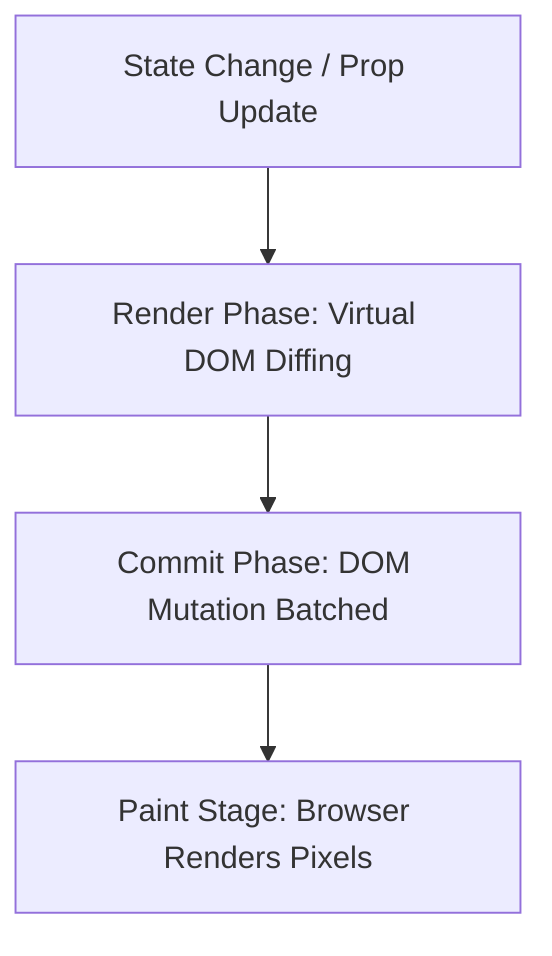

# ReactJS Cheatsheet

## 1. Functional Components & JSX

```jsx
import React, { useState, useEffect } from 'react';

export function CounterComponent({ initialCount = 0 }) {
  const [count, setCount] = useState(initialCount);

  // Effect Trigger Hook
  useEffect(() => {
    document.title = `Count: ${count}`;
    return () => {
      // Clean up phase on unmount
      document.title = "React App";
    };
  }, [count]); // Fires every time 'count' changes

  return (
    <div className="p-4 border rounded shadow">
      <h2 className="text-xl">Counter: {count}</h2>
      <button
        onClick={() => setCount(prev => prev + 1)}
        className="px-4 py-2 mt-2 bg-blue-500 text-white rounded"
      >
        Increment
      </button>
    </div>
  );
}

---

## 8. React 19 New Features & Hooks

React 19 introduces native support for Async Actions, automatic form management, direct `ref` props, and the `use` API for resources.

### Server Actions & Form hooks (`useActionState`, `useFormStatus`)
Async Actions allow you to handle pending states, errors, and sequential data mutations automatically.

```jsx
import { useActionState } from 'react';
import { useFormStatus } from 'react-dom';

// Server Action function
async function updateProfileName(prevState, formData) {
  const name = formData.get("name");
  try {
    await api.updateName(name);
    return { success: true, message: "Profile updated successfully!" };
  } catch (err) {
    return { success: false, message: err.message };
  }
}

// Sub-component to access form submitting status
function SubmitButton() {
  const { pending } = useFormStatus(); // Must be nested inside a <form>
  return (
    <button type="submit" disabled={pending}>
      {pending ? "Saving profile name..." : "Save Name"}
    </button>
  );
}

export function ProfileForm() {
  const [state, formAction, isPending] = useActionState(updateProfileName, {
    success: null,
    message: ""
  });

  return (
    <form action={formAction} class="space-y-4">
      <input type="text" name="name" placeholder="Enter new name" required />
      <SubmitButton />
      {state.message && (
        <p style={{ color: state.success ? 'green' : 'red' }}>
          {state.message}
        </p>
      )}
    </form>
  );
}
```

### The `use` Hook (Consuming Promises and Context)
In React 19, you can read promises or React context directly during the render phase.

```jsx
import { use, Suspense } from 'react';

// Fetch resource promise (e.g. from api client)
const weatherPromise = fetch("https://api.example.com/weather").then(res => res.json());

function WeatherDisplay() {
  // Directly resolves the Promise in-render!
  const data = use(weatherPromise);
  return <p>Current Temperature: {data.temp}°C</p>;
}

export function WeatherDashboard() {
  return (
    <Suspense fallback={<div>Loading dynamic weather promises...</div>}>
      <WeatherDisplay />
    </Suspense>
  );
}
```

### Native Element `ref` Prop
In React 19, `forwardRef` is no longer required. You can pass `ref` directly as a standard component prop!

```jsx
// React 19: No forwardRef wrapper needed!
export function ModernInput({ ref, label }) {
  return (
    <label>
      {label}
      <input ref={ref} class="border border-slate-300" />
    </label>
  );
}
```
```

## 2. Advanced State Management (useReducer)

```jsx
import React, { useReducer } from 'react';

const initialState = { count: 0 };

function reducer(state, action) {
  switch (action.type) {
    case 'increment':
      return { count: state.count + 1 };
    case 'decrement':
      return { count: state.count - 1 };
    case 'reset':
      return { count: 0 };
    default:
      throw new Error();
  }
}

export function ReducerCounter() {
  const [state, dispatch] = useReducer(reducer, initialState);

  return (
    <>
      <h3>Reducer Count: {state.count}</h3>
      <button onClick={() => dispatch({ type: 'decrement' })}>-</button>
      <button onClick={() => dispatch({ type: 'increment' })}>+</button>
    </>
  );
}
```

## 3. Custom Hooks Patterns

```jsx
import { useState, useEffect } from 'react';

export function useFetch(url) {
  const [data, setData] = useState(null);
  const [loading, setLoading] = useState(true);

  useEffect(() => {
    let active = true;
    async function load() {
      setLoading(true);
      const res = await fetch(url);
      const json = await res.json();
      if (active) {
        setData(json);
        setLoading(false);
      }
    }
    load();
    return () => { active = false; };
  }, [url]);

  return { data, loading };
}
```

---

## 4. Context API (Global Prop-Drilling Avoidance)

Context provides a way to pass data through the component tree without having to pass props down manually at every level.

```jsx
import React, { createContext, useContext, useState } from 'react';

// 1. Create Context Object
const ThemeContext = createContext({
  theme: 'light',
  toggleTheme: () => {}
});

// 2. Context Provider Component
export function ThemeProvider({ children }) {
  const [theme, setTheme] = useState('light');

  const toggleTheme = () => {
    setTheme(prev => prev === 'light' ? 'dark' : 'light');
  };

  return (
    <ThemeContext.Provider value={{ theme, toggleTheme }}>
      {children}
    </ThemeContext.Provider>
  );
}

// 3. Consumer Component via useContext Hook
export function ThemeToggleButton() {
  const { theme, toggleTheme } = useContext(ThemeContext);

  return (
    <button
      onClick={toggleTheme}
      style={{
        background: theme === 'light' ? '#fff' : '#333',
        color: theme === 'light' ? '#000' : '#fff',
        padding: '8px 16px',
        border: '1px solid #ccc',
        borderRadius: '4px'
      }}
    >
      Active Theme: {theme} (Click to toggle)
    </button>
  );
}
```

---

## 5. Performance Optimization & Memoization

Avoid unnecessary re-renders with `React.memo`, `useMemo`, and `useCallback`.

```jsx
import React, { useState, useMemo, useCallback } from 'react';

// 1. React.memo prevents re-rendering a component if its props haven't changed
const ExpensiveButton = React.memo(({ onClick, label }) => {
  console.log(`Rendering button: ${label}`);
  return <button onClick={onClick}>{label}</button>;
});

ExpensiveButton.displayName = 'ExpensiveButton';

export function ParentDashboard() {
  const [count, setCount] = useState(0);
  const [text, setText] = useState('');

  // 2. useCallback caches the function definition between re-renders
  const incrementCount = useCallback(() => {
    setCount(prev => prev + 1);
  }, []); // Empty dependency array means the function is only created once

  // 3. useMemo caches the returned value of a computation between re-renders
  const expensiveCalculationValue = useMemo(() => {
    console.log('Calculating expensive result...');
    let result = 0;
    for (let i = 0; i < 10000000; i++) {
      result += i;
    }
    return result + count;
  }, [count]); // Recalculates only when 'count' changes

  return (
    <div>
      <input value={text} onChange={e => setText(e.target.value)} placeholder="Type here..." />
      <p>Expensive Calculation Result: {expensiveCalculationValue}</p>
      <ExpensiveButton onClick={incrementCount} label="Add Count" />
    </div>
  );
}
```

---

## 6. Forward Refs & Imperative Handle

Expose custom instance values/methods to parent components using `forwardRef` and `useImperativeHandle`.

```jsx
import React, { useRef, useImperativeHandle, forwardRef } from 'react';

const CustomTextInput = forwardRef((props, ref) => {
  const inputRef = useRef();

  // Expose specific custom behaviors to parent
  useImperativeHandle(ref, () => ({
    focusAndHighlight: () => {
      inputRef.current.focus();
      inputRef.current.style.borderColor = 'red';
      inputRef.current.style.backgroundColor = '#fff0f0';
    },
    clearValue: () => {
      inputRef.current.value = '';
    }
  }));

  return <input ref={inputRef} type="text" placeholder="Imperative focus input" />;
});

CustomTextInput.displayName = 'CustomTextInput';

export function FocusControlPanel() {
  const textInputRef = useRef();

  return (
    <div>
      <CustomTextInput ref={textInputRef} />
      <button onClick={() => textInputRef.current.focusAndHighlight()}>
        Focus & Highlight
      </button>
      <button onClick={() => textInputRef.current.clearValue()}>
        Clear Input
      </button>
    </div>
  );
}
```

---

## 7. React 18 Concurrent Rendering Features

Concurrent features allow React to prioritize non-blocking UI updates and split rendering phases.

```jsx
import React, { useState, useTransition, useDeferredValue } from 'react';

export function SearchFilterDashboard() {
  const [query, setQuery] = useState('');
  const [items, setItems] = useState([]);

  // 1. useTransition for low-priority state updates
  const [isPending, startTransition] = useTransition();

  // 2. useDeferredValue defers recalculating slow values until main threads are clear
  const deferredQuery = useDeferredValue(query);

  const handleSearch = (e) => {
    const value = e.target.value;
    setQuery(value); // High priority: update input instantly

    startTransition(() => {
      // Low priority: filter array (may take time)
      const filtered = Array.from({ length: 5000 }, (_, i) => `${value} item ${i}`);
      setItems(filtered);
    });
  };

  return (
    <div>
      <input type="text" value={query} onChange={handleSearch} placeholder="Type query..." />
      {isPending && <p>Filtering large item list...</p>}
      <ul>
        {items.slice(0, 10).map((item, idx) => (
          <li key={idx}>{item}</li>
        ))}
      </ul>
    </div>
  );
}
```


---

## Best Practices & Production Standards

1. **Optimize Component Renders**: Keep component state as local as possible. Leverage `React.memo` and `useCallback` to prevent unnecessary child sub-tree re-renders on expensive elements.
2. **Deterministic List Keys**: Always supply stable, unique IDs as key props for dynamic lists instead of volatile array indexes to prevent reconciliation glitches.
3. **Strict Side-Effect Cleanups**: Always return clean-up functions in `useEffect` to close open WebSockets, abort pending fetch requests, or clear timers.

---

## Common Mistakes & Antipatterns

1. **Direct State Mutations**: Modifying state variables directly (e.g., `state.value = x`) instead of using setter dispatch functions, preventing virtual DOM diff triggering.
2. **Stale Closures inside Effects**: Omitting state variables or functions from the dependency array of `useEffect`, causing closures to capture outdated variable scopes.
3. **Infinite Render Loops**: Updating a state directly inside the render phase or within a `useEffect` that reads from the same state without guard filters.

---

## Troubleshooting & Debugging Guide

1. **React Hydration Mismatches**: Ensure that server-rendered HTML matches client-rendered outputs exactly. Guard dynamic client-only views (like current time or local storage) using a state-based layout check (`isMounted`).
2. **Maximum Update Depth Exceeded**: Inspect inline handler definitions. E.g., change `onClick={handleClick()}` (immediate invocation) to `onClick={() => handleClick()}` (deferred callback).

---

## Core Interview Questions & Answers

1. **Q: Explain React's Reconciliation process and the role of the virtual DOM.**
   - **A**: Reconciliation is React's diffing algorithm to update the DOM. React builds a virtual DOM tree in memory, diffs it against the previous tree using a heuristic $O(N)$ algorithm, and batches only the precise calculated mutations to the real DOM.
2. **Q: What are the main benefits of React 19's Async Actions and how does `useActionState` help?**
   - **A**: Async Actions manage form submission lifecycles, pending loading states, and error handling automatically. `useActionState` receives an async handler, tracks submission status natively, and returns the current state plus a pending boolean.

---

## Technical Architecture Diagram



---

## Related Cheatsheets & References

- [Next.js Cheatsheet](nextjs-cheatsheet.md)
- [TypeScript Cheatsheet](typescript-cheatsheet.md)
- [Master Directory Index](../Cheatsheets.html)
- [Knowledge Hub Portal](../Knowledge%2021cb6c26d9ba808da8d4f72eb2193ca2.html)
