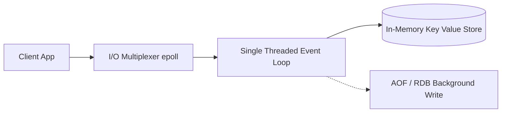

# Redis Cheatsheet

A production reference for Redis keyspace commands, fundamental data structures, transactions, publishing/subscribing, and client connection setups.

---

## 1. General Keyspace Commands

```bash
SET user:1 "Jules"                 # Set string key with value
GET user:1                         # Retrieve string key
EXISTS user:1                      # Check key existence (returns 1 or 0)
DEL user:1                         # Delete a key
EXPIRE user:1 3600                 # Set key expiration in seconds (1 hour)
TTL user:1                         # Check remaining Time-To-Live in seconds
KEYS *                             # List all keys (⚠️ Warning: DO NOT use in production!)
SCAN 0 MATCH user:* COUNT 10       # Safe, non-blocking keyspace cursor iteration
FLUSHDB                            # Delete all keys in current database
FLUSHALL                           # Delete all keys across all Redis databases
```

---

## 2. Core Data Structures

### Lists (Ordered sequences)
```bash
LPUSH tasks "Deploy app"           # Push item to the left (front)
RPUSH tasks "Write tests"          # Push item to the right (back)
LPOP tasks                         # Pop item from the left
RPOP tasks                         # Pop item from the right
LRANGE tasks 0 -1                  # List all items (0 to end index)
LLEN tasks                         # Get total list length
```

### Sets (Unordered, unique collections)
```bash
SADD tags "python" "redis"         # Add elements to the set
SREM tags "redis"                  # Remove element from the set
SISMEMBER tags "python"            # Check membership (returns 1 or 0)
SMEMBERS tags                      # List all elements in set
SINTER tags1 tags2                 # Find intersection of two sets
SUNION tags1 tags2                 # Find union of two sets
```

### Hashes (Field-value objects)
```bash
HSET user:101 name "Rao" email "rao@ex.com" # Set multiple hash fields
HGET user:101 name                          # Get specific field
HGETALL user:101                            # Get all fields and values
HDEL user:101 email                         # Delete field
HEXISTS user:101 name                       # Check field existence
```

### Sorted Sets (Sets ordered by score)
```bash
ZADD leaderboard 100 "PlayerA"     # Add element with score 100
ZADD leaderboard 150 "PlayerB"     # Add element with score 150
ZRANGE leaderboard 0 -1 WITHSCORES # Get all elements sorted lowest to highest
ZREVRANGE leaderboard 0 -1 WITHSCORES # Get elements sorted highest to lowest
ZREM leaderboard "PlayerA"         # Remove element
```

---

## 3. Transactions & Pipelining

Redis transactions ensure command execution occurs in a single sequential block.

```bash
MULTI                              # Start transaction block
SET balance:1 500                  # Queued
INCRBY balance:1 100               # Queued
EXEC                               # Execute all queued commands atomically
# Alternatively, discard transaction:
DISCARD                            # Cancel transaction, discard queued commands
```

### Optimistic Locking via WATCH
```bash
WATCH balance:1                    # Watch a key for modifications
# Run GET, check value in client...
MULTI
DECRBY balance:1 50
EXEC                               # Fails (returns null) if balance:1 changed after WATCH
```

---

## 4. Pub/Sub (Publish & Subscribe)

Real-time message broadcasting channel model.

```bash
SUBSCRIBE updates:alerts           # Client A: Subscribe to channel
PUBLISH updates:alerts "CPU > 90%" # Client B: Broadcast message to channel
PSUBSCRIBE updates:*               # Subscribe to all channels matching pattern
```

---

## 5. Python Integration Example

```python
import redis

# Initialize client
r = redis.Redis(host='localhost', port=6379, db=0, decode_responses=True)

# Basic commands
r.set('system:status', 'active', ex=300) # set with 5min TTL
status = r.get('system:status')
print(f"Status: {status}")

# Pipe multiple operations to reduce network RTT latency
pipe = r.pipeline()
pipe.set('temp:1', 'a')
pipe.set('temp:2', 'b')
pipe.execute()
```


---

## Best Practices & Production Standards

1. **Reuse Connection Pools**: Avoid repeatedly establishing connections; instantiate global connection pools.
2. **Choose Appropriate Eviction Policies**: Set `maxmemory-policy` (like `allkeys-lru` or `volatile-lru`) to guarantee predictable memory behavior.
3. **Pipeline Bulk Queries**: Group sequential commands into a single `PIPELINE` batch to eliminate round-trip network times.

---

## Common Mistakes & Antipatterns

1. **Blocking O(N) Operations on Production**: Running commands like `KEYS *`, `SMEMBERS`, or `HGETALL` on large datasets, blocking Redis's single-threaded event loop.
2. **Failing to Set Expiries (TTL)**: Forgetting to apply Time-To-Live parameters to transient cache keys, leading to memory exhaustion.
3. **Misconfiguring RDB/AOF Persistence**: Enabling aggressive disk flushing configurations, causing write-performance degradation.

---

## Troubleshooting & Debugging Guide

1. **Locating CPU Bottlenecks**: Run `SLOWLOG GET` to identify queries taking longer than configured thresholds.
2. **Mitigating Cache Stampedes**: Implement probabilistic early expiration or mutual exclusion locking (mutex) to prevent concurrent backend queries when cache keys expire.

---

## Core Interview Questions & Answers

1. **Q: Why is Redis single-threaded, and how does it achieve high performance?**
   - **A**: Redis is single-threaded to avoid context switching, race conditions, and thread locks. It achieves high throughput because it operates completely in-memory and uses non-blocking asynchronous I/O multiplexing (via epoll or kqueue) to handle thousands of connections concurrently.
2. **Q: Compare RDB snapshots and AOF persistence in Redis.**
   - **A**: RDB (Redis Database) takes compact point-in-time binary snapshots of memory at intervals (fast recovery, low performance overhead, but risks losing recent writes). AOF (Append-Only File) logs every write operation sequentially (safe durability, but files are larger and slow down recovery).

---

## Technical Architecture Diagram



---

## Related Cheatsheets & References

- [Database Comparison Cheatsheet](database-comparison-cheatsheet.md)
- [PostgreSQL Cheatsheet](postgres-cheatsheet.md)
- [Master Directory Index](../Cheatsheets.html)
- [Knowledge Hub Portal](../Knowledge%2021cb6c26d9ba808da8d4f72eb2193ca2.html)
