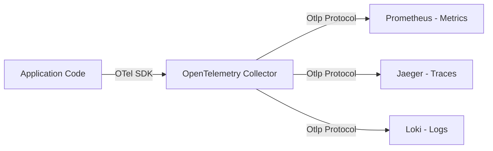

# SRE, Monitoring & Time Series Cheatsheet

## Grafana & Prometheus (Flux & PromQL)

PromQL (Prometheus Query Language) is used to filter and aggregate time-series metric data on the fly.

```promql
# 1. CPU Usage rate over the last 5 minutes grouped by instance
sum(rate(node_cpu_seconds_total{mode!="idle"}[5m])) by (instance)

# 2. Memory usage percentage calculation
(node_memory_MemTotal_bytes - node_memory_MemFree_bytes) / node_memory_MemTotal_bytes * 100

# 3. HTTP Request failure rate (> 5xx status codes)
sum(rate(http_requests_total{status=~"5.."}[5m])) / sum(rate(http_requests_total[5m]))
```

---

## InfluxDB (Flux Query Engine)

Flux is the functional scripting language used in InfluxDB 2.0+ to query and manipulate time-series points.

```flux
// Query metric points from a specific bucket
from(bucket: "system_metrics")
  |> range(start: -1h)
  |> filter(fn: (r) => r["_measurement"] == "cpu")
  |> filter(fn: (r) => r["_field"] == "usage_idle")
  |> filter(fn: (r) => r["cpu"] == "cpu-total")
  // Aggregate data in 5-minute windows calculating the mean
  |> aggregateWindow(every: 5m, fn: mean, createEmpty: false)
  // Calculate raw CPU usage percentage
  |> map(fn: (r) => ({ r with _value: 100.0 - r._value }))
```

---

## Core Prometheus Metric Types

Prometheus supports four main metric types, which are tracked via client libraries and scraped over HTTP endpoints.

| Metric Type | Characteristics | Common Use Case |
| :--- | :--- | :--- |
| **Counter** | Monotonically increasing value. Resets to 0 only on system restart. | Tracking total request count, errors, or uptime seconds. |
| **Gauge** | Value that can go up and down arbitrarily. | Tracking memory usage, CPU temperature, disk space, active threads. |
| **Histogram** | Samples observations (like duration) and counts them in configurable buckets. | Measuring API response latency percentiles (e.g., p95, p99). |
| **Summary** | Similar to Histogram, but calculates configurable quantiles over a sliding window on the client-side. | Client-side exact latency calculations. |

---

## The Four Golden Signals of SRE

According to the Google SRE Book, monitoring these four signals is the key to identifying and diagnosing system failure.

1. **Latency:** The time it takes to service a request (e.g., successful database query vs. failed timeout response).
2. **Traffic:** A measure of how much demand is being placed on your service (e.g., HTTP requests per second, bandwidth throughput).
3. **Errors:** The rate of requests that fail (e.g., HTTP 500 errors, database connection drops, or incorrect payload schemas).
4. **Saturation:** A measure of how "full" your service is, highlighting resources that are most constrained (e.g., CPU, RAM, or disk IO queues).

---

## SLA vs SLO vs SLI

Establishing reliability goals is critical for SRE governance.

* **SLI (Service Level Indicator):** A quantifiable measure of service behavior.
  * *Formula:* $\text{SLI} = \frac{\text{Good Events}}{\text{Total Events}} \times 100$
  * *Example:* "Percentage of successful HTTP requests (status < 500) over a 5-minute window."
* **SLO (Service Level Objective):** A target reliability percentage defined for an SLI.
  * *Example:* "99.9% of HTTP requests must return successfully over any rolling 30-day period."
* **SLA (Service Level Agreement):** A legal contract with users defining consequences (usually financial) if the SLO is breached.

---

## Prometheus Alerting Rules Example

These rules are configured inside Prometheus to fire alerts when specific metric thresholds are breached.

```yaml
# alerting_rules.yml
groups:
  - name: API-Alerts
    rules:
      - alert: HighHttpErrorRate
        expr: (sum(rate(http_requests_total{status=~"5.."}[5m])) / sum(rate(http_requests_total[5m]))) * 100 > 5
        for: 2m
        labels:
          severity: critical
        annotations:
          summary: "High HTTP 5xx error rate detected on {{ $labels.instance }}"
          description: "HTTP error rate is above 5% (current value: {{ $value | printf \"%.2f\" }}%) for more than 2 minutes."

      - alert: DiskApproachingFull
        expr: (node_filesystem_free_bytes{mountpoint="/"} / node_filesystem_size_bytes{mountpoint="/"}) * 100 < 10
        for: 5m
        labels:
          severity: warning
        annotations:
          summary: "Disk space low on root partition"
          description: "Free space on / is below 10% (current value: {{ $value | printf \"%.2f\" }}%)."
```

---

## OpenTelemetry (OTel) Architecture

OpenTelemetry is a vendor-neutral observability framework for generating, collecting, and exporting telemetry data (Metrics, Logs, and Traces).



### Core Components
* **API:** Defines data types and abstractions (Tracer, Meter, Logger) without implementation.
* **SDK:** Implementations of the API, managing resource tagging, sampling, batching, and memory queue sizes.
* **OTLP (OpenTelemetry Protocol):** The gRPC/HTTP standard protocol for transmitting telemetry data.
* **Collector:** A high-performance proxy that receives OTLP streams, processes them (filters/labels), and exports them to backend systems.
