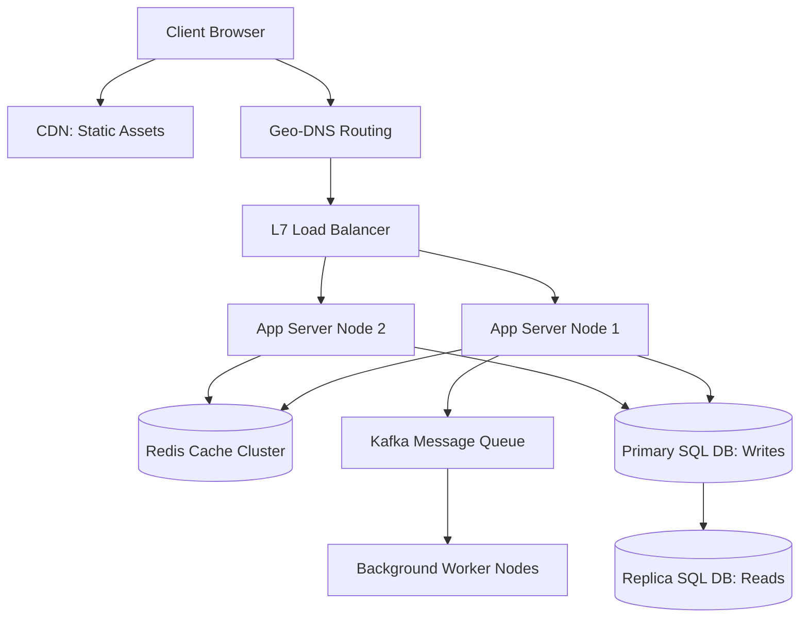

# System Design Cheatsheet

System Design is the process of defining the architecture, components, modules, interfaces, and data for a system to satisfy specified requirements.

---

## 1. Core Architectural Concepts

### Scalability (Vertical vs Horizontal)
- **Vertical Scalability (Scaling Up):** Adding more power (CPU, RAM, SSD) to an existing server. Simple but has physical limits and introduces a single point of failure (SPOF).
- **Horizontal Scalability (Scaling Out):** Adding more servers to the pool. Highly scalable and resilient, but requires load balancers and handles data synchronization.

### Availability & Reliability
- **Availability ($A$):** The percentage of time the system remains operational. Measured in "Nines" (e.g., 99.9% = "Three Nines", ~8.76 hours of downtime per year).
- **Reliability ($R$):** The probability that a system will perform its intended function without failure over a specified period.

---

## 2. Load Balancing (Layer 4 vs Layer 7)

Load balancers distribute incoming network traffic across multiple backend servers to prevent overload and ensure high availability.

### OSI Layer Comparison
- **Layer 4 (L4) Load Balancing:** Operates at the Transport layer (TCP/UDP). Routes traffic based on IP address and port number. Fast and low resource usage, but cannot inspect HTTP headers or payload.
- **Layer 7 (L7) Load Balancing:** Operates at the Application layer (HTTP/HTTPS). Routes traffic based on request headers, cookies, URL path, or query parameters. Highly intelligent and supports SSL termination, but requires more CPU/memory.

---

## 3. Caching Strategies & Eviction Policies

Caching stores copies of frequently accessed data in transient, high-speed memory (e.g., Redis, Memcached) to minimize database query latency.

| Strategy | Write Path | Read Path | Pros | Cons |
| :--- | :--- | :--- | :--- | :--- |
| **Cache Aside** | Write directly to database. | Check cache; on miss, read from database and update cache. | Simple, safe if cache fails. | Cache misses cause initial query latency. |
| **Write Through** | Write to cache first; cache immediately writes to database. | Read from cache. | Cache is never stale. | Write latency is higher due to two writes. |
| **Write Back (Behind)** | Write to cache; cache writes to database asynchronously. | Read from cache. | Extremely fast write performance. | Risk of data loss if cache crashes before database write completes. |

### Eviction Policies:
- **LRU (Least Recently Used):** Evicts the item that has not been accessed for the longest duration.
- **LFU (Least Frequently Used):** Evicts the item with the lowest access count.
- **FIFO (First In, First Out):** Evicts the oldest item regardless of access frequency.

---

## 4. Consistent Hashing

Standard hashing ($hash(key) \pmod N$) requires redistributing almost all keys when the number of servers ($N$) changes. **Consistent Hashing** resolves this by mapping both keys and servers to a circular ring (hash ring).

- When a server is added or removed, only a fraction ($\frac{1}{N}$) of the keys need to be rehashed.
- **Virtual Nodes (VNodes):** Maps multiple points on the ring to a single physical server, preventing hotspots and ensuring uniform data distribution.

---

## Best Practices & Production Standards

1. **Design for Failure (Fault Tolerance):** Use circuit breakers, bulkheads, retries with exponential backoff, and graceful degradation to prevent cascading failures.
2. **Stateless App Servers:** Store session states in external shared caches (Redis) or JWT tokens rather than local application memory to allow effortless scaling.
3. **Database Sharding:** Shard databases by a high-cardinality partition key (e.g., `user_id`) to distribute write and read loads evenly across storage nodes.
4. **Asynchronous Processing:** Move slow, resource-heavy operations (e.g., generating PDFs, sending emails) to asynchronous worker queues (RabbitMQ, Kafka).

---

## Common Mistakes & Antipatterns

1. **Premature Optimization:** Building a complex, multi-region microservices system for an MVP with very low traffic. Start monolithic and scale out as needed.
2. **Single Point of Failure (SPOF):** Forgetting to deploy redundant load balancers, database replicas, or DNS routing tables.
3. **Using Sticky Sessions:** Binding users to specific servers, which breaks horizontal scaling and load balancer traffic distribution if a server crashes.

---

## Troubleshooting & Debugging Guide

1. **Distributed Tracing (Tracing Requests):** Use correlation IDs and distributed tracing tools (Jaeger, Zipkin) to track a single request across multiple microservice boundaries.
2. **Identifying Bottlenecks:** Monitor CPU, memory, network bandwidth, disk I/O, and database lock times. Use profiling tools to inspect execution paths.

---

## Core Interview Questions & Answers

1. **Q: What is the difference between CAP and PACELC theorems?**
   - **A**: CAP states that in the presence of network **P**artitions, a system must choose between **C**onsistency and **A**vailability. **PACELC** extends this: **P**artition: choose **A**vailability or **C**onsistency; **E**lse (normal operation): choose **L**atency or **C**onsistency.
2. **Q: How does a CDN (Content Delivery Network) work?**
   - **A**: CDNs cache static assets (HTML, JS, CSS, images) at edge servers located physically close to users. When a user requests an asset, they are routed to the nearest edge node, minimizing latency and server load.

---

## Technical Architecture Diagram

---

## Related Cheatsheets & References

- [Master Index](../Cheatsheets.html)
- [Apache Kafka Cheatsheet](kafka-cheatsheet.md)
- [Microservices Cheatsheet](microservices-cheatsheet.md)
- [Web Security Cheatsheet](web-security-cheatsheet.md)
