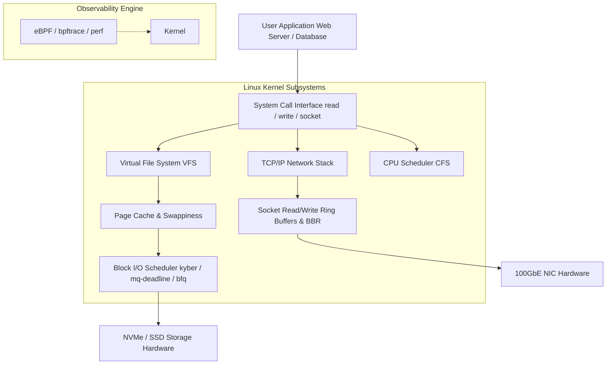

# Linux System Tuning & Performance Engineering Cheatsheet

High-performance Linux tuning optimizes kernel parameters, I/O scheduling, TCP network stack memory buffers, virtual memory swappiness, and file descriptor limits for low latency and high concurrency workloads.

---

## 1. Linux Kernel Performance Subsystems



---

## 2. Production Kernel Tuning (`/etc/sysctl.d/99-performance.conf`)

```ini
# ====================================================================
# Network Stack & High-Concurrency TCP Optimizations
# ====================================================================
# Increase maximum socket receive and send buffer size
net.core.rmem_max = 67108864
net.core.wmem_max = 67108864
net.core.rmem_default = 33554432
net.core.wmem_default = 33554432
net.ipv4.tcp_rmem = 4096 87380 67108864
net.ipv4.tcp_wmem = 4096 65536 67108864

# Maximum number of connection requests queued in socket backlog
net.core.somaxconn = 65535
net.core.netdev_max_backlog = 65535

# Enable TCP BBR Congestion Control Algorithm (requires fq qdisc)
net.core.default_qdisc = fq
net.ipv4.tcp_congestion_control = bbr

# Reuse TIME_WAIT sockets for new connections when safe
net.ipv4.tcp_tw_reuse = 1
net.ipv4.tcp_fin_timeout = 15

# Enable TCP Fast Open (TFO)
net.ipv4.tcp_fastopen = 3

# ====================================================================
# Virtual Memory & Page Cache Tuning
# ====================================================================
# Reduce aggressiveness of swapping (0-100, default 60)
vm.swappiness = 10

# Ratio of dirty memory at which pdflush begins writing dirty pages
vm.dirty_background_ratio = 5
vm.dirty_ratio = 10

# Prevent Out-Of-Memory (OOM) panic on overcommit
vm.overcommit_memory = 1
vm.overcommit_ratio = 50

# ====================================================================
# File Descriptors & Process Limits
# ====================================================================
fs.file-max = 2097152
fs.inotify.max_user_watches = 524288
```

---

## 3. Applying Settings & Diagnostic Commands

```bash
# Reload sysctl kernel parameters immediately without rebooting
sysctl --system

# Check active TCP congestion control algorithm
sysctl net.ipv4.tcp_congestion_control

# Monitor real-time Disk I/O performance (1-second intervals)
iostat -xz 1

# Monitor Virtual Memory and CPU context switching
vmstat -sm 1

# Monitor eBPF TCP connection latency histogram
bpftrace -e 'kprobe:tcp_v4_connect { @start[tid] = nsecs; } kretprobe:tcp_v4_connect /@start[tid]/ { @ms = hist((nsecs - @start[tid]) / 1000000); delete(@start[tid]); }'
```

---

## 4. System File Descriptor Limits (`/etc/security/limits.conf`)

```text
# <domain>      <type>  <item>      <value>
*               soft    nofile      1048576
*               hard    nofile      1048576
*               soft    nproc       524288
*               hard    nproc       524288
root            soft    nofile      1048576
root            hard    nofile      1048576
```

---

## Related Cheatsheets

- [Master Index](../Cheatsheets.md)
- [Linux Commands Cheatsheet](linux-cheatsheet.md)
- [Networking Cheatsheet](networking-cheatsheet.md)
- [Nginx Cheatsheet](nginx-cheatsheet.md)
