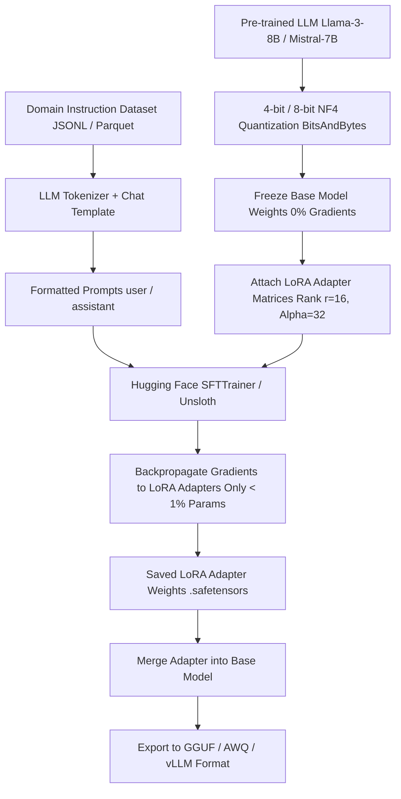

# Transformers & Large Language Model (LLM) Fine-Tuning Cheatsheet

Fine-tuning adapts pre-trained foundation models (Llama 3, Mistral, Qwen) to domain-specific tasks using Parameter-Efficient Fine-Tuning (PEFT), Quantized Low-Rank Adaptation (QLoRA), Direct Preference Optimization (DPO), and model serving frameworks (vLLM, Ollama).

---

## 1. QLoRA Fine-Tuning Pipeline Architecture



---

## 2. LoRA & QLoRA Mathematical Concept

Standard fine-tuning updates full weight matrix $W_0 \in \mathbb{R}^{d \times k}$:
$$W = W_0 + \Delta W$$

LoRA decomposes the weight update matrix $\Delta W$ into two low-rank matrices $A$ and $B$:
$$\Delta W = B \cdot A \quad \text{where } A \in \mathbb{R}^{r \times k}, B \in \mathbb{R}^{d \times r}, \quad r \ll \min(d, k)$$

- **Rank $r$:** Usually set to $8, 16, 32, 64$.
- **Alpha $\alpha$:** Scaling factor (typically $\alpha = 2 \times r$).
- **Parameter Reduction:** Reduces trainable parameter footprint by **99.9%** (e.g. training only 40M parameters instead of 8B).

---

## 3. Production PyTorch & Hugging Face QLoRA Training Script

```python
import torch
from datasets import load_dataset
from transformers import (
    AutoModelForCausalLM,
    AutoTokenizer,
    BitsAndBytesConfig,
    TrainingArguments
)
from peft import LoraConfig, get_peft_model, prepare_model_for_kbit_training
from trl import SFTTrainer

MODEL_ID = "meta-llama/Meta-Llama-3-8B-Instruct"

# 1. Configure 4-bit NF4 Quantization for QLoRA
bnb_config = BitsAndBytesConfig(
    load_in_4bit=True,
    bnb_4bit_quant_type="nf4",
    bnb_4bit_compute_dtype=torch.bfloat16,
    bnb_4bit_use_double_quant=True,
)

# 2. Load Model & Tokenizer
tokenizer = AutoTokenizer.from_pretrained(MODEL_ID, trust_remote_code=True)
tokenizer.pad_token = tokenizer.eos_token

model = AutoModelForCausalLM.from_pretrained(
    MODEL_ID,
    quantization_config=bnb_config,
    device_map="auto",
    torch_dtype=torch.bfloat16,
)

# 3. Prepare Model for K-Bit Training
model = prepare_model_for_kbit_training(model)

# 4. Define PEFT LoRA Config
peft_config = LoraConfig(
    r=16,
    lora_alpha=32,
    target_modules=["q_proj", "k_proj", "v_proj", "o_proj", "gate_proj", "up_proj", "down_proj"],
    lora_dropout=0.05,
    bias="none",
    task_type="CAUSAL_LM",
)

model = get_peft_model(model, peft_config)
model.print_trainable_parameters()

# 5. Define Training Arguments
training_args = TrainingArguments(
    output_dir="./llama3-vault-adapter",
    per_device_train_batch_size=4,
    gradient_accumulation_steps=4,
    learning_rate=2e-4,
    logging_steps=10,
    max_steps=200,
    optim="paged_adamw_8bit",
    fp16=False,
    bf16=True,
    warmup_ratio=0.03,
    lr_scheduler_type="cosine",
    save_strategy="steps",
    save_steps=50,
)

# 6. Initialize SFTTrainer
dataset = load_dataset("json", data_files="instructions.jsonl", split="train")

trainer = SFTTrainer(
    model=model,
    train_dataset=dataset,
    peft_config=peft_config,
    dataset_text_field="text",
    max_seq_length=2048,
    tokenizer=tokenizer,
    args=training_args,
)

trainer.train()
trainer.model.save_pretrained("./llama3-vault-adapter")
```

---

## 4. Serving Fine-Tuned Models with vLLM

```bash
# Install vLLM high-performance inference engine
pip install vllm

# Run OpenAI-compatible REST server with LoRA adapter
python3 -m vllm.entrypoints.openai.api_server \
  --model meta-llama/Meta-Llama-3-8B-Instruct \
  --enable-lora \
  --lora-modules vault-adapter=./llama3-vault-adapter \
  --port 8000 \
  --gpu-memory-utilization 0.90
```

---

## Related Cheatsheets

- [Master Index](../Cheatsheets.md)
- [PyTorch Cheatsheet](pytorch-cheatsheet.md)
- [LLM RAG Engineering Cheatsheet](llm-rag-engineering-cheatsheet.md)
- [Prompt Engineering Cheatsheet](prompt-engineering-cheatsheet.md)
