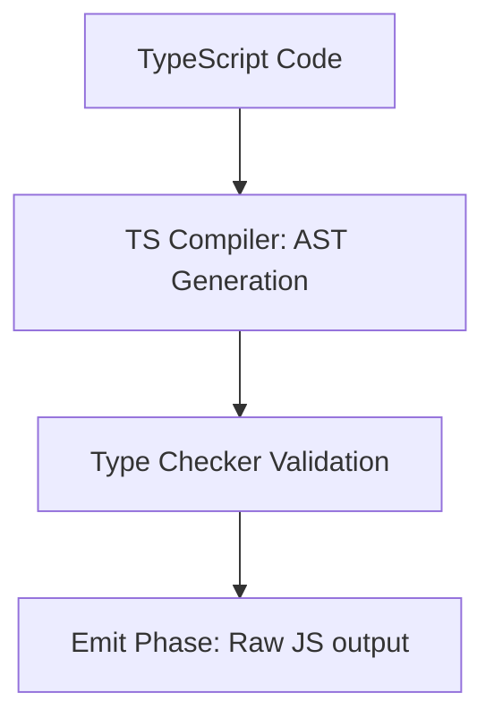

# TypeScript Cheatsheet

TypeScript is a typed superset of JavaScript that compiles to plain JavaScript. This cheatsheet covers TypeScript features, configurations, and best practices.

---

## 1. Basic Types

```typescript
let isDone: boolean = false;
let decimal: number = 6;
let color: string = "blue";
let list: number[] = [1, 2, 3];
let genericList: Array<number> = [1, 2, 3]; // alternative syntax
```

### Tuple
Fixed-length arrays with known element types at specific positions.
```typescript
let x: [string, number];
x = ["hello", 10]; // OK
// x = [10, "hello"]; // Error
```

### Enum
A way of giving more friendly names to sets of numeric or string values.
```typescript
enum Color {
  Red = 1,
  Green,
  Blue,
}
let c: Color = Color.Green; // 2

// String enums
enum Direction {
  Up = "UP",
  Down = "DOWN",
}
```

### Any, Unknown, Void, Null, and Undefined
- `any`: Opt-out of type checking. Avoid using this.
- `unknown`: Safe counterpart of `any`. You cannot perform arbitrary operations on an `unknown` without narrowing/type checking.
- `void`: Commonly used as the return type of functions that do not return a value.
- `never`: Represents types of values that never occur (e.g., a function that always throws an exception or never terminates).

```typescript
let loose: any = 4;
loose.ifItExists(); // No compiler error

let strictlyUnknown: unknown = 4;
// strictlyUnknown.ifItExists(); // Error!

if (typeof strictlyUnknown === "function") {
  strictlyUnknown(); // OK after type guard
}
```

---

## 2. Advanced Types

### Union and Intersection Types
```typescript
// Union: value can be one of several types
function printId(id: number | string) {
  console.log("Your ID is: " + id);
}

// Intersection: combines multiple types into one
interface ErrorHandling {
  success: boolean;
  error?: { message: string };
}

interface ArtworksData {
  artworks: { title: string }[];
}

type ArtworksResponse = ErrorHandling & ArtworksData;
```

### Type Aliases vs Interfaces
- **Interfaces** are basically a way to describe data shapes (e.g., an object). They can be extended/merged.
- **Type Aliases** can describe any type including primitives, unions, and intersections. They cannot be merged.

```typescript
// Interface extension
interface Animal {
  name: string;
}
interface Bear extends Animal {
  honey: boolean;
}

// Interface merging (declaration merging)
interface Window {
  title: string;
}
interface Window {
  customProp: string;
} // Now Window has both fields!

// Type Alias extension via intersections
type Point = {
  x: number;
  y: number;
};
type Point3D = Point & {
  z: number;
};
```

---

## 3. Generics

Generics provide a way to make components work over a variety of types rather than a single one.

```typescript
function identity<T>(arg: T): T {
  return arg;
}

let output = identity<string>("myString");

// Generic Classes
class GenericNumber<T> {
  zeroValue!: T;
  add!: (x: T, y: T) => T;
}

// Generic Constraints
interface Lengthwise {
  length: number;
}

function loggingIdentity<T extends Lengthwise>(arg: T): T {
  console.log(arg.length); // Now we know it has a .length property
  return arg;
}
```

---

## 4. Utility Types

TypeScript provides several utility types to facilitate common type transformations.

| Utility Type | Description | Example |
| :--- | :--- | :--- |
| `Partial<T>` | Constructs a type with all properties of `T` set to optional. | `Partial<User>` |
| `Required<T>` | Constructs a type with all properties of `T` set to required. | `Required<User>` |
| `Readonly<T>` | Constructs a type with all properties of `T` set to readonly. | `Readonly<User>` |
| `Record<K, T>` | Constructs an object type whose property keys are `K` and whose values are `T`. | `Record<string, PageInfo>` |
| `Pick<T, K>` | Constructs a type by picking the set of properties `K` from `T`. | `Pick<User, "id" \| "name">` |
| `Omit<T, K>` | Constructs a type by omitting the set of properties `K` from `T`. | `Omit<User, "password">` |
| `Exclude<T, U>` | Excludes types from `T` that are assignable to `U`. | `Exclude<"a" \| "b", "a">` |
| `Extract<T, U>` | Extracts types from `T` that are assignable to `U`. | `Extract<"a" \| "b", "a">` |
| `ReturnType<T>` | Obtains the return type of a function type. | `ReturnType<typeof fetchUser>` |

---

## 5. Type Narrowing & Guards

TypeScript uses type narrowing to identify the most specific type possible inside conditionals.

```typescript
// typeof guard
function doSomething(x: number | string) {
  if (typeof x === "number") {
    return x.toFixed(2); // x is narrowed to number
  }
  return x.toUpperCase(); // x is narrowed to string
}

// instanceof guard
class Foo {
  foo = 123;
}
class Bar {
  bar = 456;
}

function doStuff(arg: Foo | Bar) {
  if (arg instanceof Foo) {
    console.log(arg.foo); // arg is narrowed to Foo
  } else {
    console.log(arg.bar); // arg is narrowed to Bar
  }
}

// Custom Type Predicates (User-Defined Type Guards)
function isFish(pet: Fish | Bird): pet is Fish {
  return (pet as Fish).swim !== undefined;
}
```

---

## 6. TSConfig Quick Reference (`tsconfig.json`)

```json
{
  "compilerOptions": {
    "target": "es2022",                          /* Specify ECMAScript target version */
    "module": "commonjs",                        /* Specify module code generation */
    "lib": ["es2022", "dom"],                   /* Specify library files to be included in the compilation */
    "strict": true,                              /* Enable all strict type-checking options */
    "esModuleInterop": true,                     /* Enables emit interoperability between CommonJS and ES Modules */
    "skipLibCheck": true,                        /* Skip type checking of declaration files */
    "forceConsistentCasingInFileNames": true,    /* Disallow inconsistently-cased references to the same file */
    "outDir": "./dist",                          /* Redirect output structure to the directory */
    "rootDir": "./src"                           /* Specify the root directory of input files */
  },
  "include": ["src/**/*"],
  "exclude": ["node_modules", "**/*.spec.ts"]
}
```

---

## 7. Common Gotchas

1. **`any` vs `unknown`:** Avoid `any` whenever possible. Use `unknown` if the type is truly not known beforehand, then narrow the type before working with it.
2. **Non-Null Assertion Operator (`!`):** Writing `user!.name` tells TS that you are 100% sure `user` is not null. Use this with caution as it can hide runtime crashes.
3. **Array Type Declarations:** `const list = []` will be inferred as `any[]`. Always supply a type signature like `const list: string[] = []` or `const list: Array<string> = []`.
4. **Structural Typing (Duck Typing):** TypeScript type checking is based on the shape of values, not explicit declaration. If two objects have the same properties, they are considered to be of the same type.


---

## Best Practices & Production Standards

1. **Enable Strict Mode**: Always configure `strict: true` in `tsconfig.json` to enforce null safety and strict type check constraints.
2. **Avoid Type Assertions**: Prefer type guards or narrow types instead of using `as MyType` assertions which bypass compile-time safety checks.
3. **Utilize Generics constraints**: Write reusable, bounded generic functions using the `extends` keyword.

---

## Common Mistakes & Antipatterns

1. **Abusing `any`**: Using `any` instead of `unknown` for dynamic values, destroying type-safety and compile-time validation.
2. **Mismatched Union Narrowing**: Forgetting to write discriminating field properties on unified interface structures, resulting in runtime access failures.
3. **Over-annotating Types**: Explicitly writing types for variables that the TypeScript compiler can infer automatically.

---

## Troubleshooting & Debugging Guide

1. **Property 'X' does not exist on type 'Y'**: Implement a custom type guard using `in` or `typeof` check to narrow down union structures before accessing properties.
2. **Type instantiation is excessively deep**: Refactor recursive interface declarations, or use simpler index lookup types.

---

## Core Interview Questions & Answers

1. **Q: What is the difference between `interface` and `type` alias in TypeScript?**
   - **A**: Both can describe object shapes and support declaration merging. Interfaces are open to extension via declaration merging and have faster compiler performance. Type aliases can define unions, primitives, tuples, and mapped types.
2. **Q: Explain the difference between `any`, `unknown`, and `never`.**
   - **A**: `any` disables all type-checking. `unknown` represents any value but is type-safe; you must perform type narrowing/checking before calling methods on it. `never` represents the type of values that never occur (e.g., functions that throw exceptions or infinite loops).

---

## Technical Architecture Diagram



---

## Related Cheatsheets & References

- [TypeScript Advanced](typescript-advanced-cheatsheet.md)
- [JavaScript Cheatsheet](javascript-cheatsheet.md)
- [Master Directory Index](../Cheatsheets.html)
- [Knowledge Hub Portal](../Knowledge%2021cb6c26d9ba808da8d4f72eb2193ca2.html)
