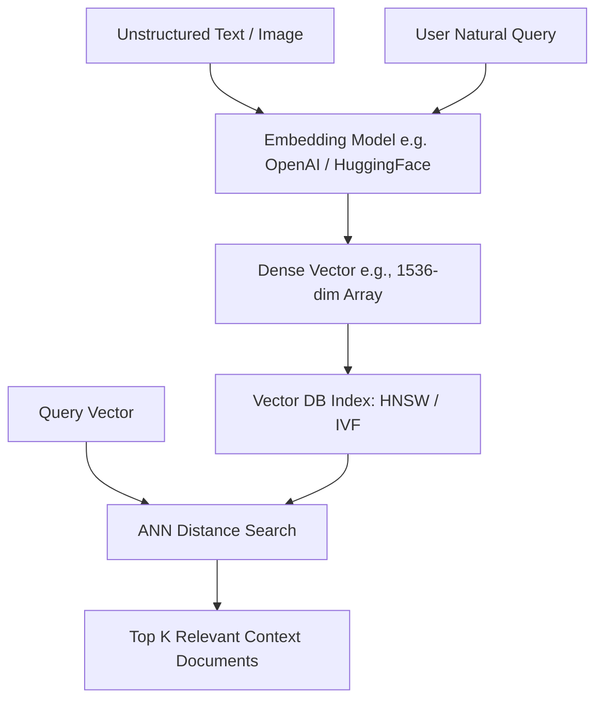

# Vector Databases & Search Cheatsheet

Vector databases store, index, and query high-dimensional vector embeddings generated by machine learning models to enable semantic similarity search and Retrieval-Augmented Generation (RAG).

---

## 1. Vector Search Architecture

---

## 2. Common Distance Metrics

- **Cosine Similarity:** Measures the cosine of the angle between two vectors. Range: [-1, 1]. Best when text length varies.
- **Euclidean Distance (L2):** Measures straight-line distance between points in N-dimensional space.
- **Dot Product:** Product of magnitude and cosine angle. Highly efficient when vectors are normalized.

---

## 3. Comparison of Vector Stores

| Database | Architecture | Index Type | Best For |
| :--- | :--- | :--- | :--- |
| **Qdrant** | Rust-native engine | HNSW, Segment | Fast Rust/Python integrations, payload filtering |
| **Pinecone** | Cloud Managed SaaS | Graph-based | Serverless zero-management cloud RAG |
| **Chroma** | Embedded / In-Memory | HNSW | Local prototyping and Python Jupyter notebooks |
| **pgvector** | PostgreSQL Extension | HNSW, IVFFlat | Adding vector search to existing relational Postgres DBs |

---

## Related Cheatsheets

- [Master Index](../Cheatsheets.html)
- [Qdrant Cheatsheet](qdrant-cheatsheet.md)
- [LangChain Cheatsheet](langchain-cheatsheet.md)
- [Prompt Engineering Cheatsheet](prompt-engineering-cheatsheet.md)
