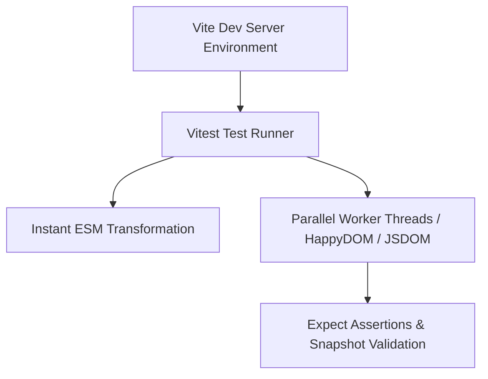

# Vitest Testing Cheatsheet

Vitest is a blazing fast unit test framework powered by Vite. It provides out-of-the-box support for TypeScript, JSX, ESM, and jest-compatible APIs.

---

## 1. Execution Pipeline



---

## 2. Core API Syntax

### Test Suite & Test Blocks
```typescript
import { describe, it, expect, beforeEach, vi } from 'vitest';

describe('Math Utilities', () => {
  beforeEach(() => {
    // Setup state before each test
  });

  it('calculates sum correctly', () => {
    expect(1 + 2).toBe(3);
  });

  it('handles async resolution', async () => {
    const data = await Promise.resolve('vitest');
    expect(data).toMatch(/vit/);
  });
});
```

### Spies & Mocks
```typescript
import { vi, expect, it } from 'vitest';

it('tracks function calls', () => {
  const fetchMock = vi.fn().mockResolvedValue({ status: 200 });

  fetchMock('https://api.example.com');

  expect(fetchMock).toHaveBeenCalledWith('https://api.example.com');
  expect(fetchMock).toHaveBeenCalledTimes(1);
});
```

---

## 3. Configuration (`vitest.config.ts`)

```typescript
import { defineConfig } from 'vitest/config';

export default defineConfig({
  test: {
    globals: true,
    environment: 'happy-dom',
    coverage: {
      provider: 'v8',
      reporter: ['text', 'json', 'html'],
    },
  },
});
```

---

## Best Practices & Common Pitfalls

1. **Use `happy-dom` for Speed:** `happy-dom` is significantly faster and lighter than `jsdom` for DOM testing.
2. **Clear Spies Between Tests:** Use `vi.clearAllMocks()` or configure `clearMocks: true` in config to prevent mock state pollution across tests.

---

## Related Cheatsheets

- [Master Index](../Cheatsheets.html)
- [Vite Cheatsheet](vite-cheatsheet.md)
- [Playwright E2E Cheatsheet](playwright-cheatsheet.md)
- [TypeScript Cheatsheet](typescript-cheatsheet.md)
