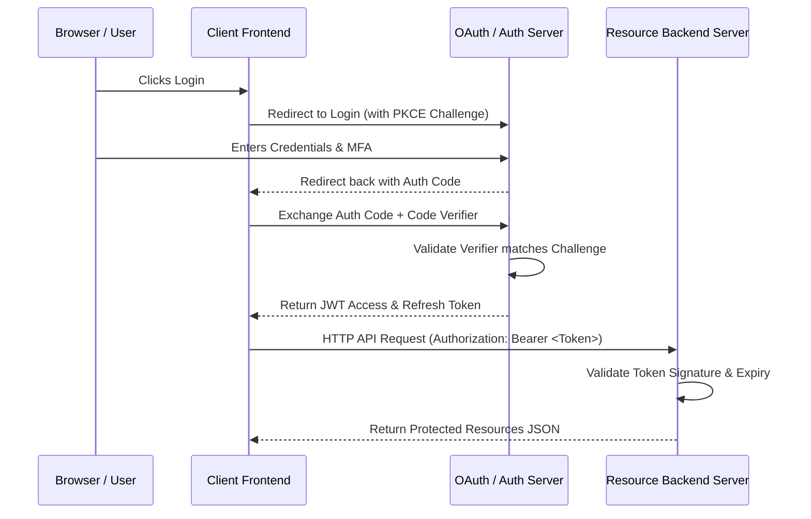

# Web Security Cheatsheet

Web Security is the practice of protecting web-facing assets, applications, servers, and data from unauthorized access, manipulation, disruption, or malware.

---

## 1. OWASP Top 10 Critical Web Vulnerabilities

The Open Web Application Security Project (OWASP) lists the most critical security risks facing web applications.

### 1. SQL Injection (SQLi)
- **Concept:** Attackers inject malicious SQL statements into input fields, manipulating backend databases to extract, modify, or delete sensitive data.
- **Prevention:** Always use parameterized queries (Prepared Statements) or Object-Relational Mappers (ORMs). Never concatenate input strings directly into SQL queries.

### 2. Cross-Site Scripting (XSS)
- **Concept:** Attackers inject malicious client-side scripts (usually JavaScript) into web pages viewed by other users.
  - *Stored XSS:* Malicious payload is stored in the database and served to users.
  - *Reflected XSS:* Payload is reflected off the web server in response queries.
  - *DOM-based XSS:* Payload is executed due to unsafe DOM manipulation.
- **Prevention:** Sanitize and html-escape user outputs; implement a strict **Content Security Policy (CSP)**.

### 3. Cross-Site Request Forgery (CSRF)
- **Concept:** Forces an authenticated user's browser to send a forged HTTP request to a vulnerable web application where the user is already authenticated.
- **Prevention:** Generate and validate anti-CSRF tokens for mutating requests; use `SameSite=Lax` or `SameSite=Strict` cookie flags.

---

## 2. Browser Security Mechanisms

Browsers implement strict policy boundaries to secure client-side execution environments.

### Content Security Policy (CSP)
An HTTP response header that declares approved resource loading origins. Minimizes XSS vulnerabilities by restricting script, image, stylesheet, and plugin sources.

```http
Content-Security-Policy: default-src 'self'; script-src 'self' https://trustedscripts.com; img-src 'self' data:;
```

### Cross-Origin Resource Sharing (CORS)
An HTTP header protocol that permits servers to specify which third-party origins can bypass the browser's default **Same-Origin Policy (SOP)** to fetch server resources.

```http
Access-Control-Allow-Origin: https://mytrustedapp.com
Access-Control-Allow-Methods: GET, POST, OPTIONS
Access-Control-Allow-Headers: Content-Type, Authorization
```

---

## 3. Token-Based Authentication & Cryptography

### JSON Web Tokens (JWT)
JWTs are compact, URL-safe means of representing claims to be transferred between two parties.
- **Structure:** `Header.Payload.Signature`
- **Security Rule:** Signature verification is absolutely mandatory. Always use secure, modern signing algorithms (e.g., RS256, EdDSA) instead of insecure HS255 or `none`.
- **Storage:** Avoid storing JWT access tokens in `localStorage` due to XSS vulnerability. Secure them in a `HttpOnly`, `Secure`, and `SameSite` cookie.

---

## Best Practices & Production Standards

1. **HTTPS Everywhere:** Force TLS 1.3 across all domains. Implement HTTP Strict Transport Security (HSTS) headers to block unencrypted connections.
2. **Secure Cookie Configuration:** Enforce flags: `HttpOnly` (blocks JS access), `Secure` (requires HTTPS), and `SameSite=Lax` (blocks CSRF cross-origin state transmission).
3. **Defense in Depth:** Never rely on a single layer of security. Enforce authentication, rate limiting, logging, web application firewalls (WAF), and perimeter network segmentation.
4. **Input Sanitization & Output Encoding:** Treat all client-supplied data as hostile. Validate schemas, enforce strict types, and encode outputs based on context (HTML, JS, URL, or CSS context).

---

## Common Mistakes & Antipatterns

1. **Hardcoding Private Secrets:** Committing API keys, database credentials, or private cryptographic keys into Git repositories.
2. **Failing to Verify Signatures:** Accepting JWTs without validating their signatures on backend routes, or allowing the `alg: "none"` header vulnerability.
3. **Permissive CORS Wildcard (`*`):** Configuring `Access-Control-Allow-Origin: *` alongside active credentials, exposing endpoint resources to third-party scripts.

---

## Troubleshooting & Debugging Guide

1. **Debugging SSL Handshake Failures:** Check server cipher suites using OpenSSL commands. Verify certificates are valid, not expired, and chain root CA correctly.
2. **Tracking Content Blocked by CSP:** Monitor browser console reports. Implement `Content-Security-Policy-Report-Only` headers to send violations to a collection endpoint without blocking active users.

---

## Core Interview Questions & Answers

1. **Q: What is the difference between Symmetric and Asymmetric Encryption?**
   - **A**: Symmetric encryption uses a single shared secret key to both encrypt and decrypt data (fast, good for large file content). Asymmetric encryption uses a public key to encrypt and a separate private key to decrypt (secure key exchange, signatures, slower).
2. **Q: Explain how OAuth 2.0 Authorization Code Flow with PKCE works.**
   - **A**: PKCE (Proof Key for Code Exchange) protects public clients from authorization code interception. The client generates a random secret (`Code Verifier`) and hashes it (`Code Challenge`). During the initial login redirect, the challenge is sent. When exchanging the auth code for a token, the client passes the raw verifier, proving identity without relying on a pre-shared client secret.

---

## Technical Architecture Diagram



---

## Related Cheatsheets & References

- [Master Index](web-security-cheatsheet/Cheatsheets.html)
- [System Design Cheatsheet](system-design-cheatsheet.md)
- [Microservices Cheatsheet](microservices-cheatsheet.md)
