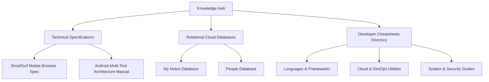

# Knowledge & Architecture Hub

Welcome to the central Knowledge Hub for technical specifications, architecture blueprints, system manuals, and relational database records.

---

## 🏛️ Knowledge Hub Overview

The Knowledge Hub serves as the master catalog mapping our local markdown vault assets, specifications, and relational database schemas to the unified backup ecosystem.

### Core Ecosystem Architecture

---

## 📑 Technical Specifications & Architecture Manuals

* 📱 **[DroidSurf Mobile Browser & Multi-Tool Integration Specification](DroidSurf%20Mobile%20Browser%20%26%20Multi-Tool%20Integration%20Specification%2058c8-1d4a.md)**
  * Comprehensive specification for custom mobile browser engine, protocol handling, webview sandboxing, and multi-tool shell integrations.

* 🛠️ **[Android Multi-Tool Master Engineering & Architecture Specification Manual](My%20notes%2021cb6c26d9ba81648e18c1761db2dcca/Android%20Multi-Tool%20Master%20Engineering%20%26%20Architecture%20Specification%20Manual%2035eb6c26d9ba80e59335c26c5f2b6de9.md)**
  * Enterprise engineering specification covering system partition modifications, custom recovery tools, ADB integration routines, and low-level flashing architectures.

---

## 🗄️ Relational Database Records

* 📂 **[My Notes Database](My%20notes%2021cb6c26d9ba81648e18c1761db2dcca.csv)**
  * Structured notes database containing action items, interview preparation material, and architecture specs.
* 👤 **[People Database](People%20d3db6c26d9ba82dfb0d8014512d331ec.csv)**
  * Directory of engineer contact profiles, roles, and project ownership records.

---

## 🔗 Related Resources

- [Portal Home Page](index.md)
- [Cheatsheets Master Directory](Cheatsheets.md)
- [System Design Cheatsheet](Cheatsheets/system-design-cheatsheet.md)
